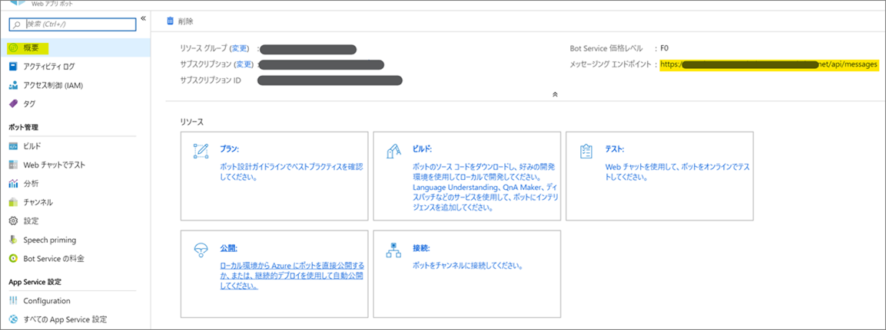
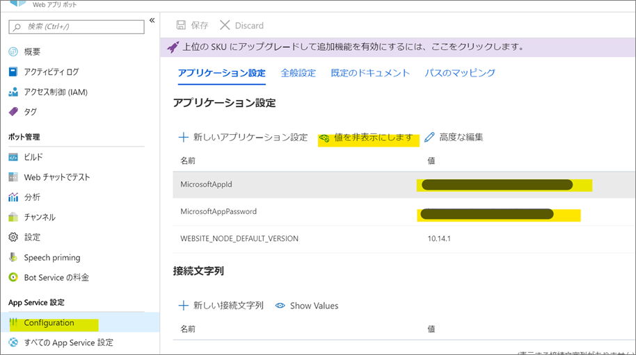
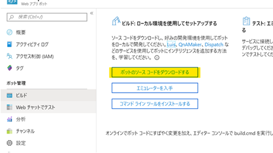

こんにちは。Azure Bot Service サポート チームの大嶋です！  

弊社にお問い合わせいただくお客様に、スムーズな解決をご提供するためにお役に立てるのではないかということで、今回の記事の執筆に至っています。

Azure Bot Service (Web App Bot もしくは Bot Channels Registration) をご利用の場合、問題の原因はクライアントアプリケーション起因やホストする Bot アプリケーション起因、それらをホストする基盤起因、弊社管理のコネクタサーバー等多岐に渡るため、複数の情報を正確に把握し調査を進めていく必要があります。

お問い合わせいただいた後、これらの把握のために複数の情報をご提供いただくようお願いしておりますが、今回の記事で、その採取方法についてご紹介いたします！
現象により必要な情報は異なりますが、今回はほとんどの現象の調査に対して有効な情報について以下にご紹介いたします。

---

## 1. Azure Portal 上の Azure Bot Service リソース情報について

Azure 側での詳細な確認を行うために以下の 4 つをご提供ください。

1-1. Azure Bot Service の種類 (Web App Bot (Web アプリ ボット) か Bot Channels Registration (ボット チャンネル登録) のいずれか)
確認方法 : Azure Portal 上の該当の Azure Bot Service の左上のリソース名の下に記載

1-2. Azure Bot Service の “リソース名”
確認方法 : Azure Portal 上の該当の Azure Bot Service の左上にリソース名が記載

1-3. Azure Bot Service の  “メッセージング エンドポイント”
確認方法 : Azure Portal 上の該当の Azure Bot Service の [概要] パネルの欄にメッセージング エンドポイントが記載

1-4. (Web App Bot ご利用の場合のみ) Web App Bot  に結び付く Azure App Service のリソース名
確認方法 : Web App Bot の左パネルの [すべての App Service 設定] > App Service の画面に遷移後の左上にリソース名が記載

 

## 2. Azure Bot Service の設定パネルの画面

Azure Portal 上を Azure Bot Service の [設定] パネルの画面のスクリーンショットをご提供ください。

 

## 3. (Web App Bot ご利用の場合)  Bot アプリケーションをホストする Azure App Service の構成情報

該当の Web App Bot (Azure Bot Service) の左パネルの [すべての App Service 設定] > App Service の画面に遷移 > [構成] > 上部タブの [アプリケーション設定] で [値を表示する] をクリックし値を表示した上で撮影

(なお、左上部の Azure App Service のリソース名が表示されるように画面全体を撮影ください)

 

## 4. エラーが発生するチャンネルの情報と再現時の情報

調査を行う上で、どのチャンネルで発生しているか、再現時のクライアントはどういう状態になっているのかというのは重要と考えられますので、以下の情報についてご提供ください。

4-1. エラーが発生している利用チャンネル
例 : Web Chat チャンネルと LINE チャンネルを利用していてどちらでもエラーが発生する

4-2. エラー再現時のクライアントのチャット画面側の会話時のスクリーンショット

4-3. 上記のエラーが発生した正確な時刻(“時分秒” で可能な限り正確な時間をご提供ください)

4-4. 上記再現後のチャンネルの正常性のスクリーンショット
確認方法 : Azure Portal 上の該当の Azure Bot Service リソース画面の左パネル [チャンネル] の 4-1 の発生チャンネル の正常性が “問題 (数字)” になっている場合、その問題をクリック後に出る部分を含む画面全体のスクリーンショットを撮影

 

## 5.	Web チャットでテストで試行時の情報について

Azure Bot Service では様々なチャンネルが存在しますが、一番シンプルに試せるのが Azure Portal 上の[Web チャットでテスト] という機能です。チャネル固有の機能を利用していたり、認証等を利用している場合には別のエラーが出る可能性があるため、一概にはいえませんが、一番シンプルな問題の切り分けをこちらを利用して行うことが可能です。Web チャットでテストでお試し頂き、以下について情報をご提供ください。

5-1. Azure Bot Service のリソース画面の左パネルの [Web チャット でテスト] で話しかけたときの画面全体のスクリーンショット (なお、左上部のリソース名も含まれるように画面全体を撮影ください)

5-2. 上記の Web チャットでテストで会話した時刻 (“時分秒” で可能な限り正確な時間をご提供ください)

5-3. Azure Bot Service のリソース画面の左パネルの [チャンネル] の [Web Chat] の正常性が “問題 (数字)” になっている場合、その問題をクリック後に出る部分を含む画面全体のスクリーンショット

5-4. 再現手順 (どういったことをするとエラーが出るのかの再現ステップ)

 

## 6. ホストしている Bot アプリケーションのソースコード

エラーの調査については、一般的に再現性があり、意図的に再現できる手順が確立できていることが重要になります。
弊社側での再現確認のため、再現可能なホストしている Bot アプリケーションのソースコードを以下の手順でご提供ください。

なお Web App Bot (Web アプリボット) の場合は Azure Portal 上を Web App Bot の
[ビルド] パネルの [ボットのソース コードをダウンロードする] より、zip ファイルをダウンロードすることが可能です。

 

上記を基に私共サポートにて調査を承ることが可能です。なお、状況に応じて、例えば Application Insights の情報など追加の情報が必要になることも多々ございますが上記をまず確認した上で、より詳細な調査に向けて調査方針や追加の情報採取を検討していくことが可能となります。

今回は以上です。それでは、また次回！

 
