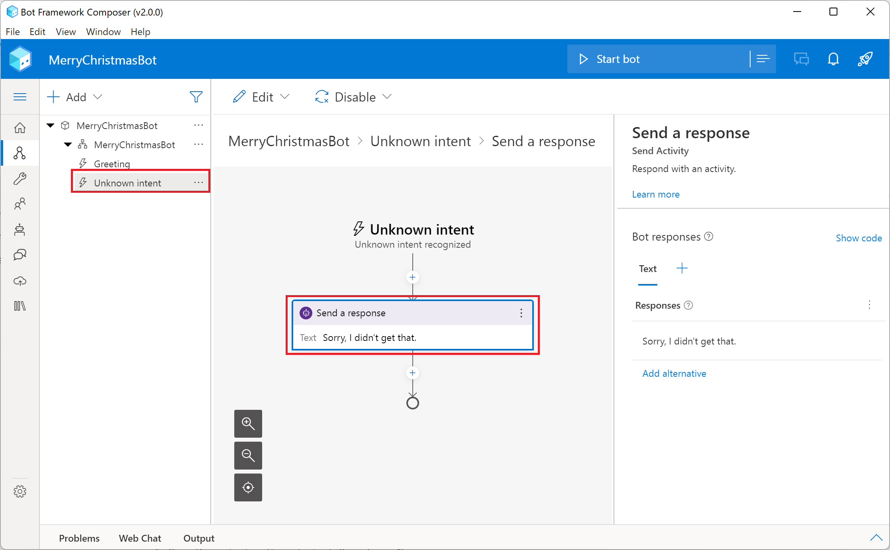
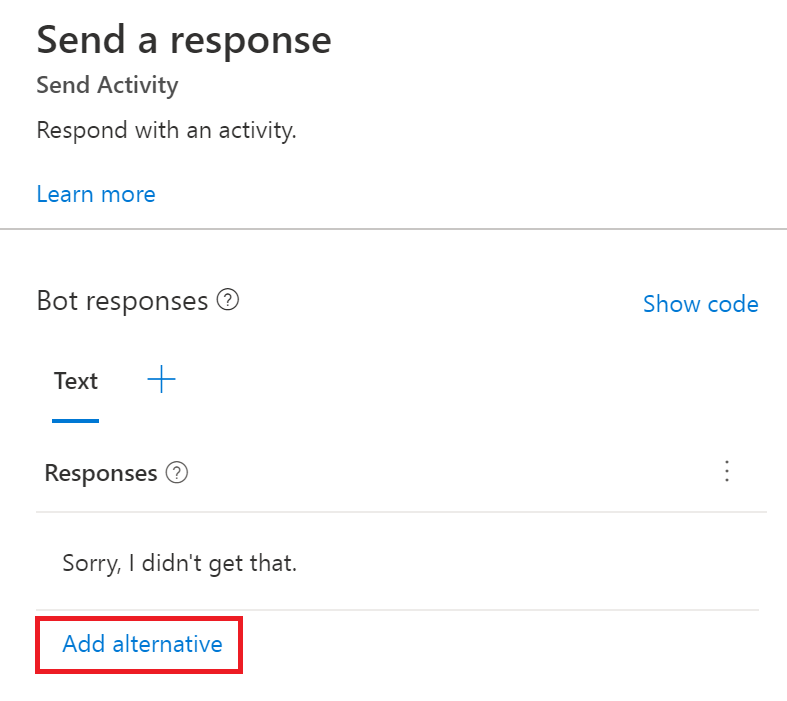

ちょっと早いですが Merry Christmas！Azure Bot Service サポート チームの石沢です！

皆様、Bot Framework Composer をご存じですか？なんとこれを利用すればノンコーディングでも Bot を構築することが可能です！
Bot でサービス構築したいけどコーディングはちょっと…という方でも GUI を操作するだけで構築完了してしまう優れものです。
今回は初めての Bot Framework Composer を利用される方向けに、Merry Christmas と話しかけると Merry Christmas と返してくれる、こちらから話しかけた内容をそのままオウム返ししてくる Bot を Azure 上に構築してみます。

________________________________________
# 0. 事前準備
Bot Framework Composer を利用するにあたって、以下のソフトウェアのインストールする必要があります。
本記事では、Node.js は 17.2.0、.NET Core SDK は 3.1.21、Composer は 2.0.0 バージョンを使用しました。

・Node.js (https://nodejs.org/en/)

・.NET Core SDK 3.1 以降 (https://dotnet.microsoft.com/download/dotnet/3.1)

・Composer (https://aka.ms/bf-composer-download-win)

参考：Install Bot Framework Composer - Prerequisites
https://docs.microsoft.com/en-us/composer/install-composer?tabs=windows#prerequisites

________________________________________
# 1. Composer を起動して Bot を作成しよう！
それでは早速インストールした Composer を起動しましょう。
Composer を起動すると以下の画面が表示されますので、おもむろに [+ Create New] をクリックします。

表示された画面で、最もシンプルな Bot のテンプレートである “Empty Bot” を選択して、[Next] をクリックします。

次の画面ではこの Bot のプロジェクトに名前を付けてあげましょう。あわせて Bot が保存されるフォルダも指定してあげてください。
ここでは Runtime type は “Azure Web App” が設定されていることを確認して、[Create] をクリックします。

________________________________________
# 2. Bot を編集しよう！ 
さて、Create が無事完了すると以下のような画面に遷移します。

ここで左のナビゲーションパネルから、”Unknown intent” をクリックして、さらに “Send a response” をクリックします。

“Unknown intent” では、ユーザーの入力が Bot 側でよくわからないものと認識された場合の処理フローが示されています。
今回の “Empty Bot” テンプレートの場合は、入力を認識するような処理は入っていないので、ユーザーの全ての入力がこのフローに入ります。
なんとなく想像できるのではないかと思いますが、ここでユーザーの入力をそのまま返すようにフローを書き替えるだけで、Merry Christmas という入力にたいして Merry Christmas という応答を返す Bot が完成します。
フローを書き替えるためには、まず右のパネルに表示された “Add alternative” をクリックします。

 
ここで Bot が返すテキストを設定できるのですが、入力されたユーザーのテキストを示すプロパティを選択します。”{x}” をクリックして、”turn.activity.text” を選択します。 

選択できたら、”Sorry, I didn’t get that.” というレスポンスは不要なので、”Remove variation” をクリックして削除してしまいましょう。

これでオウム返しする Bot が完成しました！

________________________________________
# 3. Bot を ローカルでテストしよう！
Composer ではローカルでのテストも容易に行うことができます！
後日記事を追記いたしますので、今しばらくお待ちください。
________________________________________
# 4. Bot を Publishしよう！
さて、あとは作成した Bot を Azure 上に Deploy して Publish するだけです。
これも GUI でぽちぽちするだけでできます。Composer の雲のマークのメニューを選択して、”Publishing profile” タブを選択して、さらに [Add new] をクリックします。

ここで Publish 用のプロファイルを作成します。Name は任意のものを入力し、Publishing target には “Publish bot to Azure” を選択して、[Next] をクリックします。

次に Bot を動作させるために新しいリソースを作成するか、既存のリソースをインポートするかを選択します。
ここでは、新しくリソースを作成するため “Create new resources” を選択して、[Next] をクリックします。

Azure アカウントへのログインが求められるのでログインします。

ログインできたら、利用するサブスクリプションや Resource group についての設定を行い、[Next] をクリックします。

次に追加するリソースを選択します。今回の目的の通り動作させるだけであれば “Required” 以外は追加しなくても問題ありません。
 
確認画面が出てくるので、問題なさそうであれば [Create] をクリックして、リソースのデプロイが完了するのを待ちましょう。

以下のようなメッセージが表示されれば OK です！

 
次に “Publish” タブを選択してから、パブリッシュしたい Bot にチェックを入れて、先ほど作成したプロファイルを “Publish target” に設定したら [Publish selected bots] をクリックします。

 
次の画面では、Comments に任意のコメントを入れて、[Okay] をクリックして Publish の完了を待ちましょう。

Publish が成功しているかどうかは、Message に ”Success” と表示されていることで確認できます。

________________________________________
# 5. Bot の動作確認をしよう！
ここでは詳細は割愛しますが、Azure Portal にアクセスして、作成した Azure Bot リソースから、”Web チャットでテスト” で実際に動作させてみるのが最も簡単な動作確認方法でしょう。
当初の目的であった “Merry Christmas と話しかけると Merry Christmas と返してくれる Bot を Azure 上に構築する” が達成できたことを確認できます！

 
というわけで 1 つもコーディングせずに Bot の構築ができてしまいました！
今回は以上です。それでは、また次回！
