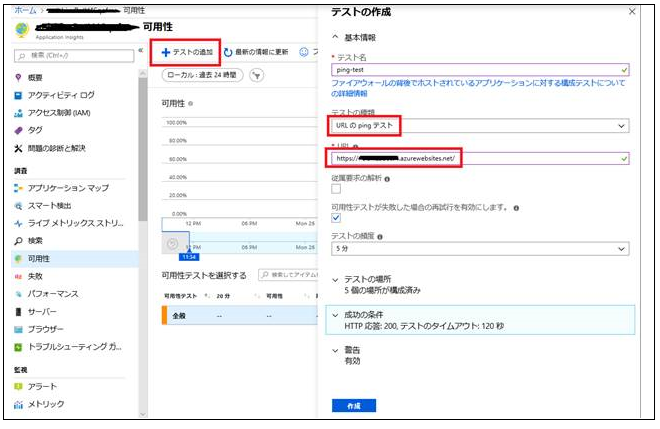
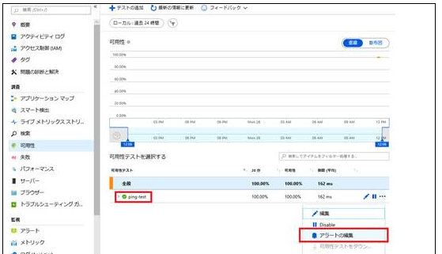
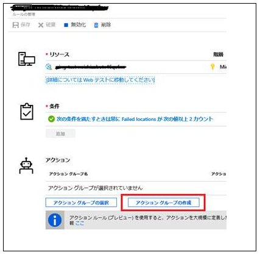
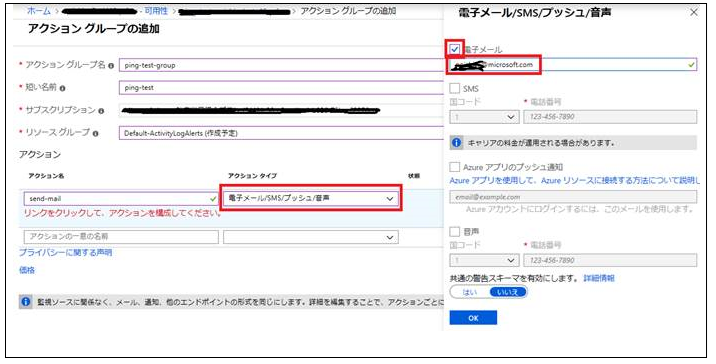
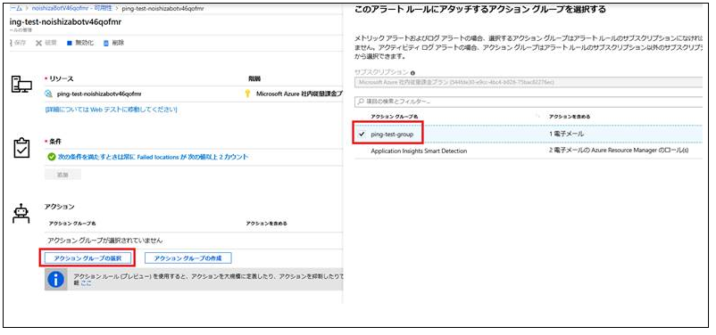

Web App Bot の監視は App Service (開発された Bot アプリケーションが動作するサーバー) と Bot Service (コネクター) の観点で行います。

App Service 側の異常については基盤として動作しているか、アプリとして想定の動作をしているのか 2 点確認するポイントがあります。
基盤として動作しているのかという点については、以下のように Application Insights で対象の App Service の URL (https://xxxx.azurewebisites.net) をテストをするよう設定します。
アラートはルールとアクションの設定が必要です。

1. テストを追加します (ルール)  
Application Insights インスタンスより “URL の ping テスト” を追加します。URL には監視したい App Service の URL を入力します。  

2. 作成したテストについて、アラートの編集を行います  
手順 1 で作成されたテストの “…” から、”アラートの編集” を選択します。  

 
3. “アクション グループの作成” を行います (アクション)  
表示されたルールの管理画面で “アクション グループの作成” を選択します。  

4. メールで通知を行うためのアクションを追加します  
アクションタイプ “電信メール/SMS/プッシュ/音声” のアクションを追加し、電子メールに送信したいメールアドレスを追加します。  

5. 作成したアクショングループとテストを紐づけます  
作成したアクショングループを “アクショングループの選択” より設定します 

6. 編集内容を保存します  
保存ボタンをクリックします。

> URL の Ping テストを作成する
> https://docs.microsoft.com/ja-jp/azure/azure-monitor/app/monitor-web-app-availability#create-a-url-ping-test
> 
> Azure Portal でのアクション グループの作成および管理
> https://docs.microsoft.com/ja-jp/azure/azure-monitor/platform/action-groups

一方、アプリとして想定の動作をしているのか (常にボットがエラーを返さずに動作しているか) を確認するには、Bot Service の仕組み上、クライアントがコネクターを介してリクエストを行う必要があるため監視はできません。
ただ、実際にクライアントからのリクエストでエラーが発生した場合には、以下のように例外 (exception) を検知するようログ検索を仕掛けることが有効と考えられます。

> カスタム ログ検索を使用して例外アラートを設定する方法
> https://docs.microsoft.com/ja-jp/azure/azure-monitor/app/alerts#how-to-set-an-exception-alert-using-custom-log-search

また、Bot Service (コネクター) の観点では、以下のように Bot Service というサービス自体で異常が発生していないかを以下の方法で監視することができます。(Azure Portal -> すべてのサービス -> サービス正常性 -> ルールの作成 -> サービスで "Azure Bot Service" を選択)

> サービス通知のアクティビティ ログ アラートを作成する
> https://docs.microsoft.com/ja-jp/azure/service-health/alerts-activity-log-service-notifications

以上です。

