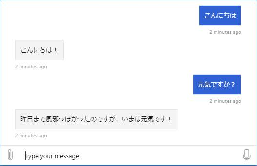
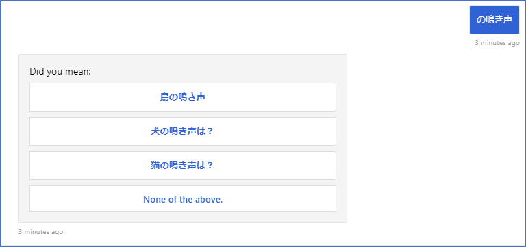

質問と回答を登録、検索するサービスである QnA Maker、ユーザーとの会話を行うボットアプリと実行基盤である Bot Service を使って、FQA ボットアプリを作成する方法です。
環境構築、QnA Maker のリソース作成、Bot Service のリソース作成を行い、最後に Azure 上に公開するところまでおまとめしています。



## 環境構築

以下の記事に沿って Visual Studio Code + C# 拡張機能 (または Visual Studio 2017 以降)、.NET Core SDK (最新)、Bot Framework Emulator をインストールします。

> (Visual Studio Code) C# および Visual Studio Code の使用を開始する
> https://docs.microsoft.com/ja-jp/dotnet/core/tutorials/with-visual-studio-code
> 
> (Visual Studio 2017 以降) チュートリアル:基本的なボットを作成してデプロイする
> https://docs.microsoft.com/ja-jp/azure/bot-service/bot-builder-tutorial-basic-deploy?view=azure-bot-service-4.0&tabs=csharp
> 
> Bot Framework Emulator
> https://github.com/microsoft/BotFramework-Emulator/blob/master/README.md


## サンプルを作成して Azure 上に公開するまでの流れ

1. QnA Maker のリソースを作成し、任意の Question、Answer を登録します。  
チュートリアル:QnA Maker ポータルでナレッジ ベースを作成する  
https://docs.microsoft.com/ja-jp/azure/cognitive-services/qnamaker/tutorials/create-publish-query-in-portal

1. 以下のチュートリアルに沿って QnA Maker ポータルより Knowledge Base を作成し、それを利用するボットを Azure ポータルより作成します。  
チュートリアル:Azure Bot Service v4 を使用して QnA ボットを作成する  
https://docs.microsoft.com/ja-jp/azure/cognitive-services/qnamaker/tutorials/create-qna-bot

1. 作成した Web App Bot の "ビルド" より zip ファイルでソースコードをダウンロードし、Visual Studio Code または Visual Studio でソースコードをお好みに合わせて編集します。  
(Visual Studio Code) C# および Visual Studio Code の使用を開始する  
https://docs.microsoft.com/ja-jp/dotnet/core/tutorials/with-visual-studio-code  
(Visual Studio 2017 以降) チュートリアル:基本的なボットを作成してデプロイする  
https://docs.microsoft.com/ja-jp/azure/bot-service/bot-builder-tutorial-basic-deploy?view=azure-bot-service-4.0&tabs=csharp

1. Bot Framework Emulator でローカルデバッグします。  
Bot Framework Samples  
https://github.com/microsoft/BotBuilder-Samples

1. Azure 上に公開します。  
(Visual Studio Code) Visual Studio Code で ASP.NET Core アプリを Azure に公開する  
https://docs.microsoft.com/ja-jp/aspnet/core/tutorials/publish-to-azure-webapp-using-vscode?view=aspnetcore-3.1  
(Visual Studio 2017 以降) Visual Studio を使用して Azure App Service に Web アプリを発行する  
https://docs.microsoft.com/ja-jp/visualstudio/deployment/quickstart-deploy-to-azure?view=vs-2019

1. Web App Bot の “チャネル” より、ブラウザー (Web チャット) や LINE、Microsoft Teams で利用できるよう設定ができます。  
ボットを Web チャットに接続する  
https://docs.microsoft.com/ja-jp/azure/bot-service/bot-service-channel-connect-webchat?view=azure-bot-service-4.0  
ボットを LINE に接続する  
https://docs.microsoft.com/ja-jp/azure/bot-service/bot-service-channel-connect-line?view=azure-bot-service-4.0  
ボットを Teams に接続する  
https://docs.microsoft.com/ja-jp/azure/bot-service/channel-connect-teams?view=azure-bot-service-4.0


## ご参考
サンプルではユーザーからの質問に複数該当しそうな QnA Maker の回答 (Question と Answer のペア) がある場合には、以下の画像のように近い内容の質問を複数選択肢で提示します。



この仕組みは QnA Maker にて表示する Confidence Score を元にしています。
Dialog\QnAMakerBaseDialog.cs にはボットアプリが QnA Maker に問い合わせをしたときに回答 (Question と Answer のペア) として受け取る最少スコア (ScoreTheashold)、回答の数 (Top) が指定されています。
サンプルの例では Confidence Score が 10 以上の QA ペアを 3 つ受け取るよう指定されていますので、値を変更することで複数選択肢の表示を調整することができます。

```C# Dialog\QnAMakerBaseDialog.cs
public const float DefaultThreshold = 0.1F;
public const int DefaultTopN = 3;
```

> QnA Maker ナレッジ ベースの信頼度スコア
> https://docs.microsoft.com/ja-jp/azure/cognitive-services/qnamaker/concepts/confidence-score

以上です。
