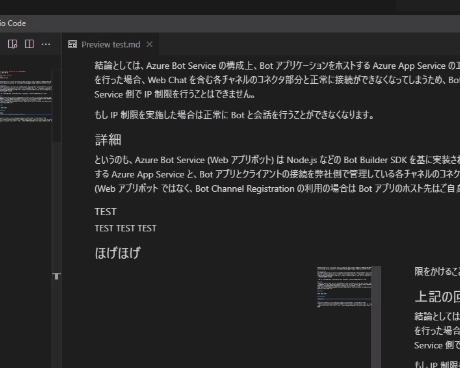

こんにちは。今回は “Azure Bot Service (Web App Bot) をご利用時にボットアプリケーションの Azure App Service 側に IP 制限をかけることができるの？” という疑問に答えます。

## 上記の回答
結論としては、Azure Bot Service の構成上、Bot アプリケーションをホストする Azure App Service のエンドポイントに IP 制限を行った場合、Web Chat を含む各チャネルのコネクタ部分と正常に接続ができなくなってしまうため、Bot 本体をホストする App Service 側で IP 制限を行うことはできません。

もし IP 制限を実施した場合は正常に Bot と会話を行うことができなくなります。

## 詳細
というのも、Azure Bot Service (Web アプリボット) は Node.js などの Bot Builder SDK を基に実装される Bot アプリをホストする Azure App Service と、Bot アプリとクライアントの接続を弊社側で管理している各チャネルのコネクタにより構成されます。
(Web アプリボット ではなく、Bot Channel Registration の利用の場合は Bot アプリのホスト先はご自身で用意します)

## test
### test
