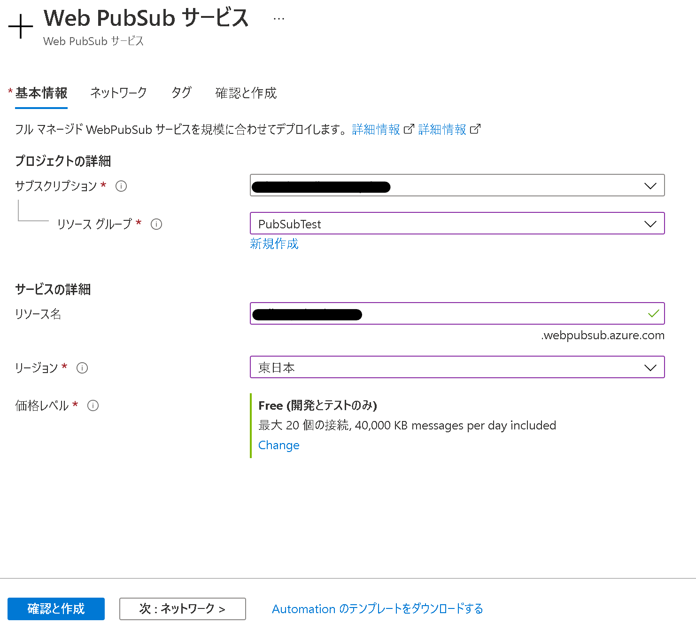
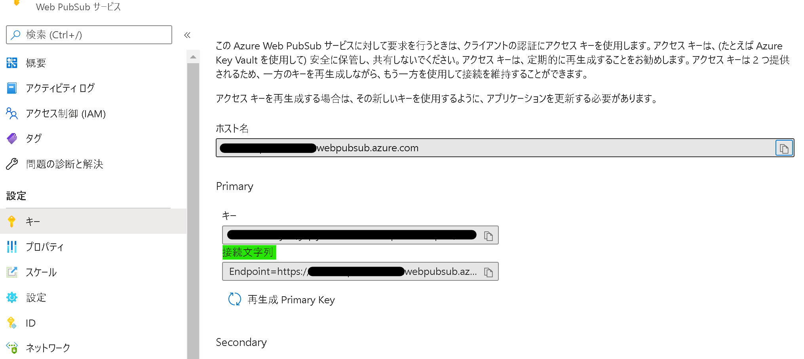
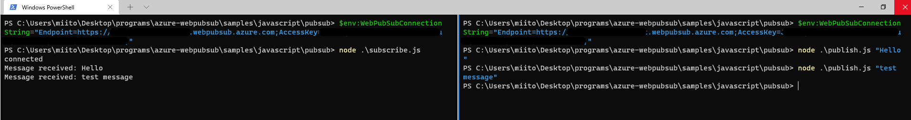
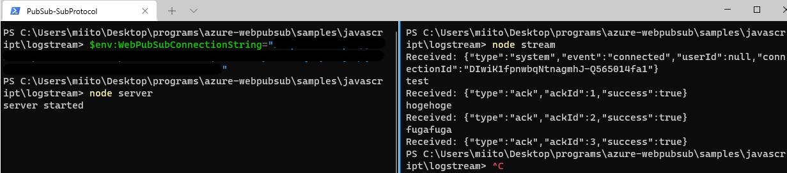
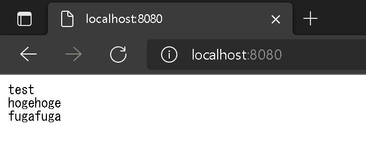

# はじめに
＊本記事は [Microsoft Azure Tech Advent Calendar 2021](https://qiita.com/advent-calendar/2021/microsoft-azure-tech) の 20 日目の記事になります。

皆さんこんにちは。Developer Support Internet チームの伊藤です。今回の記事では、2021 年 11 月に正式にリリースされた、Azure Web PubSub Service についてご紹介します。少しでもこれから初めて Azure Web PubSub Service に触るという方や、Azure Web PubSub Service の使用を検討してるという方々の参考になればと嬉しいです！

# Azure Web PubSub Service とは
Azure Web PubSub Service とはパブリッシュ-サブスクライブ パターンを利用して、リアルタイムに双方向通信を実現するメッセージング サービスです。(以降、この記事では適宜 PubSub と略します。)
例えば、複数人でのチャット サービスや地図アプリでの現在地の表示、複数の IoT デバイスとの情報のやり取り等では、高いリアルタイム性を求められますが、そういったケースでは PubSub の使用を検討できます。

その他の概要やユースケースは[こちらの公開情報 (Azure Web PubSub サービスとは)](https://docs.microsoft.com/ja-jp/azure/azure-web-pubsub/overview) にも纏められてます。

# Azure SignalR との差異
双方向通信を使用する Azure 製品として、現状 [Azure SignalR](https://docs.microsoft.com/ja-jp/azure/azure-signalr/signalr-overview) があります。ただし、Azure SignalR と PubSub はどちらが上位互換であるというものではなく、それぞれユースケース等が異なります。

PubSub の利点として、標準の WebSocket 接続をサポートしており、各言語の様々な WebSocket クライアント SDK を利用することができる点です。

また、WebSocket のサブプロトコルにも対応しており、 JSON/Protobuf のサブプロトコルを使用したり、独自にサブプロトコルを実装することもできます。(本記事を書いた際は JSON/Protobuf の 2 種類を用意しています。) 加えて、C# 以外にも JavaScript、Java、Python の SDK にも対応していることも PubSub の強みの 1 つです。

Azure SignalR を使う利点としては既に ASP.NET Core 等で SignalR をご利用の場合には、比較的開発コストを抑えて Azure SignalR へ移行できます。また、.NET や .NET Core を使用したシステムと統合する必要がある場合(例えば Blazor との連携等) には有力な選択肢となります。

また、PubSub と比べた時の大きな違いとしては、Azure SignalR は WebSocket だけでなく、Server Send Event や Long Porring 等にも対応しています。そのため、WebSocket に非対応のクライアントを利用している場合もサポートされる HTTP ベースの双方向通信の方式にフォールバックすることが可能です。

これらのように、Azure SignalR と PubSub では得意なところや不得意なところがそれぞれありますので、もしこれらの利用を検討されている方は、ぜひご自身が作成しようとしているシステムがどのような特性を必要とするか、どのような言語やエコシステムを使用するか等に合わせて利用するサービスを検討してください！その他の違い等については[こちらの公開情報 (Azure SignalR Service と Azure Web PubSub サービスのどちらかを選択するにはどうすればよいですか?)](https://docs.microsoft.com/ja-jp/azure/azure-web-pubsub/resource-faq#how-do-i-choose-between-azure-signalr-service-and-azure-web-pubsub-service) でも纏められてます。


なお、余談にはなりますが、もし 現在 ASP.NET Core の SignalR を使用していて、これから Azure SignalR への移行を検討してるという方は、ぜひ[本ブログのこちらの記事](https://jpdsi.github.io/blog/web-apps/MigrationAzureSignalR/) もご参考ください！

# チュートリアルでの動作確認
それでは実際にサンプルを動かしながら動作を確認していきましょう。

PubSub ではいくつかの公式チュートリアルが用意されていて、コードを触らないで既に用意された[デモ用のサイトを利用するチュートリアル](https://docs.microsoft.com/ja-jp/azure/azure-web-pubsub/quickstart-live-demo)もありますが、今回は折角なので SDK を用いて各個人でサンプルを試すチュートリアルをいくつかご紹介します。また、Azure SignalR との差別化も含めて、今回は JaveScript(Node.js) の SDK を使用します。

＊各チュートリアルを完全にトレースすると分量が多くなるので、要所要所をスクリーンショット等を添えて補足していきます。

＊ Node.js の 12.x 以降が必要となります。

## PubSub リソースの作成
まずは[こちらの公開情報(Azure portal から Web PubSub インスタンスを作成する)](https://docs.microsoft.com/ja-jp/azure/azure-web-pubsub/howto-develop-create-instance) の手順にそって Azure Portal から PubSub のリソースを作成しましょう。価格レベルはとりあえずこの記事で紹介するチュートリアルを試す目的であれば `Free` で問題ありません。



リソースを無事に作成できたら、以下のキーの項目から、Primary の接続文字列の値をどこかにメモしておきましょう！この後のチュートリアルがスムーズにできます！



### Tips : チュートリアル中に使用する環境変数について
PubSub のチュートリアルでは基本的に bash を使ったコマンドで紹介されていますが、もしも Windows の PowerShell を使って開発をされている場合には、以下のような `$env` コマンドで環境変数を設定できます。以下の実行例では、`WebPubSubConnectionString` という環境変数に `"<connection-string>"` という String を値として設定しています。

```powershell
$env:WebPubSubConnectionString="<connection-string>"
```

$env コマンドの詳細は[こちらの公開情報](https://docs.microsoft.com/ja-jp/powershell/module/microsoft.powershell.core/about/about_environment_variables?view=powershell-7.2#using-and-changing-environment-variables)をご確認ください。


なお、上記の環境変数は PowerShell を閉じたり、別のウィンドウでは効力がありません。そのため、実際の利用等では `.env` という環境変数用のファイルを作成するのも良いかと思います。ご参考程度ですが、 npm の環境変数用のファイルを扱うモジュールとして、[dotenv というモジュール](https://www.npmjs.com/package/dotenv) 等があります。

今回の記事では Windows の PowerShell で環境変数を設定していきます。

## メッセージの発行とサブスクライブのチュートリアル
### チュートリアルの大まかな流れと実際の画面

[こちらのチュートリアル](https://docs.microsoft.com/ja-jp/azure/azure-web-pubsub/tutorial-pub-sub-messages?tabs=javascript#set-up-the-project) ではシンプルなコンソールでの動作を確認できます。プログラムとしてはメッセージを受信する側の `Subscriber` とメッセージを送信する側の `Publisher` の 2 つがあります。基本的には手順通りにコマンドを実行していくと各プログラム等も完成しますが、こちらの GitHub に[完成したサンプル](https://github.com/Azure/azure-webpubsub/tree/main/samples/javascript/pubsub
)もあります。

このサンプルでは以下のような手順で動作を確認します。

1. subscriber 側で環境変数を設定する。($env コマンド)
1. subscriber を起動する。(node subscribe.js)
1. publisher 側で環境変数を設定する。($env コマンド)
1. publisher で任意のメッセージを送信する。(node pusblish.js "<任意のメッセージ>")

環境変数の設定では、上述の `$env` コマンド等を使用します。(subscriber と publisher でそれぞれコンソールを用意して、それぞれで環境変数を設定します。)

実行した場合のコンソール画面は以下のようになります。画面左側は subscriber で、右側が publisher です。画面左側の subscriber で接続が確立して connected となった状態で、publisher 側で引数として指定して実行されたメッセージを subscriber 側に送信しています。


### プログラムの概要
subscriber 側のプログラムは以下になります。subscriber 側では環境変数を設定した後に、`node subscribe.js` という風に subscriber を起動するのみです。環境変数で指定した `WebPubSubConnectionString` の値を基に WebPubSubServiceClient インスタンスを作成して、そこからトークンや接続用の URL を作成していますね。

main() 関数の後半部分では、正常に動作したら connected という値が表示され、publisher からのメッセージを受け取った際には Message Recieved: <送られたメッセージ> とコンソールに出力するように実装されています。WebSocket のインスタンスである `ws` を作成してからは特に PubSub 固有の実装ということもなく、一般的な WebSocket と同じような実装ですね！

``` javascript
const WebSocket = require('ws');
const { WebPubSubServiceClient } = require('@azure/web-pubsub');

async function main() {
  const hub = "pubsub";
  let service = new WebPubSubServiceClient(process.env.WebPubSubConnectionString, hub);
  let token = await service.getClientAccessToken();
  let ws = new WebSocket(token.url);
  ws.on('open', () => console.log('connected'));
  ws.on('message', data => console.log('Message received: %s', data));
}

main();
```

pusblisher 側のプログラムは以下になります。かなりシンプルなプログラムですね。`process.argv[2]` というところでプログラム実行時の引数をメッセージとして取得してます。このサンプルでは同じハブにいるユーザー全員にメッセージを送るために PubSub 用に作られた SDK である `@azure/web-pubsub` を pusblisher 側でも使用していますね。

``` javascript
const { WebPubSubServiceClient } = require('@azure/web-pubsub');

const hub = "pubsub";
let service = new WebPubSubServiceClient(process.env.WebPubSubConnectionString, hub);

// by default it uses `application/json`, specify contentType as `text/plain` if you want plain-text
service.sendToAll(process.argv[2], { contentType: "text/plain" });
```

## WebSocket のサブプロトコルのチュートリアル
### WebSocket のサブプロトコルの概要
PubSub の利点の一つとして Websocket のサブプロトコルを使用できます。Websocket のサブプロトコルの大まかなイメージとしては、WebSocket の接続を行う際に、送信するデータに JSON 等の形式の規則を指定できるイメージです。WebSocket のサブプロトコルの詳細については[RFC6455 の WebSocket の項目](https://datatracker.ietf.org/doc/html/rfc6455#section-1.9) をご参考ください。


### チュートリアルの大まかな流れと実際の画面
今回は、[こちらのチュートリアル](https://docs.microsoft.com/ja-jp/azure/azure-web-pubsub/tutorial-subprotocol?tabs=csharp)に沿って試してみようと思います。[GitHub のサンプルもこちら](https://github.com/Azure/azure-webpubsub/tree/main/samples/javascript/logstream/) にあります。大まかな全体の流れとしては以下のような流れで行います。

1. Web ページをホストするサーバーアプリ側で環境変数を設定する。($env コマンド)
1. サーバーアプリを起動する。(node server)
1. ブラウザーで http://localhost:8080 へとアクセスする。
1. クライアントアプリを起動する。(node stream)
1. クライアントアプリ側でメッセージを送信する。(クライアント側のコンソールでメッセージを入力)
1. ブラウザーに送信したメッセージが表示されるのを確認する。

プログラム実行時のコンソールは以下のようになります。左側が Web ページをホストするサーバーアプリ、右側がクライアントアプリになります。サーバーアプリ側でやることは環境変数を設定してからは起動するのみです。クライアントアプリではクライアントアプリを起動してから、メッセージを入力していきます。



以下のようにクライアント側から送信したメッセージがブラウザー側で表示されていることを確認できます。


### プログラムの概要
Web ページをホストするサーバー 側のプログラムは以下のようになっています。先程の subscriber のプログラムと大きく違う点として、express というモジュールを使用して、サーバーアプリ化していますね。

また、クライアントが使用する Token に WebPubSubServiceClient のインスタンスのメソッドを使って roles を指定してます。これにより、クライアントが stream グループに対してメッセージを送ることや、グループへの参加/脱退が可能となります。

```javascript
const express = require('express');
const { WebPubSubServiceClient } = require('@azure/web-pubsub');

let endpoint = new WebPubSubServiceClient(process.env.WebPubSubConnectionString, 'stream');
const app = express();

app.get('/negotiate', async (req, res) => {
  let token = await endpoint.getClientAccessToken({
    roles: ['webpubsub.sendToGroup.stream', 'webpubsub.joinLeaveGroup.stream']
  });
  res.json({
    url: token.url
  });
});

app.use(express.static('public'));
app.listen(8080, () => console.log('server started'));
```

ブラウザー側で開いている .html ファイルより一部を抜粋したコードが以下です。WebSocket の message のイベントを検出した際に、ページ上にクライアントから送られてきたメッセージをログのように表示させます。また、WebSocket のインスタンスを作成する時に、第 2 引数として `'json.webpubsub.azure.v1'` と入力しています。これが、今回使用する JSON 向けに用意されたサブプロトコルです。

また、ws.send の際に JSON.stringfy() 関数で JSON に成形していることが確認できますね。

```html
<body>
  <div id="output"></div>
  <script>
    (async function () {
      let res = await fetch('/negotiate')
      let data = await res.json();
      let ws = new WebSocket(data.url, 'json.webpubsub.azure.v1');
      let ackId = 0;
      ws.onopen = () => {
        console.log('connected');
        ws.send(JSON.stringify({
          type: 'joinGroup',
          group: 'stream',
          ackId: ++ackId,
        }));
      };

      let output = document.querySelector('#output');
      ws.onmessage = event => {
        let message = JSON.parse(event.data);
        if (message.type === 'message' && message.group === 'stream') {
          let d = document.createElement('span');
          d.innerText = message.data;
          output.appendChild(d);
          window.scrollTo(0, document.body.scrollHeight);
        }
      };
    })();
  </script>
</body>
```

クライアント側のプログラムは以下になります。先程のチュートリアルと比べると少し記述は増えてますね。先程の .html 同様に ws.send で送る値を JSON に変換しています。

```javascript
const WebSocket = require('ws');
const fetch = require('node-fetch');

async function main() {
  let res = await fetch(`http://localhost:8080/negotiate`);
  let data = await res.json();
  let ws = new WebSocket(data.url, 'json.webpubsub.azure.v1');
  let ackId = 0;
  ws.on('open', () => {
    process.stdin.on('data', data => {
      ws.send(JSON.stringify({
        type: 'sendToGroup',
        group: 'stream',
        ackId: ++ackId,
        dataType: 'text',
        data: data.toString()
      }));
    });
  });
  ws.on('message', data => console.log("Received: %s", data));
  process.stdin.on('close', () => ws.close());
}

main();
```

# まとめ
他にもいくつかチュートリアルはありますが、今回は分量など含めてここまでとなります。双方向通信の仕組みやサービスは色々と出回っていますが、ぜひ今後の選択肢として Azure Web PubSub サービスもご検討いただけたら嬉しいです！

まだまだ一般公開されたばかりのサービスですので、今後もっと発展するとより皆さんのご要望にそった機能等も追加されるかもしれませんので、ぜひよろしくお願いします。それでは、また次回！