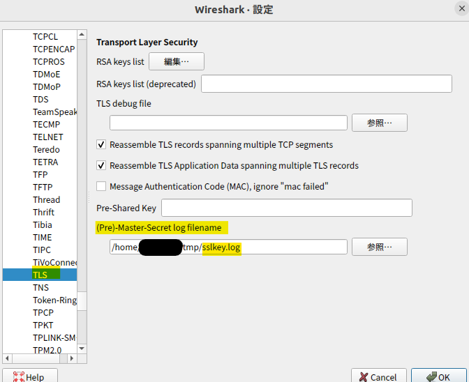
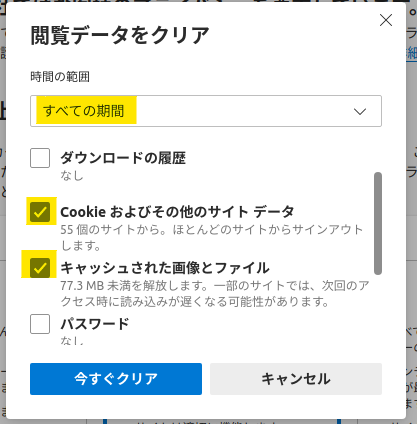

こんにちは。Developer Support チームの大嶋です。

実は Microsoft Edge は Linux 版もあることはご存じでしょうか？
例えば [Edge Download サイト](https://www.microsoft.com/en-us/edge/business/download) の Linux の欄からもダウンロードできます。

今回はその Microsoft Edge の Linux 版 Microsoft Edge on Linux  (今回は Ubuntu を想定) で動作する Web アプリケーションにて、例えば事前に ssllogkey を設定し、ネットワークに関連する調査に活用できるネットワークトレースを Linux 上で取得する方法等をご紹介いたします。なお、実際のトラブルシューティングの際は、同時に [net-export](https://jpdsi.github.io/blog/internet-explorer-microsoft-edge/how-to-use-net-export/) の取得も併せてご実施ください。

なお、本方法では多くの HTTPS の通信を調査のために見ることも可能であると想定されますが、TLS のバージョンや暗号化の種類等によっては正常に復号できない可能性もあり、全ての HTTPS 通信を分析が可能であることを保証するものではありません。

---

<font color="red"> Edge ブラウザーのキャッシュが利用されてキャプチャーに記録されないことを避けるために、InPrivate ブラウズをご利用いただく方法をご案内していますが、InPrivate ブラウズをご利用いただけない場合には、ログ取得前にブラウザーのキャッシュを下部の補足に記載の方法で必ずすべて消去して実施ください。</font>

## 0. 前提

- Ubuntu 上で 再現手順が確立されており、Chromium ベースの Microsoft Edge on Linux にてネットワークに関する事象が意図的に再現可能

  Linux 版の新しい Microsoft Edge ブラウザーダウンロード | Microsoft
  https://www.microsoft.com/ja-jp/edge?form=MA13DE&OCID=MA13DE

- Wireshark がダウンロード済み (任意)

  Download Wireshark
  https://www.wireshark.org/download.html

---

## 1. 事前準備

1. Ubuntu 上で Microsoft Edge や Google Chrome を含めて、一度、全てのブラウザを閉じます。ブラウザ以外のアプリも出来る限り通信を減らすために閉じます。

2. System Monitor アプリ等で msedge に関するプロセスがいないことを念の為確認します。

3. エクスプローラーまたはターミナルのコマンドにて、キーを保存する任意のディレクトリ等を作成しておきます。

```
:~$ mkdir tmp
```

4. ターミナルにて上記作成のディレクトリに移動し、以下の echo コマンドで上記で作成した任意のディレクトリ (ここでは ~/tmp と仮定) に空の新規ファイルを作成します。作成後は該当ディレクトリで ls コマンド等で正常に sslkey.log ファイルが存在していることを念の為確認下さい。

```
:~/tmp$ echo > sslkey.log
```

<br />
<br />

---

## 2. ユーザー環境変数の設定

再ログイン時に自動的に SSLKEYLOGFILE の環境変数を設定するように ~/.bash_profile ファイルに以下の内容で追記で指定しておきます。

```
export SSLKEYLOGFILE=~/tmp/sslkey.log
```

その後、Ubutsu OS を再起動します。

<br />
<br />

---

## 3. Microsoft Edge on Linux による再現と tcpdump によるキャプチャ

3-1. OS 再起動後に New Microsoft Edge を InPrivate ウィンドウで開きます。
(タスクバー等の Edge アイコンを右クリックで “新しい InPrivate ウィンドウ” で開けます)
※ InPrivate ブラウズをご利用いただけない場合には、ログ取得前に Edge ブラウザーのキャッシュを必ずすべて消去してください。手順は下部の補足をご覧ください。

3-2. ターミナルを開き tcpdump でキャプチャを開始する。ターミナルはそのままにしておきます。

```
:~$ sudo tcpdump -s0 -i any -n -w edgeclient.pcap
```

<br />

※ 上部に記載の通り、[net-export](https://jpdsi.github.io/blog/internet-explorer-microsoft-edge/how-to-use-net-export/) で net-export のログも同時に採取開始することも併せてご検討下さい。

3-3. Microsoft Edge にて該当のサイトを開き、素早く事象の再現を行います。

3-4. ターミナルに戻り、取得中のパケットキャプチャを Ctrl + C で停止します。

---

## 4. 復号

4-1. Wireshark を開き、上部の [編集] タブを押し、[設定] ボタンを押します。

4-2. 左側の [Protocols] 内の [TLS] を選択します。

4-3. [(Pre)-Master-Secret log filename] の [Browse] ボタンを選択し、sslkey.log ファイルを選択します。

<br />



<br />
<br />

4-4. [OK] ボタンを押し、キャプチャした pcap ファイルを開き、キャプチャした内容を確認します。

4-5. もし私共サポートから本 Blog による情報採取をご依頼された場合は、.pcap ファイルと sslkey.log の 2 つ両方とも提供します。

※ なお、Wireshark 自体のツールや tcpdump コマンドに関するトラブルシューティングや操作方法等のご質問は 3 rd party 製品となる為、Microsoft の技術サポートでは承ることができませんのでご了承ください。

---

## 5. 後片付け

もし不要であれば、先の手順で追加した ~/.bash_profile で設定した SSLKEYLOGFILE の export コマンドを削除しておきます。


---

## 補足 : ブラウザーのキャッシュ消去について

1. Microsoft Edge on Linux にて edge://settings/clearBrowserData を開きます。

2. 以下のように設定し、[今すぐクリア] ボタンをクリックします。



<br />
<br />

---

以上で今回のご紹介は終了です。

なお、私共では様々なお客様のお問い合わせの内容や状況等に合わせて、お問い合わせ後にその他の情報等のご提供もお願いすることもあります。また、多くの場合ではクライアント側のキャプチャだけでは原因究明が出来ないことも多々あり、その場合はサーバー側や中間機器等でも情報を採取いただく必要もございます。

今回はその中のあくまで 1 つである ssllogkey を用いて、Linux 上のクライアント側のブラウザ Microsoft Edge で動作する　Web アプリに関するネットワークトレースの取得方法をご紹介いたしました。

今回は以上です。それでは、また次回！
