※ これまで Japan IE Support Team Blog にて公開していた３つの記事を整理してまとめました。

Internet Explorer 関連の設定を、ドメインのグループ ポリシーを使用してクライアントに配布する方法についての紹介です。

以下の赤枠の部分についてを本記事で扱います。

---

# 基本設定の種類 (IE 関連)

基本設定ポリシーにて Internet Explorer 関連の設定を構成する場合は以下の 3 つを使用します。

- インターネット設定 --- インターネット オプションと類似の設定から構成できます
- レジストリ --- インターネット オプションの設定に対応するレジストリ値を配布できます
- ショートカット --- IEの観点では "お気に入り" を配布するときに利用できます

ぞれぞれ順にみていきます。

---

## インターネット設定

インターネット設定は以下の手順で開きます。

1. [グループ ポリシー管理エディター] を開きます。
2. [ユーザーの構成] > [基本設定] > [コントロール パネルの設定] > [インターネット設定] を選択します。
3. [インターネット設定] を右クリックし、[新規作成] > [Internet Explorer XX] (配布先のバージョン) を選択します。

※ "Internet Explorer 11" という項目がありませんが、"Internet Explorer 10" を選択することで Internet Explorer 11 への配布が可能です。

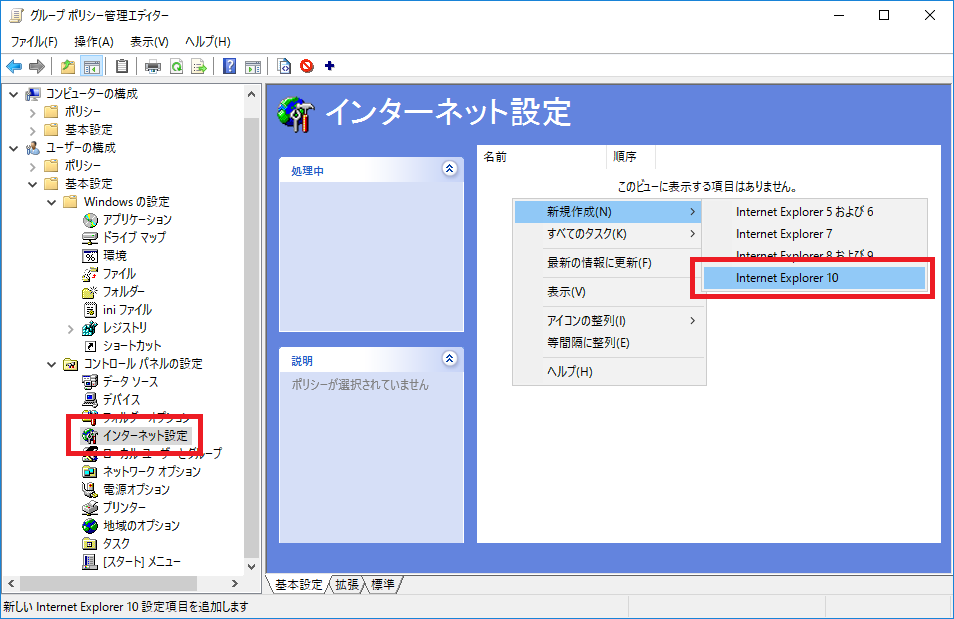

---

**重要**
各設定項目では『緑は配布する』/『赤は配布しない』を表しています。

以下のようにファンクション キーで切り替えることができます。

- 画面上の全項目を有効(全て緑)にする：F5
- 画面上の全項目を無効(全て赤)にする：F8
- 選択中の項目を有効にする(項目のみ緑)：項目選択中にF6
- 選択中の項目を無効にする(項目のみ赤)：項目選択中にF7

設定を配布するつもりのないタブを開いたとき、緑の線や丸印で表示されている項目は、"OK" ボタンで設定で閉じた時点で配布対象となります。
そのため、特に設定を配布する必要のない画面を開いた場合は、『キャンセル後再度編集する』か『F8で配布不可にする』ようお気をつけください。

---

それでは、例としてプロキシの設定を配布する手順を紹介します。

なお、プロキシの設定については [こちらの記事](../LAN-Settings/) で詳しく説明していますが、「よくあるお問い合わせ」に記載のとおりプロキシの情報はバイナリ データを含む複数のレジストリが自動的に同期をとりながら管理されています。
技術的な観点からは、これらのレジストリをまとめて配布することでプロキシの設定を行うことができますが、サポートされる方法としては、基本設定 - インターネット設定を利用することですので、以下の方法での対応をご検討ください。

### インターネット設定の構成手順

1. 上述の手順で設定画面を開きます。

先ほどお伝えしたように『緑は配布する』/『赤は配布しない』を表しています。
今回はプロキシの設定だけを配布しようと考えていますので、F8 キーなどで画面上に見えている『緑』の項目を『赤』に切り替えます。

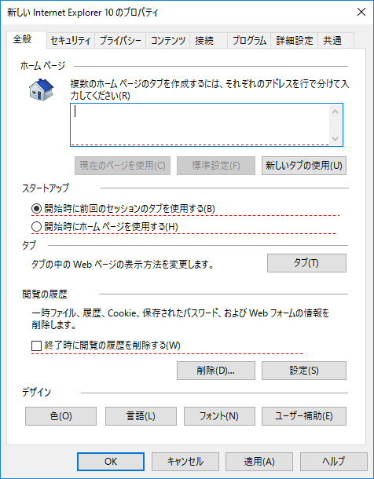

繰り返しになりますが、全般タブを (緑の項目を目にしたあと) このまま "OK" ボタンで閉じると、[スタートアップ] の設定や [終了時に閲覧の履歴を削除する] の設定も配布対象となり、意図しない設定を配布してしまうことになるのでご注意ください。

2. 次に [接続] タブを開きますが、先ほどと同様に『緑』の項目 "プロキシ サーバーを構成する…" を配布つもりがない時は以下のように『赤』に変更しておきます。
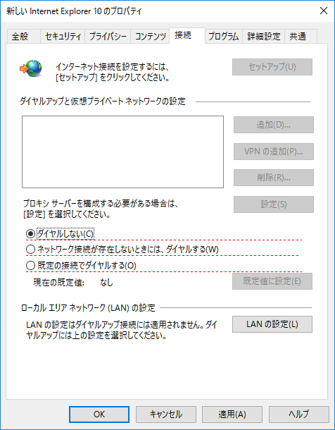

3. [LAN の設定] ボタンをクリックします。
この例では、自動構成スクリプトのアドレスを明示的に指定したものを配布することにします。
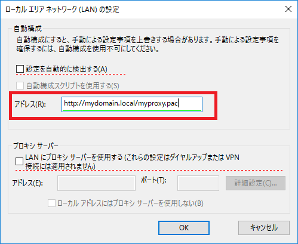
pac の URL を入力し、F6 キーで『緑』にします。
※ [自動構成スクリプトを使用する] を構成する場合はアドレス欄を構成するのみで自動でチェックが入ります。

ここでも、配布しない項目は『赤』にしておくことを忘れずに...

4. 最後に、いま構成した設定をクライアント環境に　"一度だけ"　適用したい場合は、[共通]　タブにおいて [1 度だけ適用し、再適用しない] にチェックを入れます。
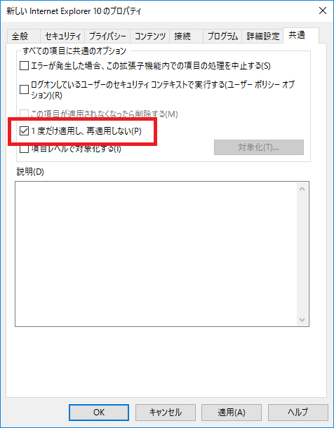

5. [OK] で画面を閉じます。
実際に配布される項目は、グループ ポリシー オブジェクト (GPO) を選択した際に右側に表示される画面の [設定] タブにて確認できます。
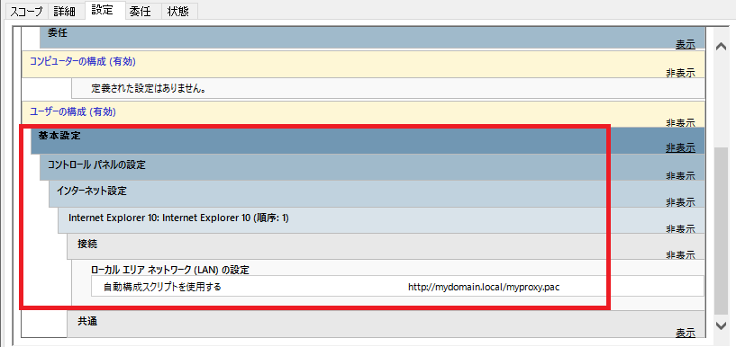

6. クライアントに配布されたプロキシの設定をみてみましょう。
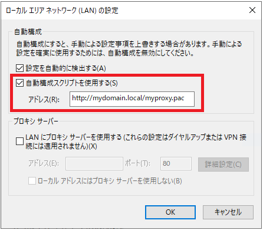

[自動構成スクリプトを使用する] が、手順 3 で設定した pac の URL になっています。
[設定を自動的に検出する] は手順 3 で『赤』にしたのでユーザーが指定した設定が上書きされずに残されています。

---

## レジストリ

次に基本設定でレジストリを配布してみます。
先ほどの『インターネット設定』はインターネット オプションと類似の設定画面を用いて配布項目を構成 / 配布できる非常に便利な項目ですが、セキュリティ ゾーン の URL の配布に対応していません。
(以下の画像のように[サイト]ボタンがグレーアウトしています)

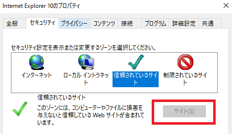

※ 管理用テンプレートにある「サイトとゾーンの割り当て一覧」を構成した場合、ユーザーが手動で設定した内容は無視され、本項目で設定した内容に強制されます。
インターネット オプション上の当該の項目は、グレーアウトした状態でユーザーは変更できず、かつ、本項目で設定したサイト (ドメイン) のみが表示される動作となります。
このため「サイトとゾーンの割り当て一覧」を使用するかどうかは、よく検討してください。

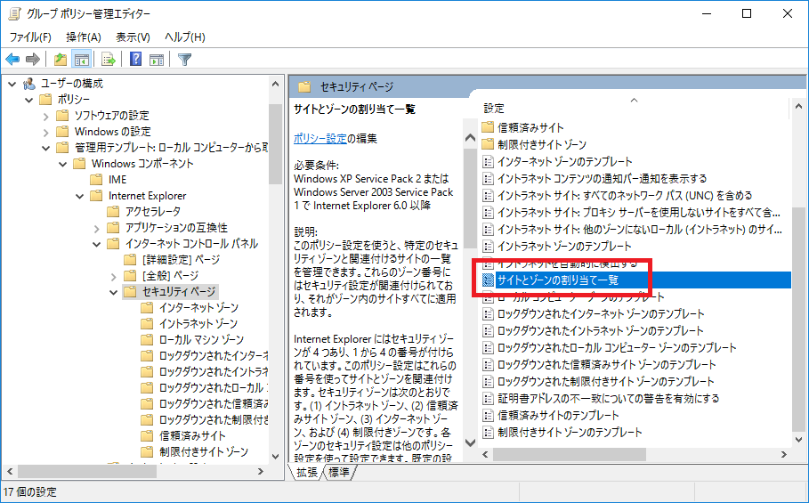

そこで、クライアント環境に対して『ユーザーが任意に変更可能な状態』でセキュリティ ゾーンの URL を配布したい場合は、基本設定の『レジストリ項目』を構成します。

**前提 : セキュリティ ゾーンの URL が登録されるレジストリ**
各セキュリティ ゾーンのレジストリは以下のように登録されます。

場所 : HKCU\Software\Microsoft\Windows\CurrentVersion\Internet Settings\ZoneMap\Domains\トップレベルドメイン\サブドメイン
名前 : プロトコル（http / https）
種類 : REG_DWORD
値 : 1 (ローカル イントラネット) / 2 (信頼済みサイト) / 3 (インターネット) / 4 (制限付きサイト)

例えば、"https://www.microsoft.com" を "信頼済みサイト" として配布した場合は以下のようになります。
場所 : HKCU\Software\Microsoft\Windows\CurrentVersion\Internet Settings\ZoneMap\Domains\microsoft.com\www
名前 : https
種類 : REG_DWORD
値 : 2

---

### 基本設定のレジストリ項目の設定手順

この例では "https://www.microsoft.com" を信頼済みサイトに登録してみます。

※ 誤入力防止のために、登録されるレジストリ キーを直接指定して基本設定を構成する方法としています。
サーバー上で設定ができない場合は、手順 5 でレジストリ ([キーのパス] / [値の名前] / [値の種類] / [値のデータ]) を直接入力します（手順6/7は不要です）。

1. サーバー上の IE を起動し、配布する URL (ここでは https://www.microsoft.com) を信頼済みサイトとして設定します。

2. [グループ ポリシー管理エディター]を開きます。

3. [ユーザーの構成] > [基本設定] > [Windows の設定] > [レジストリ] を選択します。

4. [レジストリ]を右クリックし、[新規作成] > [レジストリ項目] を選択します。

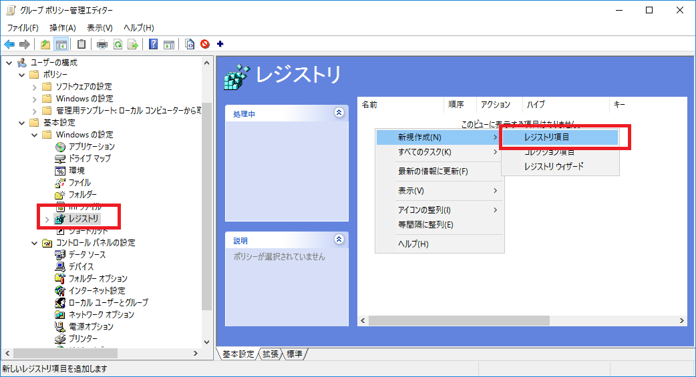

5. 最初に [全般タブ] が開かれます。[アクション] では既定の "更新" を、[ハイブ] は "HKEY_CURRENT_USER" を選択します。
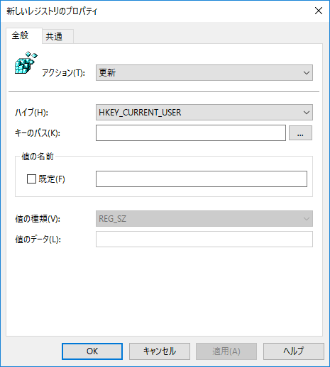

6. [キーのパス] 項目の […] ボタンをクリックし、[レジストリ項目ブラウザー] から予め登録したドメインを選択します。
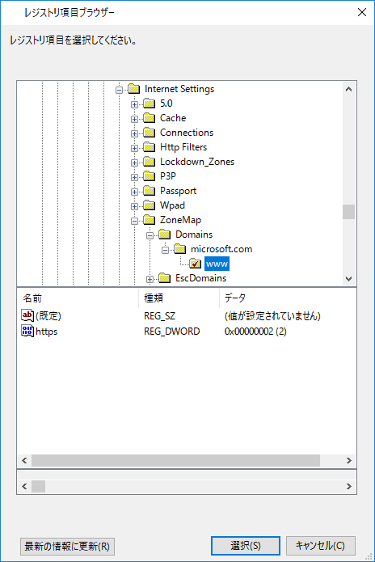

※ この例ではレジストリ キーは以下のとおりです。
HKCU\Software\Microsoft\Windows\CurrentVersion\Internet Settings\ZoneMap\Domains\microsoft.com\www

注意

サーバー OS には『Internet Explorer セキュリティ強化の構成 (IE ESC)』と呼ばれる機能があります。（既定は "有効" です）
IE ESC の有効/無効の状態により、サーバー OS 上の IE では、登録 / 参照するセキュリティ ゾーンのレジストリ パスが異なりますので、レジストリ項目ブラウザーでパスを選択する際にはご注意ください。

有効：HKCU\Software\Microsoft\Windows\CurrentVersion\Internet Settings\ZoneMap\EscDomains
無効：HKCU\Software\Microsoft\Windows\CurrentVersion\Internet Settings\ZoneMap\Domains

なお、IE ESC機能についての詳細は以下をご覧ください。

Internet Explorer セキュリティ強化の構成による Internet Explorer のユーザー操作の変更
https://support.microsoft.com/ja-jp/help/815141/ie-enhanced-security-configuration-changes-browsing-experience

7. 画面下部に表示される [名前] / [種類] / [データ] 欄の [名前] をクリック (反転します) し、[選択] ボタンを押下します。
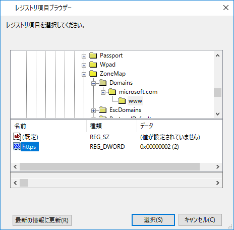

自動的に値が入力されます。
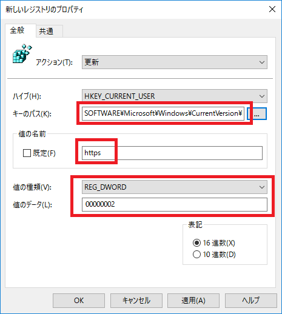
※ 手順 6 をせずに直接入力することも可能ですが、パスや値を間違えないように気を付けてください。

注意

IE ESC が有効な場合、手順 6 で "～～～ZoneMap\EscDomains" のパスを選択していると思いますが、クライアント OS には IE ESC が存在しないため、配布先のパスは "～～～ZoneMap\EscDomains" ではなく "～～～ZoneMap\Domains" にする必要があります。
そのため、自動的に入力されたキーのパスで、EscDomains の部分を Domains に書き換えてください。

8. クライアント環境に "一度だけ" 適用したい場合は、[共通] タブにおいて [1 度だけ適用し、再適用しない] にチェックを入れます。
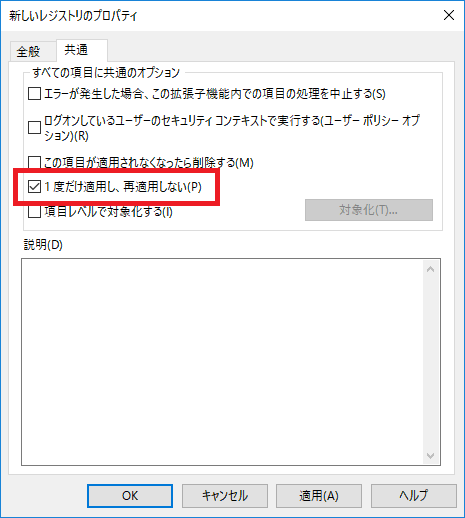

9. [OK] で設定画面を閉じると、作成した設定が登録されます。(ログオン等の GPO 適用のタイミングでクライアント環境に値が反映されるようになります)
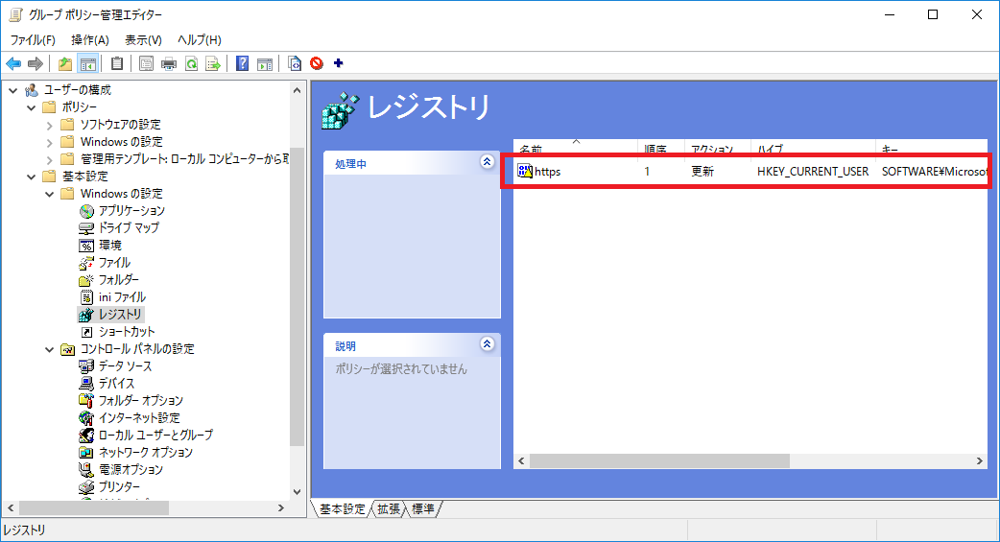

10. 実際に配布される項目は、グループ ポリシー オブジェクト (GPO) を選択した際に右側に表示される画面の [設定] タブにて確認可能です。
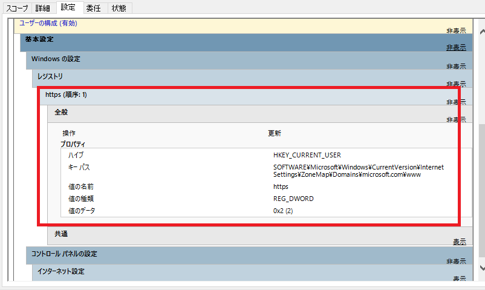

11. クライアントに配布された信頼済みサイトの設定をみてみましょう。
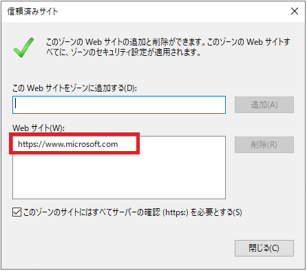

---

## ショートカット

最後に、ショートカットでお気に入りを配布してみます。

1. [グループ ポリシー管理エディター] を開きます。

2. [ユーザーの構成] > [基本設定] > [Windows の設定] > [ショートカット] を選択します。

3. [ショートカット] を右クリックし、[新規作成] > [ショートカット] を選択します。
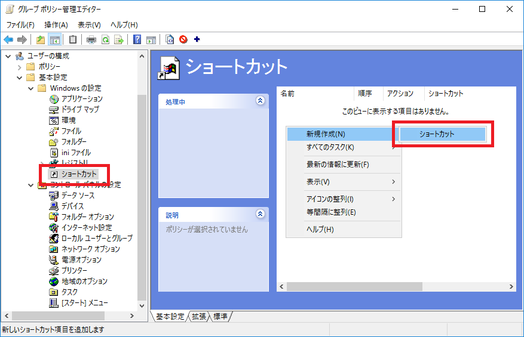

4. 最初に [全般タブ] が開かれます。[アクション] は既定の "更新" のままとします。

[名前] は %userprofile%\Favorites\ <ショートカット名> と入力します。
[ターゲットの種類] は "URL" を、[場所] は "<完全なパスの指定>" を選択します。
[ターゲット URL] に URL (この例では https://www.microsoft.com) を指定します。
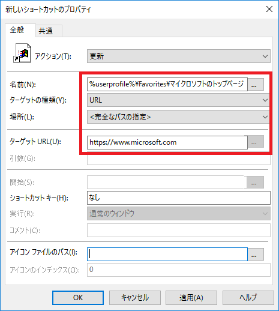

5. [共通タブ] の [ログインしているユーザーのセキュリティ コンテキストで実行する (ユーザー ポリシーオプション)] はそのままにしておきます。
クライアント環境に "一度だけ" 適用したい場合は、[共通] タブにおいて [1 度だけ適用し、再適用しない] にチェックを入れます。
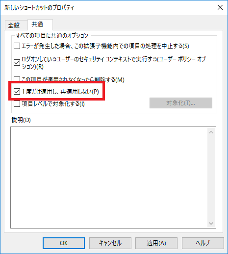

6. [OK] で設定画面を閉じると、作成した設定が登録されます。(ログオン等の GPO 適用のタイミングでクライアント環境に値が反映されるようになります)
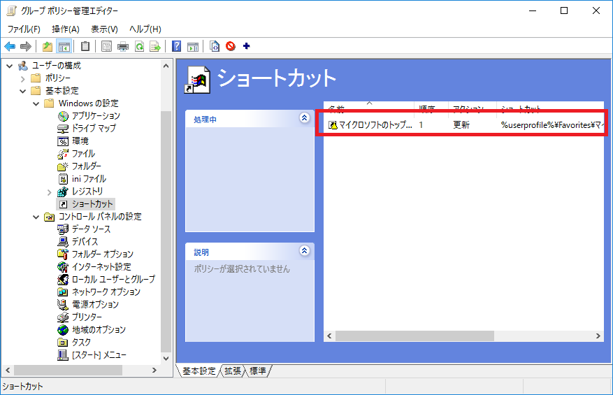

7. 実際に配布される項目は、グループ ポリシー オブジェクト (GPO) を選択した際に右側に表示される画面の [設定] タブにて確認可能です。
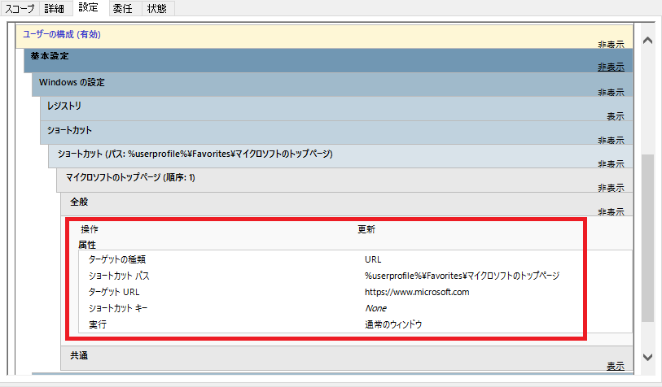

8. クライアントに配布されたお気に入りをみてみましょう。
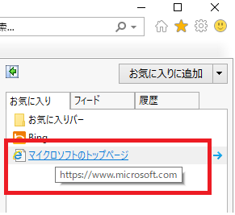
