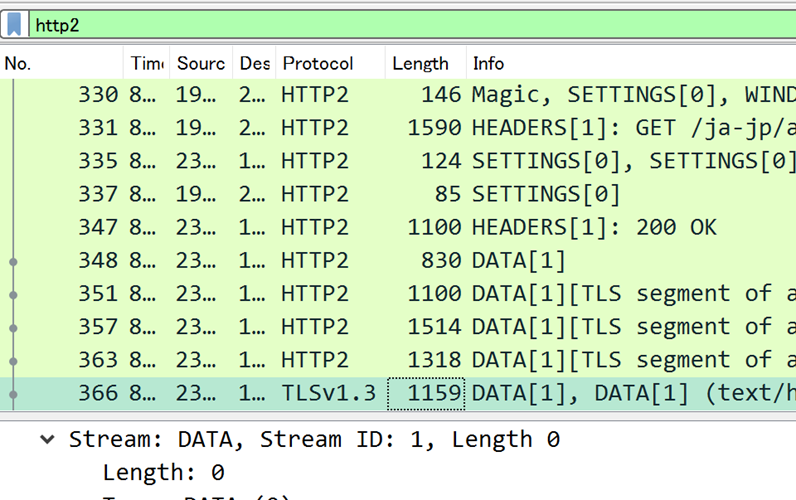
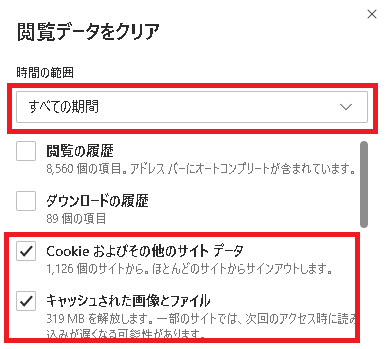

<font color="red">2020/8/7 更新 : ブラウザーのキャッシュが利用されてキャプチャーに記録されないことを避けるために、InPrivate ブラウズをご利用いただく方法をご案内していますが、InPrivate ブラウズをご利用いただけない場合には、ログ取得前にブラウザーのキャッシュをすべて消去してください。</font>
<font color="red">2023/8/28 更新 : 事前準備と環境変数 SSLKEYLOGFILE 追加時について見直しました。</font>


こんにちは。Developer Support Internet チームの大嶋です！

今回は、Chromium ベースの New Microsoft Edge で動作する Web アプリケーションにて、ネットワークに関連する問題が起こった際に、もしかしたら活用できるかもしれない Wireshark を用いたネットワークトレース取得方法の Tips をご紹介いたします。

今回は Wireshark を利用して New Microsoft Edge で動作するクライアントアプリ側にてトレースを取得します。
なお、本方法では HTTPS の通信をキャプチャすることも可能ですが、TLS のバージョンや暗号化の種類等によっては正常に復号できない可能性もあり、全ての HTTPS 通信を分析できるものではありません。

また、この方法については、Chromium ベースではない旧 Microsoft Edge や Internet Explorer では適用できませんのでご注意ください。
また弊社サポート製品ではございませんが、Google Chrome で動作するクライアントアプリのネットワークトレース取得にも現時点では適用可能な方法と存じます。

---

## 0. 前提

- 再現手順が確立されており、Chromium ベースの New Microsoft Edge にてネットワークに関する事象が再現可能

  新しい Microsoft Edge ブラウザーをダウンロード | Microsoft
  https://www.microsoft.com/ja-jp/edge?form=MA13DE&OCID=MA13DE

- Wireshark がダウンロード済み

  Download Wireshark
  https://www.wireshark.org/download.html

---

## 1. 事前準備

1. この Blog の記事の手順や再現するアプリの URL 等をノート帳 (Notepad) で開けるテキストファイル (.txt) などにコピーし開いておきます。

2. New Microsoft Edge や Google Chrome を含めて、全てのブラウザを閉じます。なお、Microsoft Edge で edge://settings/system にあるスタートアップ ブーストがオンの場合は一時的にオフにしてください。このあとの環境変数の設定変更をすぐに反映させるためです。

3. ブラウザ以外のアプリも上記の 1. の手順のテキストファイル以外はすべて閉じます。

4. エクスプローラーにて、キーを保存する任意のフォルダ (C:\tmp) 等を作成しておきます。このフォルダーはこのあとの手順 2 で環境変数 SSLKEYLOGFILE のパスに含めるものです。

<br />
<br />

---

## 2. ユーザー環境変数の設定

ツールバーの検索等から “環境変数を編集” を開き、ユーザー環境変数の “新規” ボタンを
クリックし、”ユーザー変数の編集” にて、以下のように、ユーザー変数の環境変数を設定します。

```
  変数名 : SSLKEYLOGFILE
  変数値 : C:\tmp\ssl.txt
```

<br />
<br />


<br />
<br />

なお、上記で指定したファイル (例 : C:\tmp\ssl.txt) が存在している場合はファイルを削除しておきます。

---

## 3. Wireshark の準備

1. Wireshark を開きます。

2. キャプチャーしたいインターフェース (イーサネット や wifi、vEthernet など) を選択します。

3. 左上の赤い四角ボタンを押し、一度、停止しておきます。


<br />
<br />

---

## 4. New Microsoft Edge による再現とキャプチャ

4-1. New Microsoft Edge を InPrivate ウィンドウで開く。
(タスクバー等の Edge アイコンを右クリックで “新しい InPrivate ウィンドウ” で開けます)
※ InPrivate ブラウズをご利用いただけない場合には、ログ取得前にブラウザーのキャッシュをすべて消去してください。手順は後述の補足をご覧ください。

4-2. Wireshark にて、左上の青いシャークの形をしたボタンを押してキャプチャを開始する。
(保存に関するダイアログが出た場合、”保存せずに続ける” を押しキャプチャを開始する)


<br />

4-3. New Microsoft Edge にて該当のサイトを開き、素早く事象の再現を行う。

4-4. 再現後、すぐに Wireshark に戻り、左上の赤い四角のボタンを再度押し、停止する。

---

## 5. 復号

5-1. Wireshark 上部の [編集] タブを押し、[設定] ボタンを押す。

5-2. 左側の [Protocols] 内の [TLS] を選択する。

5-3. [(Pre)-Master-Secret log filename] の [Browse] ボタンを選択し、C:\tmp\ssl.txt を選択する。

<br />


<br />
<br />

5-4. [OK] ボタンを押し、復号し、キャプチャした内容を確認します。
(これを行うことで、全てではないものの、HTTPS の通信が復号されたキャプチャを見ることが可能となります)

イメージ : 



<br />
<br />

5-5. 必要に応じて、Wireshark 上部の [ファイル] タブを押し、[保存] ボタンから .pcapng 形式で保存します。

5-6. もし私共サポートから本 Blog による情報採取をご依頼された場合は、.pcapng ファイルと C:\tmp\ssl.txt の 2 つ両方とも提供します。

※ なお、Wireshark 自体のツールに関するトラブルシューティングや操作方法等のご質問は 3 rd party 製品となる為、Microsoft のサポートでは承ることができませんのでご了承ください。

---

## 6. 後片付け

2 で追加した環境変数 SSLKEYLOGFILE を削除します。

---

## 補足 : ブラウザーのキャッシュ消去について

1. New Microsoft Edge にて edge://settings/clearBrowserData を開きます。

2. 以下のように設定し、[今すぐクリア] ボタンをクリックします。



---

## 補足 : netsh でのトレース取得方法

New Microsoft Edge の SSLKEYLOGFILE を用いたネットワークトレースの復号について、ネットワークトレースを取得するツール自体は Wireshark ではなく、netsh でも取得は可能です。

私共サポートから  netsh を用いた New Microsoft Edge のトレース取得をご案内することもございますため、以下、簡単にその方法についても記載いたします。

1. 上部の "1. 事前準備" を行います。

2. "2. ユーザー環境変数の設定" を行います。

3. "Wireshark の準備"　は実施せずにスキップ

4. "4. New Microsoft Edge による再現とキャプチャ" は以下の手順で実施します (上部の 5 はスキップします)

4-1. New Microsoft Edge を InPrivate ウィンドウで開く。
(タスクバー等の Edge アイコンを右クリックで “新しい InPrivate ウィンドウ” で開けます)
※ InPrivate ブラウズをご利用いただけない場合には、ログ取得前にブラウザーのキャッシュをすべて消去してください。手順は上述の補足をご覧ください。

4-2. 管理者権限でコマンド プロンプトを開き、次のコマンドを実行し、キャプチャを開始します。

```
　netsh trace start capture=yes maxSize=2000MB
```

4-3. New Microsoft Edge にて該当のサイトを開き、素早く事象の再現を行う。

4-4. 次のコマンドを実行して、キャプチャを停止します (しばらく時間がかかります)

```
　netsh trace stop
```

4-5. もし私共サポートから本 Blog による New Microsoft Edge の netsh の情報採取をご依頼された場合は、トレースの .etl ファイルと .cab ファイルと C:\tmp\ssl.txt の 3 つ両方とも提供します。

(参考) 以下の etl2pcapng を利用すると、.etl を Wireshark で開ける .pcapng　形式に変換できます。

etl2pcapng
https://github.com/microsoft/etl2pcapng

コマンド例

```
etl2pcapng in.etl out.pcapng
```

---

---

## 補足２ : pktmon でのトレース取得方法

Windows 10 の 1809 から pktmon が搭載されており、上述の netsh と同様にネットワークトレースを取ることができます。

1. 上部の "1. 事前準備" を行います。

2. "2. ユーザー環境変数の設定" を行います。

3. "Wireshark の準備"　は実施せずにスキップ

4. "4. New Microsoft Edge による再現とキャプチャ" は以下の手順で実施します (上部の 5 はスキップします)

4-1. New Microsoft Edge を InPrivate ウィンドウで開く。
(タスクバー等の Edge アイコンを右クリックで “新しい InPrivate ウィンドウ” で開けます)
※ InPrivate ブラウズをご利用いただけない場合には、ログ取得前にブラウザーのキャッシュをすべて消去してください。手順は上述の補足をご覧ください。

4-2. 管理者権限でコマンド プロンプトを開き、次のコマンドを実行し、キャプチャを開始します。

```
　pktmon start -c -f client.etl -s 2000 --pkt-size 0
```

4-3. New Microsoft Edge にて該当のサイトを開き、素早く事象の再現を行う。

4-4. 次のコマンドを実行して、キャプチャを停止します

```
　pktmon stop
```

4-5. もし私共サポートから本 Blog による New Microsoft Edge の pktmon の情報採取をご依頼された場合は、トレースの .etl ファイルと C:\tmp\ssl.txt の両方とも提供します。

(参考) 以下のコマンドを実行すると、Wireshark で開ける .pcapng　形式に変換できます。

```
  pktmon pcapng PktMon.etl -o PktMon.pcapng
```

---

以上で今回のご紹介は終了です。

私共では様々なお客様のお問い合わせの内容や状況等に合わせて、お問い合わせ後に、Fiddler や netsh、Wireshark によるトレース、その他の情報等のご提供をお願いしております。また、多くの場合ではクライアント側のキャプチャだけでは原因究明が出来ないことも多々あり、その場合はサーバー側や中間機器等でも情報を採取いただく必要もございます。

今回はその中のあくまで 1 つである Wireshark を用いて、クライアント側のブラウザ New Microsoft Edge で動作する　Web アプリに関するネットワークトレースの取得方法をご紹介いたしました。

今回は以上です。それでは、また次回！
