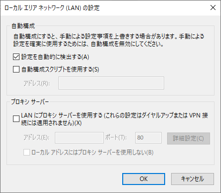
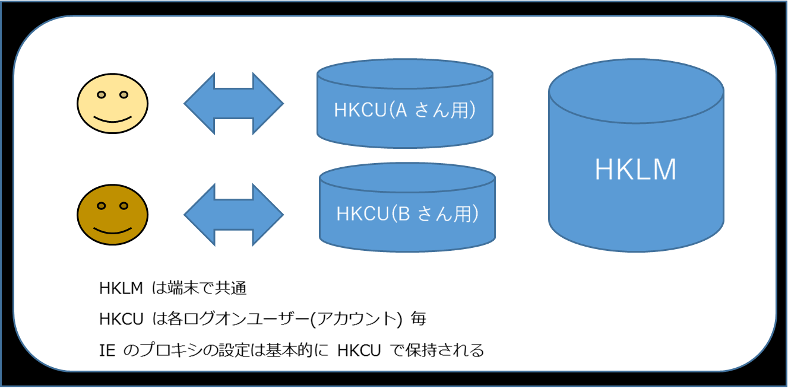

これまで Japan IE Support Team Blog にて公開していた記事のうち、プロキシ関連の記事を整理しました。
長い記事になってしまうため、下記の 4 つの記事に分けています。

[ローカル エリア ネットワーク (LAN) の設定について](../LAN-Settings/)
**(今回の記事) IE からみるプロキシの設定について**
[PAC について](../pac/)
[WPAD について](../wpad/)

---

# IE からみるプロキシの設定について

昨今、インターネットの通信をする機能や製品が多くなっており、「プロキシの設定」についてお問合せを頂く事があります。

プロキシの設定については "インターネットオプション – 接続 – LAN の設定" があります。

この設定「どのように管理されており、アプリケーションがどのようにこの設定を利用するか」ご存知でしょうか？この Blog では以下の目次の内容に沿って、この "プロキシの設定について" の理解を深めて頂ければと思います。

1. はじめに ～ HTTP 通信に利用されるモジュール ～
2. インターネットオプションのプロキシ設定は誰のもの？
3. IE の設定はいつどのように設定値が利用されるのか
4. プロキシの設定についてよくある質問

---

### 1. はじめに ～ HTTP 通信をするモジュール ～
弊社から提供している HTTP の通信を行うモジュールには以下の 2 つがあります。

wininet.dll : 主にデスクトップにログインしたユーザーの権限で動くアプリケーションで利用する事を目的として作成されているモジュール。
winhttp.dll : 主にサービスなどログインをせずバックグラウンドで利用される事を目的として作成されているモジュール。

これらの 2 つのモジュールの API は一般向けにも公開されており、弊社製品以外でも様々なアプリケーションやサービスで利用することができます。

なお、IE はデスクトップでログオンし動作するアプリケーションであり、wininet.dll を利用しています。

---

### 2. インターネットオプションのプロキシ設定は誰のもの？
プロキシの設定を行う際、よく目にするのは "IE の設定" として管理されている以下のインターネットオプションの画面になるとおもいます。

弊社製品では多くの設定情報をレジストリに管理しており、代表的なものに「端末全体で共通した設定」を保持する場所(HKEY_LOCAL_MACHINE/HKLM)と、「ユーザー毎に行われた設定」を保持する場所が (HKEY_CURRENT_USER/HKCU)が存在します。

インターネットオプションで設定したプロキシの設定は、基本的には「ユーザー毎の情報」として HKCU で保存・維持管理されます。

詳細については別の機会に譲りますが、このプロキシ設定は以下のような複数のレジストリキー配下にある複数の値を連動させて設定を管理するようになっています。

キー : HKEY_CURRENT_USER\SOFTWARE\Microsoft\Windows\CurrentVersion\Internet Settings
キー : HKEY_CURRENT_USER\SOFTWARE\Microsoft\Windows\CurrentVersion\Internet Settings\Connections

---

### 3. IE の設定はいつどのように設定値が利用されるのか
上記の IE の設定はもちろん IE が通信を行う際に参照され利用されます。

では、その他のアプリケーションや機能ではどうでしょうか？

IE の管理するインターネットオプションから設定されたプロキシの設定を『利用するか否か』や『どのように利用するか』は各アプリケーションや機能の実装内容に依存します。

例えば、以下のようなシナリオが考えられます。

- IE と同様の通信モジュールである wininet.dll を利用しており、IE で設定された値をそのまま利用している
- wininet.dll は利用しているが、プロキシの設定については独自の実装を行っており別に管理されている
- サービスなど向けに用意されている winhttp.dll を利用しており、IE の設定を参照しその値を利用するようにしている
- winhttp.dll を利用しているがサービスとして動作しており、(IEでプロキシの設定を行った)ユーザーの権限で動作しないため他の設定を (netsh コマンドで設定されたプロキシの値)が参照される
- wininet/winhttp のいずれも利用していないが、プロキシの設定は IE の設定値をレジストリから参照しその情報を利用している
- wininet/winhttp のいずれも利用しておらず、完全に独自の実装が行われている

アプリケーションなどの実装によっては動作シナリオによって動きを柔軟に変化させられるよう上記の中の動作を組み合わせられていることなどもあります。
昨今ではサードパーティ製品も含めインターネットに接続し通信する機能やアプリケーションも増えており、一概に「いつどのように利用されるのか」をお伝えすることができません。

"IE の管理する" プロキシの設定値をどのように参照し利用するかについては個々のアプリケーションなどの実装についての確認をする必要があります。

<u>ご参考</u>

本題とは外れますが、上記に記載する wininet.dll や Winhttp.dll についてより知りたいという場合は、以下のような公開情報もご参照下さい。

Win32 Internet Extensions (WinInet)
https://docs.microsoft.com/en-us/cpp/mfc/win32-internet-extensions-wininet?view=vs-2019

About WinHTTP
https://docs.microsoft.com/en-us/windows/win32/winhttp/about-winhttp

WinINet vs. WinHTTP
https://docs.microsoft.com/en-us/windows/win32/wininet/wininet-vs-winhttp

---

### 4. プロキシの設定についてよくある質問
Q:
システムアカウントで動作するサービスがあるので、このアカウント用に(インターネットオプションからの設定と同等の) IE の設定を行いたいです。できますか？

A:
いいえ。IE の観点ではサポート可能な方法はありません。
前項で記載の通り、プロキシの設定の参照／利用の動作については対象のアプリケーションやサービス内での実装に依存します。
IE 自体はデスクトップなどにログオンしたユーザーが利用することを想定し開発されており、システムアカウントで IE を動作させること自体を想定していません。この為、システムアカウント用のプロキシの設定方法については IE の観点ではサポート可能な適切な方法がないという状況になります。

プロキシの設定の参照動作について、対象の製品／機能の観点での確認が必要な場合、弊社製の場合は対象の機能や製品の観点でのお問合せ、他社製品の場合には提供元へのお問合せなどをご検討下さい。

なお、以下の公開情報の通り IE 内部で利用している通信モジュールの wininet.dll はサービスなどのユーザーがログオンしない状態でのバックグラウンドでの利用はサポートしていません。

[INFO] サービスでは WinInet の使用はサポートされない
https://support.microsoft.com/ja-jp/help/238425/info-wininet-not-supported-for-use-in-services

  
Q:
インターネットオプションのプロキシの設定を変更した場合の影響範囲は？

A:
「影響範囲」の内容が「どの程度の対象のアプリケーションがこの変更により動作が変わる可能性があるのか」であるとした場合、大変恐縮ながら "IE の観点" ではお答えすることができません。

ただし、すべてのアプリケーションや機能において事前に把握し動作を確認することも難しいかと思います。

設定変更に伴い「通信できなくなる」などの弊害が発生しないかについては、テスト環境などでもご確認をいただき特に弊社製品で何かお困りの状況が発生する場合には、専門の担当からのご支援も含め調整をいたしますのでお問い合わせください。
 
  
Q:
インターネットオプションで設定をしたプロキシはいつ利用されますか？

A:
もちろん "IE が利用する" 場合にはこの設定を使って通信しますが、"IE 以外" という観点では直接的が難しい部分です。

様々なアプリケーションやサービスが wininet や winhttp を利用して通信する可能性がありますが、IE で管理する設定を利用するか否か、いつ通信を行うかはそのアプリケーションやサービスに依存する為です。

実際の通信は上記のようなモジュールを利用していなくても、設定値のみ参照し独自のモジュールで実施する通信時に利用することもできます。

普段よく見かけるようでいて、あまり詳細を目にすることのない上記のような情報を何かお困りごとのある場合の検討材料や方向性のご検討にお役立ていただければ幸いです。

