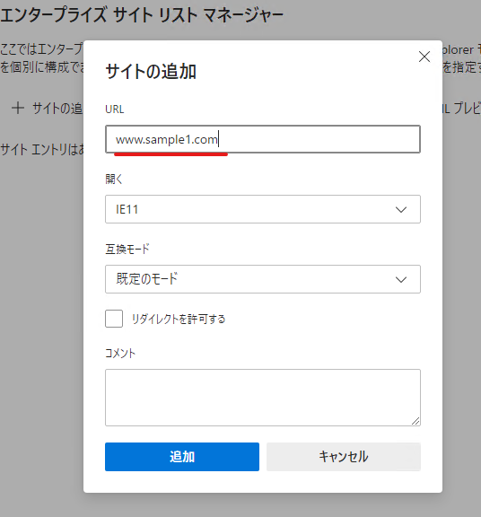

みなさんこんにちは！

Microsoft Edge に組み込まれた サイト リスト マネージャー をご紹介します。

モダンなブラウザーにまだ対応できていないサイトを IE モードで表示させたい場合や、逆にモダンなサイトを IE で開こうとした場合に Edge に転送したい場合などにサイト リスト (.xml) をご利用いただいているかと思います。

これまでサイト リストの作成を支援するために [スタンドアロンの Enterprise Mode Site List Manager というツール](https://docs.microsoft.com/ja-jp/internet-explorer/ie11-deploy-guide/use-the-enterprise-mode-site-list-manager) を提供してきましたが、今後は機能の更新は行われませんので、代わりに Microsoft Edge の組み込みの機能をご利用ください。

この機能は [Microsoft Edge の Enterprise Site List Manager](https://docs.microsoft.com/ja-jp/deployedge/edge-ie-mode-site-list-manager) でもご紹介していますが、今回は画面ショットを交えてご説明していきます。

---

1. Microsoft Edge を起動してアドレスバーに edge://compat/sitelistmanager と入力し開きます。

※ 以下ポリシーを設定することで、「Microsoft Edge の互換性」の画面 (edge://compat/) に「エンタープライズ サイト リスト マネージャー」へのメニューを追加することもできます。

      [コンピューターの構成]or[ユーザーの構成]
       ＋[管理用テンプレート]
        ＋[Microsoft Edge]
      「Enterprise Mode Site List Manager」有効

2. 「サイトの追加」をクリックします。

3. Web サイトの URL を指定します。この時 https:// や http:// などのプロトコルの指定を含めてはいけません。

4. Web サイトを開くブラウザーを選択します。
   IE モードについては [こちらのブログ記事](https://jpdsi.github.io/blog/internet-explorer-microsoft-edge/ie-mode-faq/) をご参考ください。

5. Web サイトに合わせて互換モードを選択します。

6. 必要に応じてコメントを記載します。そして「追加」をクリックして Web サイトをエンタープライズ サイト リストに追加します。

7. 必要に応じて「XML プレビュー」を使用してエクスポート時に作成される XML の内容を事前に確認します。

また、フィルターを利用してどの URL を追加したか確認できますのでこちらもご活用ください。

8. Web サイトの追加や確認が完了したら、XML ファイルに書き出すため「XML にエクスポート」をクリックします。

9. バージョン番号とファイル名を指定し、XML ファイルに「エクスポート」します。
XML ファイルはダウンロード フォルダーに保存されます。

以上の方法でサイト リストを作成することができます。
会社に管理された環境で新たなソフトウェアをインストールできない場合でもこの方法ならサイト リストを作成できますね。

---

<参考情報>

[エンタープライズ モードとエンタープライズ モード サイト一覧](https://docs.microsoft.com/ja-jp/internet-explorer/ie11-deploy-guide/what-is-enterprise-mode)

[エンタープライズ モード スキーマ v.2 ガイダンス](https://docs.microsoft.com/ja-jp/internet-explorer/ie11-deploy-guide/enterprise-mode-schema-version-2-guidance)
