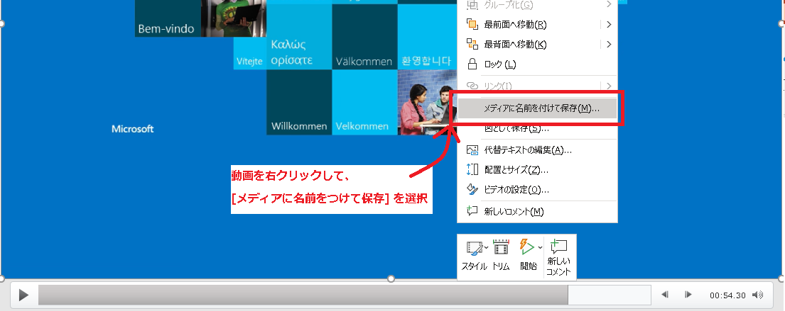

# Enterprise Mode Site List (サイトリスト) のお問い合わせの調査に必要な基本的なログ情報について<!-- omit in toc -->

みなさん、こんにちは!

サイトにアクセスした際に、Edge や IE モードなど指定したブラウザでページを表示させるために設定する **Enterprise Mode Site List (以下、サイトリスト)** に関連して、
「設定したのにうまく反映されない」、「IE モードで開かれない」、
「Edge で開かれず IE ブラウザで開かれる」など、様々なお問い合わせをいただいております。

サイトリストに関するお問い合わせは多岐に及び、その原因もお客様の環境によって様々なため、画一的にこのログを取得すれば原因がわかるということはございません。

ただし、お問い合わせいただいた最初の段階で、**問題の把握** のためによく取得をご依頼するログがあるため、それを **サイトリストの調査に必要な基本的なログ情報** として以下おまとめいたしました。

事象が発生した際は、こちらをご参考にログ採取を行い、弊社サポートチームにご提供いただけますと幸いです。

調査を加速させ、翻ってお客様の問題解決までの時間を短くすることが可能になります。  
(※ なおあくまでもこちらのログ取得は **問題の把握** のために利用するものであり、こちらのログをいただくことによって **原因究明** を保証するものではございません。状況によってはさらなるログ採取をご依頼することがございますので、予めご了承ください。)

## 目次<!-- omit in toc -->

- [取得いただきたいログについて](#取得いただきたいログについて)
  - [事前準備が必要なものについて](#事前準備が必要なものについて)
    - [IEDigest のインストール](#IEDigest-のインストール)
- [1 事象に関連する発生頻度や発生するサイトなど関連情報](#1-事象に関連する発生頻度や発生するサイトなど関連情報)
- [2 PowerPoint の動画撮影またはステップ記録ツールによる事象の記録](#2-PowerPoint-の動画撮影またはステップ記録ツールによる事象の記録)
  - [PowerPoint の動画撮影による事象の記録方法](#PowerPoint-の動画撮影による事象の記録方法)
  - [PSR による事象の記録方法](#PSR-による事象の記録方法)
  - [PSR の事前設定](#PSR-の事前設定)
- [3 IEDigest によるログ取得](#3-IEDigest-によるログ取得)
- [4 edge://policy による Edge に関連するポリシー設定の取得](#4-edge-policy-による-Edge-に関連するポリシー設定の取得)
- [5 edge://compat/iediagnostic による サイトリストに関連するポリシー設定の取得](#5-edge-compat-iediagnostic-による-サイトリストに関連するポリシー設定の取得)
- [6 サイトリストとして設定されている .xml のスキーマファイル](#6-サイトリストとして設定されている-xml-のスキーマファイル)
  - [edge://compat/iediagnostic で検索する場合](#edge-compat-iediagnostic-で検索する場合)
  - [GPO で検索する場合](#GPO-で検索する場合)
  - [レジストリで検索する場合](#レジストリで検索する場合)
- [アップロードについて](#アップロードについて)

## 取得いただきたいログについて

取得いただきたいログは以下 6 点ございます。

- 1 事象に関連する発生頻度、発生するサイトなど関連情報
- 2 PowerPoint 等による動画撮影、または、ステップ記録ツールによる事象の記録
- 3 IEDigest による適用されている GPO や レジストリ設定
- 4 edge://policy による Edge に関連するポリシー設定
- 5 edge://compat/iediagnostic による サイトリストに関連するポリシー設定
- 6 サイトリストとして設定されている .xml のスキーマファイル

それぞれについて説明を行います。

### 事前準備が必要なものについて

取得いただきたいログの中で、唯一事前にインストールが必要なのが IEDigest です。

#### IEDigest のインストール

IEDigest のインストーラを以下の URL よりダウンロードします。

- IEDigest : https://aka.ms/iedigest

リンクをクリックすると自動的にダウンロードが開始されます。

端末によってはダウンロード時に以下のような警告が表示される場合がございますが、その場合は [もっと見る] からダウンロードを行ってください。 

ダウンロード後、以下の画像のように 2 つのファイルが確認できる場合は、iedigest.exe を利用します。

iedigest.exe を起動すると、最初はライセンスに同意するかと表示されますので、[Agree] を選択します。

事前準備はこれにて完了です。

## 1 事象に関連する発生頻度や発生するサイトなど関連情報

我々サポートチームが調査をするにあたって、「何をお客様が問題として捉えているのか、そして理想的な状態はどのようなものか」を明確に把握する必要がございます。  

そのため、弊社にご連絡をする際には以下の 2 択の質問についてメモ帳などにコピーペーストを行い、それぞれの質問についてお答えしたファイルをご提供いただけますと幸いです。

- 事象が発生する頻度は 100% か [YES/NO]
- 複数のサイトにおいて事象は発生するか、それとも単一のサイトにおいてのみ事象は発生するか [複数/単一]
- 事象はユーザー全員で発生するか、複数のユーザーで発生するか、それとも単一のユーザーのみか [全員/複数/単一 複数の場合はその共通項]
- 事象が発生するサイトのパスはどこか [http\[s\]\://\<path\>]
- 事象が発生せず問題なくサイトリスト通り読み込めるサイトはあるか [YES/NO, YES の場合はサイトのパス http\[s\]\://\<path\ ]
- いつから発生したか [XXXX/XX/XX XX:XX]
- 事象が発生した以前にはサイトリストを設定できていたのか [YES/NO]
- 事象が発生する以前と以後でなにか設定を行ったか [YES/NO, YES の場合はその詳細]

特に時間については非常に重要なため、できる限り正確な日時をお答えください。まとめたら **CheckList.txt** などの名前としてテキストファイルを保存します。

## 2 PowerPoint の動画撮影またはステップ記録ツールによる事象の記録

我々サポートチームが調査をするにあたって、「何をお客様が問題として捉えているのか、そして理想的な状態はどのようなものか」を明確に把握する必要がございます。  
そのために事象を動画などで記録することをお願いしております。

そのために利用するのが、**PowerPoint による動画撮影** または **ステップ記録ツール (以下、PSR)** です。

### PowerPoint の動画撮影による事象の記録方法

- PowerPoint を開きます。
- [記録] を表示し、[画面録画] を選択します。  
  

- ( ※もし [記録] がない場合は、[挿入] から [画面録画] を選択します。)
  

- 領域の選択が行えますので、こちらでディスプレイ全体または対象のブラウザやアプリケーションなどを選択し、録画ボタンを押します。 (なおオーディオは状況に応じてオフにしていただいても構いません)  
  

- 録画が開始されるので、事象を再現させその一部始終を記録します。
- 記録が終わりましたら [Windows] + [Shift] + [Q ボタン] を押すか、画面中央上部にマウスカーソルをあわせ ■ のマークをクリックして停止を行ってください。  
  

- PowerPoint に動画が貼り付けられておりますので、 [メディアに名前を付けて保存] を選択し、保存した動画ファイルをご提供ください。  
  

  ※ なお PowerPoint がない場合は [Windows] + [G ボタン] でゲームバーを開き、そこから動画取得する方法もございますが、今回は詳述いたしませんので、PowerPoint がインストールされていない環境などではそちらをお調べいただき動画撮影をいただけますと幸いです。  
  ※ もしくはディスプレイ自体をスマホなどで撮影頂く方法でも構いません。(その場合は視認がしやすいように画質に注意してください。)

### PSR による事象の記録方法

事象の確認のために、原則として動画撮影を推奨しておりますが、同時に以下の PSR による画面キャプチャによるログ取得もいただけますと幸いです。

### PSR の事前設定

PSR は、画面上の操作（クリックなど）の際にスクリーンショットが記録されるものです。これにより問題発生時の GUI 上での動作を確認することができます。

- [スタート ボタン] を開き、"PSR" と入力し、[ステップ記録ツール] を開きます。  
- 起動しましたら、右端の [?] マークをクリックし、[設定] を開きます。  
- [保存する最新の取り込み画像数] に "999" を設定します。  
  

- [記録の開始] をクリックします。  
  

- 一連の操作を行い、現象を再現させます。  
  
  ※ 事象が発生しても例えばその画面を操作をせずに取得を終了すると事象発生時の画面状態が記録されません。操作が可能な場合、事象発生後の画面上でクリックをする／ウィンドウを動かす、閉じるなどの操作を実施頂き、事象再現時の状況のスクリーンショットが取得されるようにしたうえで以降の記録の停止を実施ください。  
  PSR によってキャプチャが行われる際は、以下の画像の様に赤い丸が出現し、フェードアウトします。 こちらが生成されていない場合は記録がされていませんのでご注意ください。  
  

- [記録の停止] をクリックします。  
  

- "名前を付けて保存" のダイアログが表示されますので、ファイルの保存場所、ファイル名を指定し、 [保存] をクリックします。

ステップ記録ツールの取得方法について: https://support.microsoft.com/ja-jp/help/22878/windows-10-record-steps

## 3 IEDigest によるログ取得

- ダウンロードした IEDigest のツール (iedigest.exe) をダブルクリックします。  
- [Reports] タブの [Create report] をクリックすると、ログが取得されます。  
  

- [Compare] タブに出力先設定がございますので、保存されたログをご提供ください。
  

## 4 edge://policy による Edge に関連するポリシー設定の取得

- Edge を起動し、アドレスバーに edge://policy と入力します。
- [JSON にエクスポート] を行い、その出力した JSON ファイルをご提供ください。
  

## 5 edge://compat/iediagnostic による サイトリストに関連するポリシー設定の取得

- Edge を起動し、 edge://compat/iediagnostic と入力します。
- [診断データをエクスポート] という項目の [Export] をクリックし、出力される .xml ファイルをご提供ください。  
  

  ※ なお、ダウンロードの際に Edge による警告が表示される場合もございますが、こちらは無視し […] から [保存] を選択ください。

## 6 サイトリストとして設定されている .xml のスキーマファイル

現在サイトリストとして参照されている .xml のスキーマファイルを edge://compat/iediagnostic または GPO またはレジストリから参照し、取得します。

### edge://compat/iediagnostic で検索する場合

- edge://compat/iediagnostic のページの下部に存在する[エンタープライズ モード IE の Web サイト一覧を使用する (IE ポリシー)] と、
[エンタープライズ モード サイトリストを構成する(Edge ポリシー)] のいずれかまたは両方において指定されているサイトリストをご提供ください。  
   

### GPO で検索する場合

いずれかの 2 箇所を確認します

- [コンピューターの構成 または ユーザーの構成] - [管理用テンプレート] - [Microsoft Edge] - [エンタープライズ モード サイト一覧を構成する] に存在する、.xml ファイルのパス  
  
- [コンピューターの構成 または ユーザーの構成] - [管理用テンプレート] - [Windows コンポーネント] - [Internet Explorer] - [エンタープライズ モード IE の Web サイト一覧を利用する] に 存在する .xml ファイルのパス

### レジストリで検索する場合

いずれかの 2 箇所を確認します

- キー (HKEY_LOCAL_MACHINE または HKEY_CURRENT_USER)\Software\Policies\Microsoft\Edge の InternetExplorerIntegrationSiteList の バリューとして存在する .xml のファイルパス
  

- キー (HKEY_LOCAL_MACHINE または HKEY_CURRENT_USER)\SOFTWARE\Policies\Microsoft\Internet Explorer\Main\EnterpriseMode に存在する SiteList のバリューとして存在する .xml のファイルパス
  

※ それぞれにおいて異なるサイトリストが指定されている場合もございますので、指定されているすべての .xml ファイルをご提供ください。

## アップロードについて

以上のログ採取により以下 6 点のログ取得をいただきました。

- 事象に関連する発生頻度、発生するサイトなど関連情報についての CheckList.txt ファイル
- 動画ファイルまたは PSR の.zip ファイル
- IEDigest の .zip ファイル
- edge://policy の .json ファイル
- edge://compat/iediagnostic の .xml ファイル
- サイトリストの .xml スキーマファイル

**これらすべてのログを 1 つの .zip ファイルにまとめ、ファイル名として 202X-XX-XX-SiteList-Basic-Log-Collection.zip のような形にしてご提供ください。**
