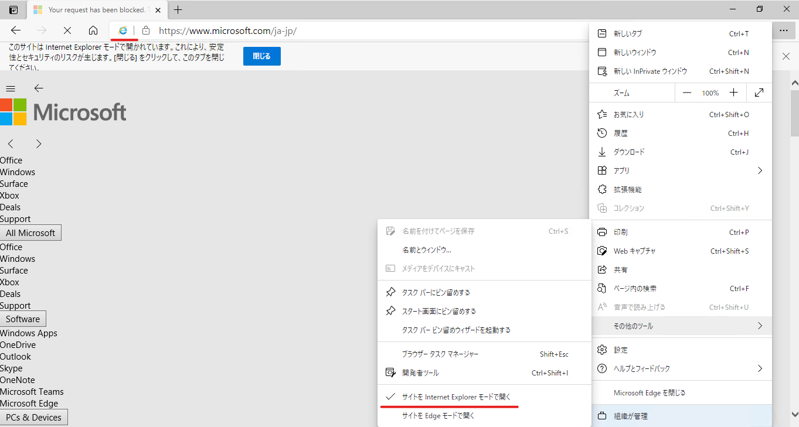
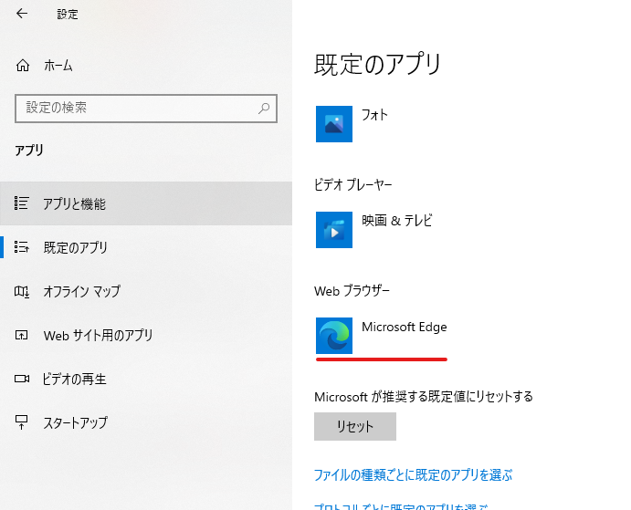

[2023/02/20 更新: IE ショートカット アイコン](#2023-02-20-appendix)

---

みなさんこんにちは！

Microsoft は Internet Explorer (以降 IE) デスクトップ アプリのサポートを 2022 年 6 月 15 日に終了することをブログで公開しました。

[Internet Explorer は Microsoft Edge へ – Windows 10 の Internet Explorer 11 デスクトップアプリは 2022 年 6 月 15 日にサポート終了](https://blogs.windows.com/japan/2021/05/19/the-future-of-internet-explorer-on-windows-10-is-in-microsoft-edge/)

[Internet Explorer 11 デスクトップ アプリのサポート終了へ! IE モードへの移行を進めましょう!](https://jpdsi.github.io/blog/internet-explorer-microsoft-edge/internet-explorer-app-end-of-support/)

[(PDF) Microsoft Edge + Internet Explorer モード Getting Started ガイド](https://46c4ts1tskv22sdav81j9c69-wpengine.netdna-ssl.com/wp-content/uploads/prod/sites/31/2021/05/a837387e3dad2d655f50ebc0e83c8edf.pdf)

これに伴い IE から Microsoft Edge (以降 Edge) やモダン ブラウザーへの移行を本格的に検討される方が多くなることを予想しています。
そんなことで今日は IE から Microsoft Edge へのステージ別移行ガイドライン的なブログを書きたいと思います。

2029 年をターゲットに 4 つのステージでやるべきことをご紹介します。
最終的にはステージ 4 の "IE が不要な状態" となることが望ましいので、本記事を参考に Edge への移行を進めてみてください。

---

## 目次

- [ステージ 1. IE を既定のブラウザーとして運用している](#ステージ-1-IE-を既定のブラウザーとして運用している)
- [ステージ 2. Edge には移行しているが、IE モードと IEデスクトップ アプリ (スタンドアロンの IE11) を併用している](#ステージ-2-Edge-には移行しているが、IE-モードと-IE-デスクトップ-アプリ-スタンドアロンの-IE11-を併用している)
- [ステージ 3. IE モードを部分的に利用しているが IE デスクトップ アプリはもう使っていない](#ステージ-3-IE-モードを部分的に利用しているが-IE-デスクトップ-アプリはもう使っていない)
- [ステージ 4. Edge に完全に移行できており、IE モード含めて完全に必要ない](#ステージ-4-Edge-に完全に移行できており、IE-モード含めて完全に必要ない)

---

## ステージ 1. IE を既定のブラウザーとして運用している

#### 1-1. IE に依存しているサイトの洗い出し
まずは IE に依存しているサイトがどれくらいあるのか、また、具体的にどのサイトが依存しているのか洗い出します。
1 ページずつ確認することが確実ですが、Enterprise Site Discoveryを使えば従来のドキュメント モードを使用しているサイトを機械的に検出することができます。

[Enterprise Site Discovery ステップ バイ ステップ ガイド](https://docs.microsoft.com/ja-jp/deployedge/edge-ie-mode-site-discovery)

#### 1-2. IE モードでの動作確認
洗い出したサイトが Edge の IE モードで動作するかテストを行い、動作しない場合は改修もしくは Microsoft のサポートに問い合わせてください。
なお、簡易的に IE モードでの動作を確認したい場合は IE モード テスト機能が便利です。
この機能は IE モードをタブ全体で有効にし、そのタブで開いたサイトはすべて IE モードになる機能です。
以下 2 つのポリシーを設定することで「…」->「その他のツール」->に「サイトを Internet Explorer モードで開く」のメニューが追加され使用できるようになります。

※ 参考 [IE モードでの表示をテストしたい](https://jpdsi.github.io/blog/internet-explorer-microsoft-edge/ie-mode-faq/#IE-%E3%83%A2%E3%83%BC%E3%83%89%E3%81%A7%E3%81%AE%E8%A1%A8%E7%A4%BA%E3%82%92%E3%83%86%E3%82%B9%E3%83%88%E3%81%97%E3%81%9F%E3%81%84)

      [コンピューターの構成] or [ユーザーの構成]
       ＋[管理用テンプレート]
        ＋[Microsoft Edge]
      「Internet Explorer 統合を構成する」有効にし IE モードを選択
      「Internet Explorer モードのテストを許可」有効

なお [こちら](https://youtu.be/XPFx4A32npk) で動画による解説もしていますのでぜひご覧ください。

#### 1-3. サイト一覧 (.xml) ファイルの作成とポリシーの設定
IE モードで問題なくサイトが動作することを確認したら、サイト一覧ファイルに IE モードで表示したいサイトを定義します。
サイト一覧の作り方については [こちらの記事](https://jpdsi.github.io/blog/internet-explorer-microsoft-edge/edge-ie-mode-site-list-manager/) がありますので参考にしてみてください。
そして以下のポリシーを使って、作成したサイト一覧の取得先を設定します。

      [コンピューターの構成] or [ユーザーの構成]
       ＋[管理用テンプレート]
        ＋[Microsoft Edge]
       「エンタープライズ モード サイト一覧を構成する」有効にしサイト一覧の取得先を設定
       (例 http://contoso.com/Sitelist.xml)
        ※IE モードを使うためには以下ポリシー設定も必要なので合わせて有効にします。
       「Internet Explorer 統合を構成する」有効にし IE モードを選択

#### 1-4. 既定のブラウザーの変更
上記までの作業でサイト表示に IE が必要なサイトは IE モードで表示できるになったのでもう IE は必要ありません。
既定のブラウザーを IE から Edge に変更します。

なお、既定のブラウザーの変更はグループ ポリシーで配布することも可能です。詳細は [こちら](https://docs.microsoft.com/ja-jp/deployedge/edge-default-browser) をご覧ください。

- [目次へ](#目次)
---

## ステージ 2. Edge には移行しているが、IE モードと IE デスクトップ アプリ (スタンドアロンの IE11) を併用している
#### 2-1. IE デスクトップ アプリ依存サイトの洗い出し
すでに IE モードを使用している環境であれば、何等かの理由で Edge or IE モード で動作しないサイトを止むを得ず IE デスクトップ アプリで表示させているのだと思います。
まずは、なにが IE デスクトップ アプリから IE モードへの移行を妨げているのかを整理し、IE デスクトップ アプリ依存のサイトの改修を進めます。

#### 2-2. サイト一覧へのサイトの追加
IE デスクトップ アプリ依存のサイトの改修が完了したら、既存のサイト一覧に改修したサイトを追加して IE デスクトップ アプリではなく IE モードで表示するよう定義してください。

- [目次へ](#目次)
---

## ステージ 3. IE モードを部分的に利用しているが IE デスクトップ アプリはもう使っていない
IE モードがあれば IE デスクトップ アプリは必要ない状況になったら、IE デスクトップ アプリの起動を無効化する以下のポリシーを配布し、IE モードのみを使用できるようにします。

        [コンピューターの構成] or [ユーザーの構成]
       ＋[管理用テンプレート]
        ＋[Windows コンポーネント]
         ＋[Internet Explorer]
      「Internet Explorer 11 をスタンドアロンブラウザーとして無効にする」

参考 : [Internet Explorer 11 を無効にする](https://docs.microsoft.com/ja-jp/deployedge/edge-ie-disable-ie11)

2023/02/20 更新  
\<補足\>  
当該のポリシーを有効にした場合、IE を起動しようとすると Edge にリダイレクトされ、且つ、IE のショートカット アイコンは削除されます。  
なお、更新プログラム適用することでスタート メニューの Windows アクセサリに IE のアイコンが再度表示される場合がございます。  
再表示されたアイコンをクリックしても Edge にリダイレクトされ、且つ、IE のショートカット アイコンは再度削除されます。

- [目次へ](#目次)
---

## ステージ 4. Edge に完全に移行できており、IE モード含めて完全に必要ない
IE に依存したサイトはすべて改修され、すべてのサイトを Edge で動作させることができるようになったら、IE デスクトップ アプリの機能を無効化することを検討してください。
「Windows の機能の有効化または無効化」にて「Internet Explorer 11」のチェックを外すことで無効化できます。
以下ドキュメントの「Method 1 - Use Control Panel (client systems only)」でも紹介しているので参考にしてください。

[Disable Internet Explorer on Windows](https://docs.microsoft.com/en-us/troubleshoot/browsers/disable-internet-explorer-windows) (機械翻訳版は [こちら](https://docs.microsoft.com/ja-jp/troubleshoot/browsers/disable-internet-explorer-windows) )

- [目次へ](#目次)
---

IE デスクトップ アプリから IE モードへの移行にあたり、互換性の問題でお困りの場合は [こちらの FAQ No.17](https://blogs.windows.com/japan/2021/05/19/internet-explorer-11-desktop-app-retirement-faq/) にある App Assure のご利用をご検討ください。

<参考リンク>
[(PDF) Microsoft Edge + Internet Explorer モード Getting Started ガイド](https://46c4ts1tskv22sdav81j9c69-wpengine.netdna-ssl.com/wp-content/uploads/prod/sites/31/2021/05/a837387e3dad2d655f50ebc0e83c8edf.pdf)

- Edge のポリシーを使うための情報
    * [Windows 用に Microsoft Edge を構成する](https://docs.microsoft.com/ja-jp/deployedge/configure-microsoft-edge)

- Edge ポリシーの一覧
    * [Microsoft Edge ブラウザー ポリシーに関するドキュメント](https://docs.microsoft.com/ja-jp/deployedge/configure-microsoft-edge)

- IE モードについて
    * [Internet Explorer モードとは](https://docs.microsoft.com/ja-jp/deployedge/edge-ie-mode)
    * [(動画) Microsoft Edge で IE モードを使ってみよう (IT 管理者向け)](https://youtu.be/XPFx4A32npk)

- エンタープライズ モード サイト一覧について
    * [エンタープライズ モードとエンタープライズ モード サイト一覧 (IT 担当者向け Internet Explorer 11)](https://docs.microsoft.com/ja-jp/internet-explorer/ie11-deploy-guide/what-is-enterprise-mode)

    * [ファイルと Enterprise Mode Site List Manager (スキーマ v.2) を使ってエンタープライズ モード サイト一覧に複数のサイトを追加する (IT 担当者向け Internet Explorer 11)](https://docs.microsoft.com/ja-jp/internet-explorer/ie11-deploy-guide/add-multiple-sites-to-enterprise-mode-site-list-using-the-version-2-schema-and-enterprise-mode-tool)

それでは皆様またの機会に！