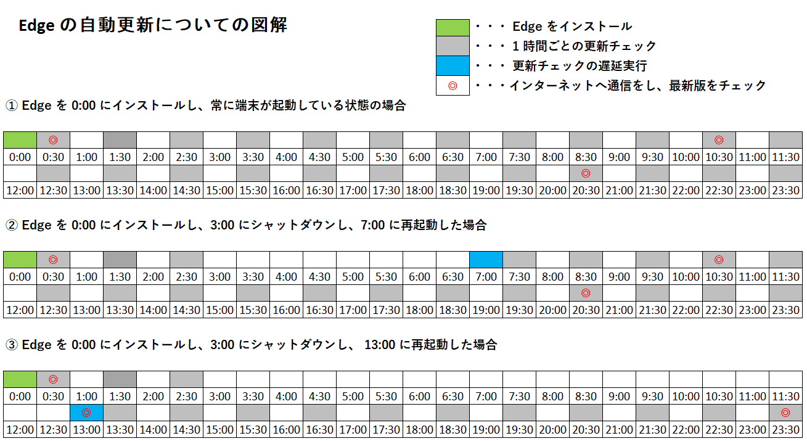

更新履歴:  
[2023/01/06 更新: UpdateDefault によって WebView2 の更新制御が行えなくなった旨](#2023-01-06-appendix)  
[2023/04/27 更新: WebView2 Runtime の強制インストールについては Install ポリシーの設定が必要な旨](#2023-04-27-appendix)
2023/09/21 更新:ドメイン管理外の端末での更新制御方法について加筆

---

みなさんこんにちは。日本マイクロソフトの IE/Edge サポートチームです。

今回はお客様からよくいただく 「Edge の更新制御」と 「Edge のサポート範囲」のお話をお伝えしたいと思います。

通常 Microsoft Edge (以下 Edge と呼称) は自動更新によってバージョンが管理されます。

端末にはEdge の更新管理用モジュールがインストールされています。モジュールはインターネットを経由してアップデートを確認すると、最新のファイルをダウンロードして、Edge を自動的に更新します。これにより常に最新版の Edge をご利用いただけます。

一方で、ユーザーによっては、ダウンロードによるネットワークの帯域負荷への問題や、ストレージが圧迫されるなどの問題から、アップデートを制御したいというご要望をいただくことがあります。また、勝手にアップデートがされることが運用上困ってしまう方もいらっしゃるかと思います。

こうしたアップデートに関する弊社のデザインとお客様のご要望のミスマッチはなぜ起きるのか。それは弊社の Edge に関するセキュリティへの考え方に理由があります。

## 目次<!-- omit in toc -->
- [なぜ Edge は自動更新を行うのか](#%E3%81%AA%E3%81%9C-Edge-%E3%81%AF%E8%87%AA%E5%8B%95%E6%9B%B4%E6%96%B0%E3%82%92%E8%A1%8C%E3%81%86%E3%81%AE%E3%81%8B)
- [Edge の種類と Edge のサポート範囲について](#Edge-%E3%81%AE%E7%A8%AE%E9%A1%9E%E3%81%A8-Edge-%E3%81%AE%E3%82%B5%E3%83%9D%E3%83%BC%E3%83%88%E7%AF%84%E5%9B%B2%E3%81%AB%E3%81%A4%E3%81%84%E3%81%A6)
  - [Edge のバージョンの読み方について](#Edge-%E3%81%AE%E3%83%90%E3%83%BC%E3%82%B8%E3%83%A7%E3%83%B3%E3%81%AE%E8%AA%AD%E3%81%BF%E6%96%B9%E3%81%AB%E3%81%A4%E3%81%84%E3%81%A6)
  - [Edge のバージョン アップデートの頻度について](#Edge-%E3%81%AE%E3%83%90%E3%83%BC%E3%82%B8%E3%83%A7%E3%83%B3-%E3%82%A2%E3%83%83%E3%83%97%E3%83%87%E3%83%BC%E3%83%88%E3%81%AE%E9%A0%BB%E5%BA%A6%E3%81%AB%E3%81%A4%E3%81%84%E3%81%A6)
    - [Extended Stable 版について](#Extended-Stable-%E7%89%88%E3%81%AB%E3%81%A4%E3%81%84%E3%81%A6)
    - [最新版の確認方法](#%E6%9C%80%E6%96%B0%E7%89%88%E3%81%AE%E7%A2%BA%E8%AA%8D%E6%96%B9%E6%B3%95)
- [Edge のインストールおよび更新制御方法について](#Edge-%E3%81%AE%E3%82%A4%E3%83%B3%E3%82%B9%E3%83%88%E3%83%BC%E3%83%AB%E3%81%8A%E3%82%88%E3%81%B3%E6%9B%B4%E6%96%B0%E5%88%B6%E5%BE%A1%E6%96%B9%E6%B3%95%E3%81%AB%E3%81%A4%E3%81%84%E3%81%A6)
  - [1) Edge のインストールの制御](#1-Edge-%E3%81%AE%E3%82%A4%E3%83%B3%E3%82%B9%E3%83%88%E3%83%BC%E3%83%AB%E3%81%AE%E5%88%B6%E5%BE%A1)
  - [2) WebView2 のインストールの制御](#2-WebView2-%E3%81%AE%E3%82%A4%E3%83%B3%E3%82%B9%E3%83%88%E3%83%BC%E3%83%AB%E3%81%AE%E5%88%B6%E5%BE%A1)
  - [3) Edge の更新制御](#3-Edge-%E3%81%AE%E6%9B%B4%E6%96%B0%E5%88%B6%E5%BE%A1)
  - [4) WebView2 の更新制御](#4-WebView2-%E3%81%AE%E6%9B%B4%E6%96%B0%E5%88%B6%E5%BE%A1)
- [Edge の更新タイミングの制御方法について](#Edge-%E3%81%AE%E6%9B%B4%E6%96%B0%E3%82%BF%E3%82%A4%E3%83%9F%E3%83%B3%E3%82%B0%E3%81%AE%E5%88%B6%E5%BE%A1%E6%96%B9%E6%B3%95%E3%81%AB%E3%81%A4%E3%81%84%E3%81%A6)
  - [Edge の更新の流れについて](#Edge-%E3%81%AE%E6%9B%B4%E6%96%B0%E3%81%AE%E6%B5%81%E3%82%8C%E3%81%AB%E3%81%A4%E3%81%84%E3%81%A6)
- [具体的な更新タイミングについての制御方法について](#%E5%85%B7%E4%BD%93%E7%9A%84%E3%81%AA%E6%9B%B4%E6%96%B0%E3%82%BF%E3%82%A4%E3%83%9F%E3%83%B3%E3%82%B0%E3%81%AB%E3%81%A4%E3%81%84%E3%81%A6%E3%81%AE%E5%88%B6%E5%BE%A1%E6%96%B9%E6%B3%95%E3%81%AB%E3%81%A4%E3%81%84%E3%81%A6)
  - [5) アップデートできない時間帯を指定する方法](#5-%E3%82%A2%E3%83%83%E3%83%97%E3%83%87%E3%83%BC%E3%83%88%E3%81%A7%E3%81%8D%E3%81%AA%E3%81%84%E6%99%82%E9%96%93%E5%B8%AF%E3%82%92%E6%8C%87%E5%AE%9A%E3%81%99%E3%82%8B%E6%96%B9%E6%B3%95)
  - [6) 更新チェック後の次の更新チェックまでの最低猶予時間を指定する方法](#6-%E6%9B%B4%E6%96%B0%E3%83%81%E3%82%A7%E3%83%83%E3%82%AF%E5%BE%8C%E3%81%AE%E6%AC%A1%E3%81%AE%E6%9B%B4%E6%96%B0%E3%83%81%E3%82%A7%E3%83%83%E3%82%AF%E3%81%BE%E3%81%A7%E3%81%AE%E6%9C%80%E4%BD%8E%E7%8C%B6%E4%BA%88%E6%99%82%E9%96%93%E3%82%92%E6%8C%87%E5%AE%9A%E3%81%99%E3%82%8B%E6%96%B9%E6%B3%95)
    - [UpdateSuppressed および AutoUpdateCheckPeriodMinutes が設定された場合](#UpdateSuppressed-%E3%81%8A%E3%82%88%E3%81%B3-AutoUpdateCheckPeriodMinutes-%E3%81%8C%E8%A8%AD%E5%AE%9A%E3%81%95%E3%82%8C%E3%81%9F%E5%A0%B4%E5%90%88)
  - [7) Edge の自動更新用のモジュールの更新の制御](#7-Edge-%E3%81%AE%E8%87%AA%E5%8B%95%E6%9B%B4%E6%96%B0%E7%94%A8%E3%81%AE%E3%83%A2%E3%82%B8%E3%83%A5%E3%83%BC%E3%83%AB%E3%81%AE%E6%9B%B4%E6%96%B0%E3%81%AE%E5%88%B6%E5%BE%A1)
- [その他更新の制御について](#%E3%81%9D%E3%81%AE%E4%BB%96%E6%9B%B4%E6%96%B0%E3%81%AE%E5%88%B6%E5%BE%A1%E3%81%AB%E3%81%A4%E3%81%84%E3%81%A6)
  - [MECM/SCCM および WSUS による Edge の更新制御](#MECM-SCCM-%E3%81%8A%E3%82%88%E3%81%B3-WSUS-%E3%81%AB%E3%82%88%E3%82%8B-Edge-%E3%81%AE%E6%9B%B4%E6%96%B0%E5%88%B6%E5%BE%A1)
  - [ドメイン管理外の端末での更新制御方法について](#%E3%83%89%E3%83%A1%E3%82%A4%E3%83%B3%E7%AE%A1%E7%90%86%E5%A4%96%E3%81%AE%E7%AB%AF%E6%9C%AB%E3%81%A7%E3%81%AE%E6%9B%B4%E6%96%B0%E5%88%B6%E5%BE%A1%E6%96%B9%E6%B3%95%E3%81%AB%E3%81%A4%E3%81%84%E3%81%A6)

## なぜ Edge は自動更新を行うのか

***

弊社の Microsoft Edge をはじめ Google Chrome などブラウザは常にセキュリティの脅威にさらされています。大多数のユーザーが利用するアプリケーションの脆弱性を悪用すれば、大多数のユーザーに影響を与えることができます。ブラウザ アプリケーションは絶えずこうしたセキュリティの脆弱性の対応を行い、修正したアプリケーションを提供する必要があります。

しかし一方で、ブラウザは莫大なユーザーが利用していることから、すべてのユーザーが適切に脆弱性を確認して修正済みの Edge を利用してくれるとは限りません。

例えば、問題が発生する度に弊社サイトにアクセスしてダウンロードを行い、インストーラーを起動しなければアップデートされないとするといかがでしょうか。

どのように脆弱性が危険であるかをお伝えしたとしても、すべてのユーザーがそうしたアップデートをおこなうとは限りません。

そのため、ユーザーに Edge を管理する負担をかけないようにするために、ユーザーの端末には Edge の更新管理用モジュールを常駐させ、モジュールが新しい Edge を確認したら自動更新するようにデザインをしています。

こちらによりユーザーは手動でインストールをすることなく、問題があれば勝手にブラウザが更新されることで、安全なブラウザ体験をお楽しみいただくことができるようになっています。

こうしたデザインは弊社としても脆弱性の対応やブラウザの不具合の修正などを簡単に行うことができ、開発を効率的に進めることができます。

## Edge の種類と Edge のサポート範囲について

***

Edge は以下 5 つのチャネルとしてご提供しています。

- Stable 版
- Extended Stable 版
- Beta 版
- Dev 版
- Canary 版

通常ユーザーにご利用いただくのは Stable 版か Extended Stable になります。

例: Stable 版が 100 とすると、Beta が 101、Dev が 102、Canary が 103 になり、Stable が 1 繰り上がれば基本的にすべてのバージョンが 1 繰り上がります。

チャネルの詳細については以下をご確認ください:  
https://docs.microsoft.com/en-us/deployedge/microsoft-edge-channels  
※ なお全てのドキュメントは英語版のリンクを掲載しております。 /en-us/ の記述を /ja-jp/ にすることで日本語版のドキュメントを参照可能です。日本語版は自動翻訳のかつアップデートが遅れていることがあります。最新の情報を確認するためには英語版のドキュメントをご参考いただけますと幸いです。

このうち、**弊社サポートにてお問い合わせを承ることができるのは Stable 版, Extended Stable 版 と Beta 版になります**。

Beta 版、Dev 版、Canary 版などは Stable 版に実装するための機能について先行実験を行い、不具合の修正や機能要望を試すために利用しております。

**弊社としてサポートする Edge のバージョンは Stable 版においては “最新版のバージョン - 2” まで**になります。 **Extended Stable 版においては “最新の偶数バージョン - 2”まで**がサポート範囲となっています。

サポート ライフサイクルの詳細については以下をご確認ください:  
https://docs.microsoft.com/en-us/deployedge/microsoft-edge-support-lifecycle

例1 最新版が 101 のときのサポート範囲:

- Stable 版は 99, 100, 101 までがサポート範囲
- Extended Stable 版は 101 が奇数であることからもっとも近い偶数の 100  を基準として、98, 100 がサポート範囲

例2 最新版が 102 のときのサポート範囲:

- Stable 版は 100, 101, 102 までがサポート範囲
- Extended Stable の場合は 100, 102 がサポート範囲

### Edge のバージョンの読み方について

***

Edge のバージョン管理は以下の Chromium のドキュメントと同様です。

AA.BB.CC.DD のバージョンについて、AA は「メジャー バージョン」、BB は「マイナー バージョン」、CC は「ビルド バージョン」、DD は 「パッチ バージョン」となります。

https://www.chromium.org/developers/version-numbers/

Edge のバージョン 100.0.1185.44 を例にして考えますと、メジャー バージョンは 100, マイナーバージョンは 0, ビルド バージョンは 1185, パッチ バージョンは 44 になります。

### Edge のバージョン アップデートの頻度について

***

Stable 版 のメジャー バージョン アップデートは **約 4 週間** になります。この “約” という点に注意が必要です。あくまでも目安であり多少のズレが発生する場合があります。

リリース スケジュールの詳細については以下をご確認ください:  
https://docs.microsoft.com/en-us/deployedge/microsoft-edge-release-schedule

Stable 版を考えますと、101 のバージョンが登場してから、その 101 のサポートが終了するのは、104 が出てくる際になります。
よって 101 が登場してから、約 4 週間後に 102, その約 4 週間後に 103, その約 4 週間後に 104 が出てきますので、**通常 Edge の最新版として提供されるバージョンのサポート期限は 約 12 週間 となります**。

**あくまでも “約” であり、Edge のサポート条件は最新版 - 2 までとご理解ください**。

パッチ バージョン アップデートより細かい頻度で行われますが、こちらはサポート範囲には関係しません。

準備が整えば提供され、提供されたバージョンについてはリリース ノートに記述されます。

Stable 版のリリースノート:  
https://docs.microsoft.com/en-us/deployedge/microsoft-edge-relnote-stable-channel

#### Extended Stable 版について

Extended Stable 版では 最新版の 102 が出ると、その 102 は次に 106 が出るまではサポート範囲になるため、約 16 週間がサポート範囲になります。Stable 版よりも約 4 週間ほどサポート期限が長くなります。

#### 最新版の確認方法

最新版がいつリリースされるのかなどの情報は以下 2 つをご確認いただけますと幸いです。

リリーススケジュール:  
https://docs.microsoft.com/en-us/deployedge/microsoft-edge-release-schedule

Stable 版のリリースノート:  
https://docs.microsoft.com/en-us/deployedge/microsoft-edge-relnote-stable-channel

## Edge のインストールおよび更新制御方法について

***

**Edge の更新を制御できるのは、対象がドメイン管理下の端末のみになります**。  
※ ここにおいてのドメイン管理下とは、Intune や Active Directory, Azure Active Directory の制御下であることを指します。

ドメイン環境においてはドメインを管理する管理者がおり、端末へのグループ ポリシーやレジストリの配布を行えることから、管理者において適切に Edge のバージョンも管理されることが想定されるため、Edge の更新管理を行うことが可能です。

一方で、**ドメイン管理下外の端末においては弊社としてサポートしている更新制御の方法はございません**。

こちらは前述いたしましたように、ユーザーが Edge の更新を止めてしまうことにより脆弱性が放置されるなどのリスクを避けるためになります。

ドメイン管理下においては弊社がサポートしている更新管理方法は以下のグループ ポリシー またはレジストリの設定になります。  
※ MECM/SCCM や WSUS による制御については後述します。  
※ **ドメイン管理外の端末においては下記の設定を行っても、設定は無視され自動更新されますのでご注意ください**。  

- 1) Edge のインストールの制御
- 2) WebView2 のインストールの制御
- 3) Edge の更新の制御
- 4) WebView2 の更新の制御
- 5) 更新タイミングについての制御
- 6) Edge の自動更新用のモジュールの更新の制御

### 1) Edge のインストールの制御

***

すべてのチャネルを制御する場合は、以下の InstallDefault のポリシーによって制御可能です。

InstallDefault (インストールの既定の動作を許可する):  
https://docs.microsoft.com/en-us/deployedge/microsoft-edge-update-policies#installdefault

- パス: HKEY_LOCAL_MACHINE\SOFTWARE\Policies\Microsoft\EdgeUpdate
-	値の名前: InstallDefault
-	値の種類: REG_DWORD

詳細:

- 値: 0 / インストールが無効になっています
- 値: 1 / 常にインストールを許可する(推奨)

個々それぞれのチャネルを制御するには以下の Install ポリシーによって制御可能です。

Install (インストールを許可する):  
https://docs.microsoft.com/ja-jp/deployedge/microsoft-edge-update-policies#install

-	パス: HKEY_LOCAL_MACHINE\SOFTWARE\Policies\Microsoft\EdgeUpdate
-	キーの値:
-	(Stable): Install{56EB18F8-B008-4CBD-B6D2-8C97FE7E9062}
-	(Beta): Install{2CD8A007-E189-409D-A2C8-9AF4EF3C72AA}
-	(Dev): Install{0D50BFEC-CD6A-4F9A-964C-C7416E3ACB10}
-	(Canary): Install{65C35B14-6C1D-4122-AC46-7148CC9D6497}
-	値の種類: REG_DWORD

詳細:

-	値: 0 / インストールが無効になっています
-	値: 1 / 常にインストールを許可する (推奨)
-	値: 4 / 常にコンピューター全体へのインストールが許可されますが、ユーザーごとのインストールは許可されません。
-	値: 5 / 強制インストール (コンピューター全体)
-	値: 6 / 強制インストール (ユーザーごと)

### 2) WebView2 のインストールの制御

***

以下で設定可能です。

Install (インストール (WebView)):  
https://docs.microsoft.com/en-us/deployedge/microsoft-edge-update-policies#install-webview

-	パス: HKEY_LOCAL_MACHINE\SOFTWARE\Policies\Microsoft\EdgeUpdate
-	キーの値: Install{F3017226-FE2A-4295-8BDF-00C3A9A7E4C5}
-	値の種類: REG_DWORD

詳細:  

-	値: 0 / インストールが無効になっています
-	値: 1 / 常にインストールを許可する (推奨)
-	値: 4 / 常にコンピューター全体へのインストールが許可されますが、ユーザーごとのインストールは許可されません。
-	値: 5 / 強制インストール (コンピューター全体)

<a name="2023-04-27-appendix"></a>
※ 2023-04-27 追記：  
WebView2 Runtime に依存するアプリケーションが増えてきたこともあり、弊社は過去 [Unmanaged 環境においての WebView2 Runtime の強制展開](https://blogs.windows.com/msedgedev/2022/06/27/delivering-the-microsoft-edge-webview2-runtime-to-windows-10-consumers/) および [Managed 環境においての WebView2 Runtime の強制展開](https://blogs.windows.com/msedgedev/2022/12/14/delivering-microsoft-edge-webview2-runtime-to-managed-windows-10-devices/) をアナウンスしてきました。

Managed 環境においても、2023年 1 月 16 日以降においては WebView2 Runtime が自動配布される可能性があるため、もし当該の強制展開を抑止したい場合は、ドキュメントにございますように **Install{F3017226-FE2A-4295-8BDF-00C3A9A7E4C5} のポリシーを 0 (無効) にしていただく必要がございますのでご注意ください**。(なお Microsoft としては Install を無効化し WebView2 Runtime がインストールされない場合、WebView2 Runtime に依存するアプリケーションが強制終了したり、起動できないといった問題を引き起こすこともあるため推奨はしておりません。)

```
As a follow-up step to the Consumer rollout, we are also announcing that after January 16th, 2023, we will start rolling out WebView2 Runtime to managed/domain-joined devices with Windows 10 April 2018 Update or later.
(…中略…)
You may also opt out of the rollout by configuring the WebView2 install policy, although in most cases we do not recommend so as disabling WebView2 Runtime installation may severely impair the normal usage of WebView2 applications such as Outlook on your tenants’ device.
```

なお、<span style="color: red">**当該の Install{F3017226-FE2A-4295-8BDF-00C3A9A7E4C5} を 0 に設定した場合は、WebView2 Runtime のオフライン インストーラー、オンライン インストーラーにかかわらずインストールのブロックが行われますのでご注意ください。**</span>

どのような方法を取るにせよ <span style="color: red">**WebView2 Runtime をインストールしたい場合は、当該のポリシーを 1 (有効) または未設定にしていただく必要がございます。**</span>

また、インストールのポリシーを無効化しても、すでにインストールされている環境の更新を制御するものではございません。その場合は Update{F3017226-FE2A-4295-8BDF-00C3A9A7E4C5} による制御が必要になりますので、ご注意ください。

2023-04-27 追記終了  

### 3) Edge の更新制御

***

すべてのチャネルを制御する場合は以下の UpdateDefault のポリシーによって制御可能です。

UpdateDefault (更新ポリシーのオーバーライドの既定値):  
https://docs.microsoft.com/en-us/deployedge/microsoft-edge-update-policies#updatedefault

-	パス: HKEY_LOCAL_MACHINE\SOFTWARE\Policies\Microsoft\EdgeUpdate
-	値の名前: UpdateDefault
-	値の種類: REG_DWORD

詳細:

-	値: 0 / 更新を無効にする (すべてのチャネルのアップデートを停止します。)
-	値: 1 / 常に更新を許可する (推奨) (通常の自動更新になります。)
-	値: 2 / 手動更新のみ (edge://settings/help による手動更新のみ可能になります。)
-	値: 3 / 自動サイレント更新のみ (Edge の更新モジュールによる自動更新のみ可能になります。)

個々それぞれのチャネルを制御するには以下の Update ポリシーによって制御可能です。

Update (更新ポリシーのオーバーライド):  
https://docs.microsoft.com/en-us/deployedge/microsoft-edge-update-policies#update

-	パス: HKEY_LOCAL_MACHINE\SOFTWARE\Policies\Microsoft\EdgeUpdate
-	値の名前:
-	(Stable): Update{56EB18F8-B008-4CBD-B6D2-8C97FE7E9062}
-	(Beta): Update{2CD8A007-E189-409D-A2C8-9AF4EF3C72AA}
-	(Dev): Update{0D50BFEC-CD6A-4F9A-964C-C7416E3ACB10}
-	(Canary): Update{65C35B14-6C1D-4122-AC46-7148CC9D6497}

詳細:

-	値: 0 / 更新を無効にする (すべてのチャネルのアップデートを停止します。)
-	値: 1 / 常に更新を許可する(推奨) (通常の自動更新になります。)
-	値: 2 / 手動更新のみ (edge://settings/help による手動更新のみ可能になります。)
-	値: 3 / 自動サイレント更新のみ (Edge の更新モジュールによる自動更新のみ可能になります。)

### 4) WebView2 の更新制御

***

以下で設定可能です。

Update (WebView) (更新ポリシーのオーバーライド):  
https://docs.microsoft.com/en-us/deployedge/microsoft-edge-update-policies#update-webview

-	パス: HKEY_LOCAL_MACHINE\SOFTWARE\Policies\Microsoft\EdgeUpdate
-	キーの値: Update{F3017226-FE2A-4295-8BDF-00C3A9A7E4C5}
-	値の種類: REG_DWORD

詳細:

-	値: 0 / 更新を無効にする
-	値: 1 / 常に更新を許可する

<a name="2023-01-06-appendix"></a>
※ 2023-01-06 追記：  
なお、Edge の更新用モジュールである MicrosoftEdgeUpdate.exe は、これまで UpdateDefault を 0 にしていた場合 Edge ブラウザーだけではなく WebView2 の更新も抑止しましたが、1.3.171.39 以降は UpdateDefault を 0 に設定していてもWebView2 の更新を抑止しなくなりました。

WebView2 の更新を抑止したい場合は上記の Update{F3017226-FE2A-4295-8BDF-00C3A9A7E4C5} を 0 に設定ください。

2023-01-06 追記終了  

## Edge の更新タイミングの制御方法について

***

Edge に関連するものとして以下 3 つがあげられます。それぞれについて更新タイミングを制御することができます。

-	① Edge アプリケーション (Stable 版、Beta 版など)
-	② WebView2 runtime
-	③ Edge の更新管理用モジュール (実体としては MicrosoftEdgeUpdate.exe やそれに関連するサービスやタスク)

### Edge の更新の流れについて

***

① Edge や ② WebView2 runtime をインストールすると、同時に ③ Edge の更新管理用モジュールがインストールされます。

この更新管理用モジュールは MicrosoftEdgeUpdate.exe や関連するタスク、サービスなど様々なもので構成されております。Windows の更新管理が Windows Update によって管理がされるのと同様に、Edge についてはこの更新管理用モジュールによって管理が行われます。

※ よくある誤解として Edge のバージョンアップデートを Windows Update で行う方法がわからないというご質問をいただくことがあります。 Edge の更新管理用モジュールと Windows Update とは直接的な関係はありません。 Windows Update を契機として Edge のバージョンが上がるということは基本的にありませんのでご安心ください。

流れは以下の様になります。

-	Edge の更新管理用モジュールがインストールされると、関連するタスクによって通常 1 時間置きに更新チェックフラグが ON になっているかを確認し、ON の場合は次に進みます。—1⃣  
-	フラグが ON の場合は実際にインターネット上に公開されている Edge のサーバーへ更新チェックを行い、次に進みます。—2⃣
-	サーバーに新しい Edge や WebView2 runtime、Edge の更新管理用モジュール(MicrosoftEdgeUpdate.exe) が存在し、現在のバージョンがそれよりも古い場合はダウンロードを行い、自動的にアップデートを行います。 —3⃣

なお以下が補足になります。

- 2⃣ のチェックを行うと、後述する UpdatesSuppressed の指定された時間または既定であれば 595 分間更新チェックフラグを OFF にします。(つまり 2⃣ まで到達すると、約 10 時間は 1⃣ から 2⃣ に進めません。)
- 更新チェックは端末起動時やユーザーログイン時などに遅延実行される場合がございます。判定条件としては 1 時間起きの更新チェックがシャットダウン等を理由として行われない場合などですが、詳細は内部仕様につき開示しておりません。

以下イメージのための図解になります。



※ 上記の図は正常な端末での動作であり、異常な状態の端末では図通りの更新チェックが行われない可能性もございます。  
※ インストール後 30 分に更新チェックが起きる想定ですが、実際は Edge をインストール後 0~59 分の間の一意のタイミングです。  
※ 遅延実行によって、端末を一斉に同じ時間に起動することによりダウンロードが多重で発生し、ドメイン内のネットワーク帯域が圧迫される可能性はあります。
※ Edge はどのような状況でも Edge に関連するモジュールを最新に保つために様々な仕組みによって重層的に制御しているため、必ずしも上記の図解通りの更新を行わない可能性もございます。

## 具体的な更新タイミングについての制御方法について

***

グループ ポリシーやレジストリによって 1⃣ のフラグの条件を詳細に設定できます。

### 5) アップデートできない時間帯を指定する方法

***

UpdatesSuppressed は、1⃣ のフラグ チェックについて、ある時間帯は必ず OFF にすることができます。

UpdatesSuppressed (自動更新チェックを停止する 1 日あたりの時間帯):  
https://docs.microsoft.com/en-us/deployedge/microsoft-edge-update-policies#updatessuppressed

-	パス: HKEY_LOCAL_MACHINE\SOFTWARE\Policies\Microsoft\EdgeUpdate
-	値の名前:
-	UpdatesSuppressedDurationMin
-	UpdatesSuppressedStartHour
-	UpdatesSuppressedStartMin
-	値の種類: REG_DWORD

値の範囲:  

- UpdatesSuppressedDurationMin : 1 ~ 960 / (アップデートさせない分数を指定します)
- UpdatesSuppressedStartHour : 0 ~ 23 / (OFF にする開始時間の Hour を設定します)
- UpdatesSuppressedStartMin : 0 ~ 59 / (OFFを にする開始時間の Minutes を設定します)

### 6) 更新チェック後の次の更新チェックまでの最低猶予時間を指定する方法

***

AutoUpdateCheckPeriodMinutes は、2⃣ が実行されてからどれくらいの間 1⃣ のフラグを OFF にするかを指定できます。

AutoUpdateCheckPeriodMinutes (自動更新チェック期間のオーバーライド):  
https://docs.microsoft.com/en-us/deployedge/microsoft-edge-update-policies#autoupdatecheckperiodminutes

-	パス: HKEY_LOCAL_MACHINE\SOFTWARE\Policies\Microsoft\EdgeUpdate
-	値の名前: AutoUpdateCheckPeriodMinutes
-	値の種類: REG_DWORD

詳細:

- 値の範囲: 1 ~ 960 (最大で 16 時間になります)

#### UpdateSuppressed および AutoUpdateCheckPeriodMinutes が設定された場合

UpdatesSuppressed および AutoUpdateCheckPeriodMinutes 両方が設定されている場合は、それぞれの条件に適合したフラグが ON のときのみ更新が可能です。

端末がシャットダウンしていた場合は、端末が起動した場合やユーザーがログインした場合などに 1⃣ が遅延実行されます。

例えば、毎日 X 時 20 分のタイミングで 1⃣ のフラグ チェックが行われる場合において、端末が 0:00 にシャットダウンし 10:40 に端末を起動した場合、10:40 のタイミングで 1⃣ が行われます。その後 X 時 20 分のタイミングで 1⃣ のフラグ チェックが行われます。

遅延実行は Edge のインストールがシステム インストールの場合は端末起動後に、ユーザー インストールの場合はログイン後に行われますが、詳細については公開していません。

あくまでも UpdatesSuppressed および AutoUpdateCheckPeriodMinutes によって更新タイミングの制御が可能であるとご理解いただけますと幸いです。

※ 上記の遅延実行によって、例えば端末を一斉に同じ時間に起動することによりダウンロードが多重で発生し、ドメイン内のネットワーク帯域が圧迫される可能性はあります。

その場合は端末が一斉に起動するタイミングにおいては UpdatesSuppressed をご設定いただくことで、瞬間的なダウンロードを抑え、それ以降の 1⃣ のチェックは端末によってバラバラですので、負荷をならすことができます。

関連して、Edge の新しいバージョンは段階的なロールアウトによってご提供をしています。すべての端末で一度にアップデート可能な状態になるわけではありません。前提として端末に徐々にアップデートが提供され負荷分散がなされるように配慮しています。

段階的なロールアウトについて:  
https://docs.microsoft.com/en-us/deployedge/microsoft-edge-update-progressive-rollout

### 7) Edge の自動更新用のモジュールの更新の制御

***

AutoUpdateCheckPeriodMinutes は通常入力しうる値の範囲は 1 ~ 960 ですが、こちらに 0 をご設定いただくと、Edge および WebView2 および Edge の自動更新用のモジュール の中心である MicrosoftEdgeUpdate.exe 自体の更新はすべて停止いたします。

(※ edge://settings/help より Edge の UI 上から手動で更新は可能です。手動更新を止めたい場合は [3) Edge の更新制御](#3-Edge-の更新制御) をご設定ください。)

通常 Edge の自動更新用のモジュールは Edge を管理する上での核となるものになります。
そのため弊社は MicrosoftEdgeUpdate.exe 自体の更新を止めることを推奨しておりません。

https://docs.microsoft.com/en-us/deployedge/microsoft-edge-update-policies#autoupdatecheckperiodminutes

```
Set this policy to the value 0 to disable all periodic network traffic by Microsoft Edge Update. This is not recommended, as it prevents Microsoft Edge Update itself from receiving stability and security updates.
```

なおこちらの設定を頂いていた場合においても Edge の自動更新用のモジュールが古くなりすぎるとセキュリティの脆弱性への対策のためにアップデートを行うモジュールが別途起動を行い、MicrosoftEdgeUpdate.exe が更新される場合がございます。こちらについては詳細は公開しておりません。

## その他更新の制御について

***

MECM/SCCM や WSUS などその他更新の制御については以下をご確認ください。

### MECM/SCCM および WSUS による Edge の更新制御

***

WSUS による更新管理については弊社 WSUS チームより以下のブログがございますのでご確認いただけますと幸いです。

WSUS による更新管理:  
https://jpmem.github.io/blog/wsus/2022-04-22_01/

MECM/SCCM による Edge の更新制御方法については以下弊社のドキュメントをご確認いただけますと幸いです。

Microsoft Edge管理:  
https://docs.microsoft.com/ja-jp/mem/configmgr/apps/deploy-use/deploy-edge#update-microsoft-edge

### ドメイン管理外の端末での更新制御方法について

***

ドメイン管理下外の端末において弊社としてサポートしている更新制御方法はありません。ドメイン管理下の端末につきましては、本ブログの [Edge のインストールおよび更新制御方法について](#Edge-%E3%81%AE%E3%82%A4%E3%83%B3%E3%82%B9%E3%83%88%E3%83%BC%E3%83%AB%E3%81%8A%E3%82%88%E3%81%B3%E6%9B%B4%E6%96%B0%E5%88%B6%E5%BE%A1%E6%96%B9%E6%B3%95%E3%81%AB%E3%81%A4%E3%81%84%E3%81%A6) のチャプターにてサポートされた方法をご案内しておりますのでそちらをご利用ください。

本ブログの [なぜ Edge は自動更新を行うのか](#なぜ-Edge-は自動更新を行うのか) のチャプターで説明したように、弊社は脆弱性や仕様の不具合などの問題への修正をお客様に負担をかけないようにするために、常に最新版の Edge アプリケーションをインターネット上に公開し、ユーザーの端末には Edge の自動管理用モジュールを常駐させ、モジュールが修正済みの Edge を確認したら自動更新するようにデザインをしています。

そのため **ドメイン管理下かそうでないかに関わらず Edge の更新管理用モジュールである MicrosoftEdgeUpdate.exe やそれに類するタスク、サービスなど一切の Edge の更新管理用モジュールに変更を加えることは非サポートとなります**。

そうした変更を加えたことによって **Edge の更新がうまく行うことができなくなったというお問い合わせをいただいた場合は、元の状態に戻していただく、または最悪の場合は端末のクリーンインストールをしていただくなどのご提案をさせていただく場合があります**。

また、 **Edge の更新を防ぐために以下の弊社ドキュメントに存在するアップデートにかかわるエンドポイントの通信を止めるといった方法についても、ドメイン管理下かそうでないかに依らず弊社としてサポートしていません**。通信を止めることによってアップデート以外の Edge の機能への不具合を生じる可能性もありますので、そうして問題が発生したとお問い合わせをいただいた場合はエンドポイントへの通信の許可を再度お願いさせていただく場合があります。

Microsoft Edge エンドポイントの許可リスト:  
https://docs.microsoft.com/en-us/deployedge/microsoft-edge-security-endpoints#download-locations-for-microsoft-edge

大変恐縮ではございますが、ドメイン管理外の端末においては皆様にセキュリティとして安全なブラウザ体験をしていただくために更新管理を行わせていないこと、また弊社としてサポートする方法はない旨をご理解いただけますと幸いです。
