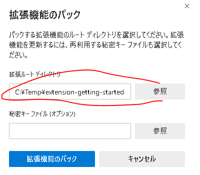

こんにちは。

今回は、自社開発などで Microsoft Store に登録されていない Microsoft Edge (Chromium) の拡張機能を、社内で自動展開する方法について紹介します。拡張機能のサンプルは [チュートリアル](https://docs.microsoft.com/ja-jp/microsoft-edge/extensions-chromium/getting-started/part1-simple-extension) からダウンロードできます。

<span style="color: red;">
自動展開 (強制インストール) を行うには、Microsoft Active Directory ドメインに参加している Windows デバイスである必要があります。
ドメインに参加していない Windows デバイスについては、強制インストールは Microsoft Store で利用できる拡張機能に限定されます。
</span>

## 拡張機能のパック (CRX ファイルの作成) と ID の確認

まずは開発した (用意した) 拡張機能をパッケージ化する必要があります。パッケージ化と ID の確認は以下の手順で行います。

1. edge://extensions を開いて [開発者モード] を有効にします。


2. [拡張機能のパック] をクリックして、[拡張ルート ディレクトリ] に用意した拡張機能のルートを指定します。




3. [拡張機能のパック] ボタンをクリックすると、指定したパスの親フォルダーにパッケージ (CRX ファイル) が作成されます。

※ 秘密鍵 (PEM ファイル) は今回使用しませんが、今後拡張機能をアップデートして再パッケージする際に必要になります

4. 作成された CRX ファイルを Microsoft Edge にドラッグ & ドロップして [拡張機能の追加] をクリックします。


5. 追加された拡張機能を確認し、ID とバージョン番号をメモしておきます。


## CRX ファイルの Web サーバーへの配置と更新マニフェストの作成

作成した CRX ファイルを Web サーバーに配置し、ダウンロードできることを確認しておきます。
CRX ファイルは既定で許可された MIME タイプではないため、Web サーバーで設定が必要な場合があります。
例えば、IIS では、以下のように Web.config で MIME タイプの設定を行う必要があります。

```xml
<?xml version="1.0" encoding="UTF-8"?> 
<configuration> 
  <system.webServer> 
    <staticContent> 
      <mimeMap fileExtension=".crx" mimeType="application/x-chrome-extension" /> 
    </staticContent> 
  </system.webServer> 
</configuration> 
```

更新マニフェスト (XML ファイル) を作成し、同じく Web サーバーに配置します。
更新マニフェストは、以下のような内容のファイルを用意します。ID とバージョンは先ほどメモした値を使用し、codebase には CRX ファイルの URL を記載します。

```xml
<?xml version='1.0' encoding='UTF-8'?>
<gupdate xmlns='http://www.google.com/update2/response' protocol='2.0'>
<app appid='gcfmppplpjjdihbhljakgaihencjcngk'>
<updatecheck codebase= 'https://edgewatcher.azurewebsites.net/nasa_picture_viewer.crx' version='0.0.0.1' />
</app>
</gupdate>
```

## グループ ポリシーを構成する

拡張機能の自動展開のために [サイレント インストールされる拡張機能を制御する](https://docs.microsoft.com/ja-jp/DeployEdge/microsoft-edge-policies#extensioninstallforcelist) のグループ ポリシーを構成します。
値の部分には、拡張機能の ID と更新マニフェストの URL をセミ コロン (;) で連結した文字列を設定します。
ポリシーが正しくクライアントに適用されたかどうかは、edge://policy で確認できます。

```text
gcfmppplpjjdihbhljakgaihencjcngk;https://edgewatcher.azurewebsites.net/nasa_picture_viewer.xml
```

以上で設定は完了です。正しく設定できていれば、Microsoft Edge 起動時に自動的に拡張機能がインストールされ、有効になります。
