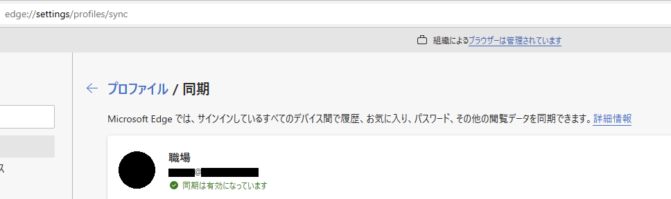
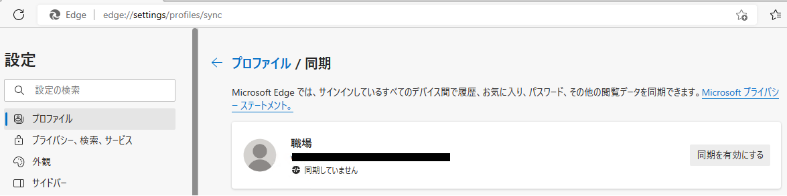
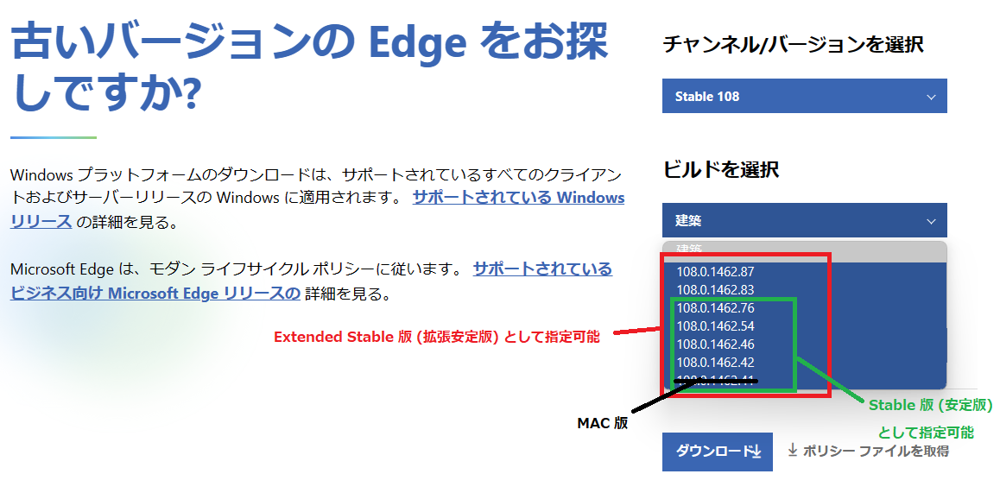
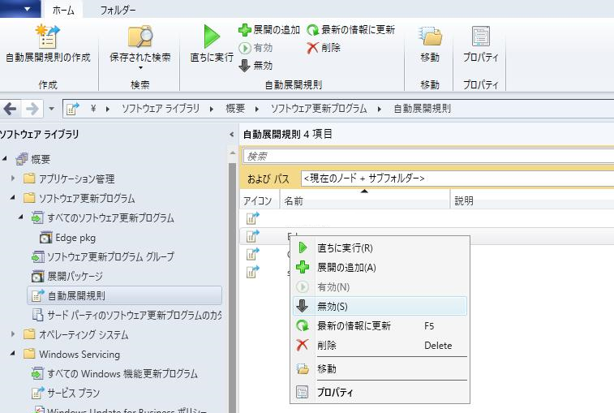
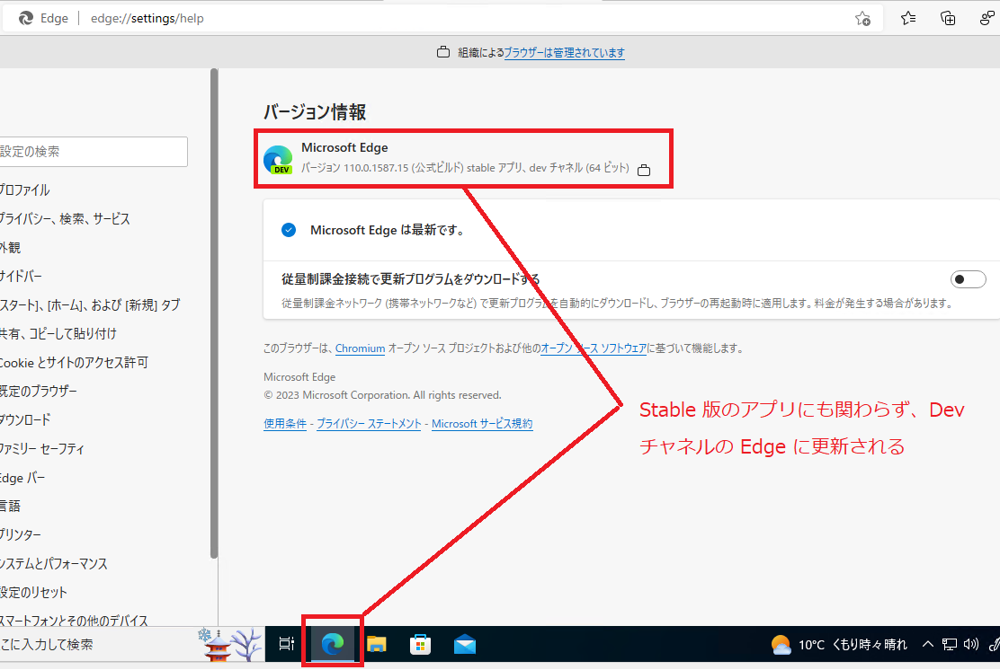

更新履歴:
[2023/02/27 更新: 同一のバージョンにロールバックを行うと失敗する場合がある件について](#ロールバックに失敗する場合について)

---

みなさんこんにちは。日本マイクロソフトの IE/Edge サポートチームです。

今回はお客様からよくいただく Microsoft Edge (以下 Edge と呼称) のロールバックについてのお話をお伝えしたいと思います。

ロールバック手順については以下のドキュメントにまとめられております。

Microsoft Edge を以前のバージョンにロールバックする方法:  
https://learn.microsoft.com/ja-jp/deployedge/edge-learnmore-rollback

ただしロールバックは前提条件や管理体制などによって選択しうるシナリオが異なります。

そのため、改めてこちらのブログにてロールバックを検討する場合に必要なポイント、やり方についておまとめさせていただきました。

## 目次<!-- omit in toc -->

- [ロールバックの前提条件](#ロールバックの前提条件)
- [ロールバックの注意点](#ロールバックの注意点)
  - [端末の同期状態について](#端末の同期状態について)
  - [データが永久に失われる危険性について](#データが永久に失われる危険性について)
  - [ロールバックが難しい場合について](#ロールバックが難しい場合について)
  - [ロールバックするバージョンについて](#ロールバックするバージョンについて)
  - [ロールバックに失敗する場合について](#ロールバックに失敗する場合について)
- [ロールバック方法の種類について](#ロールバック方法の種類について)
- [① Edge のオフライン インストーラーの .msi ファイルを利用する方法](#①-edge-のオフライン-インストーラーの-msi-ファイルを利用する方法)
  - [①-A 手動で行う方法](#①-a-手動で行う方法)
    - [Edge の自動更新を無効化する](#edge-の自動更新を無効化する)
    - [オフライン インストーラーをダウンロードする](#オフライン-インストーラーをダウンロードする)
    - [ロールバックを実行する](#ロールバックを実行する)
  - [①-B SCCM を利用してパッケージ展開によりロールバックする方法](#①-b-sccm-を利用してパッケージ展開によりロールバックする方法)
    - [Edge の自動更新を無効化する](#edge-の自動更新を無効化する-1)
    - [SCCM の自動展開規則を無効化](#sccm-の自動展開規則を無効化)
    - [オフライン インストーラーをダウンロードする](#オフライン-インストーラーをダウンロードする-1)
    - [パッケージの作成](#パッケージの作成)
    - [パッケージの展開](#パッケージの展開)
    - [配布タイミングについて](#配布タイミングについて)
    - [SCCM による配布の補足](#sccm-による配布の補足)
- [グループ ポリシーを利用する方法](#グループ-ポリシーを利用する方法)
  - [ターゲット バージョンのロールバックの有効化](#ターゲット-バージョンのロールバックの有効化)
  - [(Optional) ターゲット チャネルの上書きの有効化](#optional-ターゲット-チャネルの上書きの有効化)
  - [ターゲット バージョンのオーバーライドの設定](#ターゲット-バージョンのオーバーライドの設定)
  - [更新ポリシーのオーバーライドを有効化](#更新ポリシーのオーバーライドを有効化)
  - [(補足) グループ ポリシーを利用する方法のロールバックのタイミングについて](#補足-グループ-ポリシーを利用する方法のロールバックのタイミングについて)


## ロールバックの前提条件
***

**ロールバックは端末がドメイン管理下にあることを前提条件としています**。  
※ ここにおいてのドメイン管理下とは、Intune や Active Directory, Azure Active Directory の制御下であることを指します。

**ドメイン管理下ではない端末については、グループ ポリシーによるロールバックは行えません**。

ロールバックに必要な Edge の更新管理にかかわる GPO の設定を行っても、設定値が無視されるためです。

※ ただし、**ドメイン管理下ではない端末でも「Edge のオフライン インストーラーの .msi ファイルを利用する方法」についてはロールバックを行うことは可能**です。

ただし、ドメイン管理下ではない端末は通常自動更新によってバージョンが管理されています。そのため、インターネットに接続可能な環境の場合は、**再度最新版へ自動更新が行われてしまいます**。また最新版への自動更新は、インターネット上から Edge 本体のダウンロードを行うため、端末数が多い場合は通信帯域を圧迫する可能性もございますのでご注意ください。

## ロールバックの注意点
***

弊社は Edge を最新版に保つことを推奨しております。

以前のバージョンにロールバックすると、最新版で修正された既知のセキュリティ問題にさらされるリスクがありますのでご注意ください。

そのため、ロールバック機能については、例えば最新版の Edge で発生する問題を一時的に退避するためなどにご検討いただく機能として理解が必要です。

### 端末の同期状態について

ロールバックを行う前に、ロールバックを行うすべての端末において同期機能を有効にし、**同期が正常に終了していることを推奨します**。

正常に終了しているかどうかは、 **edge://settings/profiles/sync** にアクセスし、**「同期は有効になっています」**と表示されているかをご確認ください。



**問題がある場合は以下の画像のように「同期していません」**などのように表示されます。その場合は同期を有効にし、「同期は有効になっています」と表示されるようにしてください。



**同期に失敗している場合に置いてもロールバックは可能ですが、閲覧データや設定、お気に入りなどのデータが永久に失われる危険性があります。** 

### データが永久に失われる危険性について

通常何も設定しない場合は Azure のクラウド上でデータの同期が行われます。この場合、正常に動作していれば、同期対象の項目については維持されることが期待されます。

ただし、**同期をしないように設定したデータや、キャッシュや Cookie などについては、消えてしまう可能性はございます**。

また、通常利用されるクラウド同期ではなく、オンプレミス同期を行っている場合については、実際に過去問い合わせとしてデータが消えたという報告もございます。

同期についてご不明な点がある場合は以下のドキュメントをご参照ください。

**Microsoft Edge エンタープライズの同期を構成する:**  
https://learn.microsoft.com/ja-jp/deployedge/microsoft-edge-enterprise-sync

### ロールバックが難しい場合について

ロールバックの利用が難しい、その場合は以下をご検討ください。

- Stable 版ではない Beta 版や Dev 版、Canary 版、Edge の IE モードで回避できないか
- それ以外のブラウザを利用することで回避できないか

Beta 版、Dev 版、Canary 版について (Microsoft Edge Insider Channels):  
https://www.microsoftedgeinsider.com/ja-jp/download

※ Dev 版および Canary 版は弊社で問い合わせのサポートをしていません。  
※ Beta 版や Dev 版、Canary 版を利用することで、別の不具合や意図せぬ状態の変更につながることもございます。  

### ロールバックするバージョンについて

下記ブログに記載しておりますように、弊社として支援している Edge のバージョンは **Stable 版においては “最新版のバージョン - 2” まで**になります。 **Extended Stable 版においては “最新の偶数バージョン - 2”までがサポート範囲**となっています。

ロールバック先のバージョンが古い場合は、ロールバックに関するご質問についてもお答えしかねる場合がございますので、**必ずロールバックについては弊社がサポートしているバージョンを対象にしていただけますと幸いです**。

**Edge の種類と Edge のサポート範囲について:**  
https://jpdsi.github.io/blog/internet-explorer-microsoft-edge/how-and-why-to-update-edge/#Edge-%E3%81%AE%E7%A8%AE%E9%A1%9E%E3%81%A8-Edge-%E3%81%AE%E3%82%B5%E3%83%9D%E3%83%BC%E3%83%88%E7%AF%84%E5%9B%B2%E3%81%AB%E3%81%A4%E3%81%84%E3%81%A6


### ロールバックに失敗する場合について

Edge のロールバックにおいて、同一のバージョンに対して複数回のロールバックを
行った場合に、二回目以降のロールバック処理が失敗する事例がございます。

例)
109.0.1518.69 → 108.0.1462.**46** (ロールバック) → 109.0.1518.69 (自動更新) →  108.0.1462.**46** (ロールバック失敗)

回避策として、該当のバージョンとは異なるバージョンに対して一度ロールバックしていただくことで、ロールバックが可能である場合がございます。そのため、下記記載のロールバック手順を実施いただいた際に、Edge のバージョンが正しくロールバックされないといった場合には、一度こちらの回避方法をお試しいただければと存じます。

例)
109.0.1518.69 → 108.0.1462.46.**42** →  108.0.1462.**46**

## ロールバック方法の種類について
***

大きくロールバックの方法としては以下 2 つに分けられます。

- **① Edge のオフライン インストーラーの .msi ファイルを利用する方法**
- **② グループ ポリシーを利用する方法**

※ なお **WSUS を利用したロールバック方法はございません**。全体に自動的に配布したい場合は、後述する **「 ①-B の SCCM を利用する方法」**か、**「 ② グループ ポリシーを利用する方法」**のいずれかになりますのでご注意ください。

## ① Edge のオフライン インストーラーの .msi ファイルを利用する方法
***

オフライン インストーラーを利用する場合については、さらに細かく二つに方法が分けられます。

- **①-A** 手動で行う方法
- **①-B** SCCM を利用してパッケージ展開によりロールバックする方法

### ①-A 手動で行う方法

まずは Edge の自動更新をオフにします。

#### Edge の自動更新を無効化する

以下のブログにも記載されているように Edge の更新制御として存在する **UpdateDefault** または **Update{56EB18F8-B008-4CBD-B6D2-8C97FE7E9062}** 等の Edge のチャネルごとの制御を **0 (更新を無効にする)** に設定します。

**Edge の更新制御:**  
https://jpdsi.github.io/blog/internet-explorer-microsoft-edge/how-and-why-to-update-edge/#3-Edge-%E3%81%AE%E6%9B%B4%E6%96%B0%E5%88%B6%E5%BE%A1

#### オフライン インストーラーをダウンロードする

以下の URL より Edge のオフライン インストーラーをダウンロードします。

**ビジネス向け Microsoft Edge をダウンロードして構成する:**  
https://www.microsoft.com/edge/business/download

以下は例として Edge 108 にロールバックする場合になります。

Stable 版をロールバックしたい場合、「古いバージョンの Edge をお探しですか？」の項目からチャンネルを Stable 108 で選択し、その中からビルドを選択します。



※ 注意点として偶数バージョンの Edge は Stable 版(安定版) および Extended Stable 版(拡張安定版) が混在しております。  
**※ Stable 版のロールバックの場合は Extended Stable 版ではなく、Stable 版をご選択いただく必要がございます**。

ビルド バージョンが Extended Stable 版なのか Stable 版なのかを確認したい場合は、以下のチャネルのリリース ノートを見ていただき、「**for Extended Stable release**」 は拡張安定版のみ、「**Stable and Extended Stable release**」 は安定版もあると判断できます。 

**Microsoft Edge Stable チャネルのリリース ノート:**  
https://learn.microsoft.com/ja-jp/deployedge/microsoft-edge-relnote-stable-channel

※ 奇数( 103, 105, 107 等)は Extended Stable 版はございませんので、すべて Stable 版になります。  
※ 後述する **TargetChannel{56EB18F8-B008-4CBD-B6D2-8C97FE7E9062}** を指定することで Stable 版から Extended Stable 版へのロールバックや、その逆も可能ではございます。

#### ロールバックを実行する

ダウンロードした .msi ファイルを利用してロールバックを行います。 **ロールバックには管理者権限が必須**ですのでご注意ください。

コマンド プロンプトまたは PowerShell を管理者権限で起動します。

```
例:
msiexec /I <ロールバック対象の MSI ファイル> /qn ALLOWDOWNGRADE=1

実例:
msiexec /I MicrosoftEdgeEnterpriseX64.msi /qn ALLOWDOWNGRADE=1
```

Edge を再起動し、ロールバックの確認のためアドレスバーに **edge://version** を打ち込み、当該 URL にアクセスします。期待するバージョンになっていることを確認してください。

なお、もし期待するバージョンになっていない場合は、ロールバックがまだ完了していない可能性がございます、1 分ほど時間をおいて再度 Edge を再起動しなおして edge://version を確認してください。

なお、**edge://version** 以外にも **edge://settings/help** からも確認は可能です。 edge://settings/help で表示させた場合、自動更新を無効化していない場合は自動的に更新が始まる場合がございますのでご注意ください。

### ①-B SCCM を利用してパッケージ展開によりロールバックする方法

SCCM のパッケージ展開機能を利用してロールバックする方法になります。

**Configuration Manager を使用してアプリケーションを作成してデプロイする:**  
https://learn.microsoft.com/ja-jp/mem/configmgr/apps/get-started/create-and-deploy-an-application

SCCM を利用する方法は手動配布と同様にスクリプトと .msi ファイルを利用します。**手動配布と大きく異なるのは SCCM クライアント全体に自動で配布することができることです**。

また SCCM の仕組みを利用してオフライン インストーラーを配布するため、後に説明するグループ ポリシーを利用する方法とは異なり、**インターネットから Edge アプリケーションをダウンロードする必要がございません。そのためインターネット用の通信帯域に懸念がある場合などは SCCM を利用する方法をご検討いただくのが一番よいかと存じます。**

#### Edge の自動更新を無効化する

手動更新同様に、まずは Edge の自動更新をオフにします。

以下のブログにも記載されているように Edge の更新制御として存在する **UpdateDefault** または **Update{56EB18F8-B008-4CBD-B6D2-8C97FE7E9062}** 等の Edge のチャネルごとの制御を **0 (更新を無効にする)** に設定します。

**Edge の更新制御:**  
https://jpdsi.github.io/blog/internet-explorer-microsoft-edge/how-and-why-to-update-edge/#3-Edge-%E3%81%AE%E6%9B%B4%E6%96%B0%E5%88%B6%E5%BE%A1

#### SCCM の自動展開規則を無効化

**\ソフトウェア ライブラリ\概要\ソフトウェア更新プログラム\自動展開規則** にて該当のEdge の自動展開規則を選択し、右クリックメニューから **[無効]** を選択ください。



#### オフライン インストーラーをダウンロードする

オフライン インストーラー (.msi ファイル) を入手します。以下のリンク先から、ロールバック先のバージョンやアーキテクチャ等を選択した上でダウンロードします。

**ビジネス向け Microsoft Edge をダウンロードして構成する:**  
https://www.microsoft.com/edge/business/download

#### パッケージの作成

.msi を入手後は、以下の手順でパッケージの作成を行います。

- コンソールにて、[ソフトウェア ライブラリ] - [概要] - [アプリケーション管理] - [パッケージ] を開きます。
- [パッケージ] を右クリックし、[パッケージの作成] をクリックします。
- [パッケージとプログラムの作成ウィザード] が表示されますので、[名前] に任意の名前を入力し、[このパッケージにソース ファイルを含める] にチェックを入れます。
- [ソース フォルダー] の参照ボタンをクリックし、事前にダウンロードしたMSIファイルの格納場所(ローカルドライブ上のフォルダや共有フォルダ)を指定します。
- 次のページで、[標準プログラム] を指定します。
- 次のページで、[名前] に任意の名前を指定し、以下の様に指定します。
 
- コマンドライン( .msi ファイル名は必要に応じて読み替えください)
  - 64bit OS の場合: **%windir%\sysnative\msiexec.exe /I MicrosoftEdgeEnterpriseX64.msi /qn ALLOWDOWNGRADE=1**
  - 32bit OSの場合: **msiexec.exe /I MicrosoftEdgeEnterpriseX86.msi /qn ALLOWDOWNGRADE=1**
- 実行モード: **管理者権限で実行する**
 
その他の設定項目は既定のまま、パッケージの作成を完了します。 
 
#### パッケージの展開

パッケージの作成が完了したら、**パッケージを展開**します。

- 作成されたパッケージを右クリックし、[展開] をクリックします。
- ソフトウェアの展開ウィザードが開きます。[参照] をクリックし、配布先のコレクションを指定して [次へ] をクリックします。
- [コンテンツ] ページにおいて、[追加] をクリックし配布ポイントを選択し、[次へ] をクリックします。
- [展開設定] ページにおいて、目的を [必須] にし [次へ] をクリックします。
- [展開スケジュール] ページからスケジュールを以下のように設定し、[次へ] をクリックします。
- 割り当てスケジュールの [新規] をクリックし、[次のイベントの直後に割り当てる] > [直ちに] をクリックして、[OK] をクリックします。
- [ユーザー側の表示と操作] において、通知設定を設定し [次へ] をクリックします。
- [配布ポイント] ページにおいて、展開設定を設定し [次へ] をクリックします。(他のパッケージの展開設定と合わせて頂くとよいかと存じます。)

以降のページを進み、ソフトウェアの展開ウィザードが正常に完了することを確認します。
 
上記の手順を実施いただくことで、クライアントへの展開は完了します。
 
各項目のご説明については、次の技術情報を参照いただければ幸いです。

**パッケージとプログラムを作成する:**  
https://docs.microsoft.com/ja-jp/sccm/apps/deploy-use/packages-and-programs#create-a-package-and-program

#### 配布タイミングについて

パッケージを展開した後は、クライアント側で [コンピューター ポリシーの取得および評価サイクル] が実行されることで、コンテンツのダウンロードと実行が行われます。

こちらは**既定で 60 ～ 120 分 (60 分 + ランダム時間 [ 1～60 分] )間隔**で実行されています。

なお、できる限り早く実行させたい場合は、**「クライアント通知」という機能**を使用します。**「コンピューターポリシーの取得および評価サイクル」を直ちに実行する**ように、サーバー側からクライアントに通知させることができます。(デバイス単位でもコレクション単位でも実行可能です)
 
**Configuration Manager のクライアント通知:**  
https://docs.microsoft.com/ja-jp/sccm/core/clients/manage/client-notification

#### SCCM による配布の補足

作成した**パッケージの利用を停止する場合**は以下の手順になります。

- SCCM コンソールより、[ソフトウェア ライブラリ] - [概要] - [アプリケーション管理] - [パッケージ] を開きます。
- プログラムを選択し、下ペインより [プログラム] に移動します。
- 下ペインより、プログラム名を右クリック > 無効 をクリックします。ポップアップが表示されるので [はい] をクリックします。
- 再度、クライアント上でスクリプトを実行する場合は、プログラムを [有効] とします。

## グループ ポリシーを利用する方法
*** 

ドメイン管理下の端末についてはグループ ポリシーによってロールバックを制御することが可能です。

注意点として、端末それぞれが持つ Edge の更新チェックのタイミングに合わせてロールバックを行います。そのため**グループ ポリシーを設定をしてからすぐにロールバックが行われるとは限りません**。

更新チェックのタイミングについては以下のブログをご参考いただけますと幸いです。

**Edge の更新の流れについて:**  
https://jpdsi.github.io/blog/internet-explorer-microsoft-edge/how-and-why-to-update-edge/#Edge-%E3%81%AE%E6%9B%B4%E6%96%B0%E3%81%AE%E6%B5%81%E3%82%8C%E3%81%AB%E3%81%A4%E3%81%84%E3%81%A6

### ターゲット バージョンのロールバックの有効化

**Edge のチャネルのロールバック機能を有効化**させます。通常は **Stable 版 (安定版) ですので、以下のポリシーを 有効 にします**。 (Extended Stable 版も同様の設定値です。)

**RollbackToTargetVersion(ターゲット バージョンへのロールバック):**  
https://learn.microsoft.com/ja-jp/deployedge/microsoft-edge-update-policies#rollbacktotargetversion

- パス: HKEY_LOCAL_MACHINE\SOFTWARE\Policies\Microsoft\EdgeUpdate
- 値の名前: RollbackToTargetVersion{56EB18F8-B008-4CBD-B6D2-8C97FE7E9062}
- 値の種類: REG_DWORD

詳細:

- 値: 0 / 無効
- 値: 1 / 有効

Beta 版の Edge や Dev 版の Edge などをロールバックさせたい場合は、以下それぞれ別の値を有効にする必要があります。

- 値の名前: 
- (Beta) RollbackToTargetVersion{2CD8A007-E189-409D-A2C8-9AF4EF3C72AA}
- (Dev) RollbackToTargetVersion{0D50BFEC-CD6A-4F9A-964C-C7416E3ACB10}
- (Canary) RollbackToTargetVersion{65C35B14-6C1D-4122-AC46-7148CC9D6497}

### (Optional) ターゲット チャネルの上書きの有効化

**Stable 版から Extended Stable 版にロールバックしたい場合や、Extended Stable 版を止め Stable 版にロールバックしたい場合**などについてはこちらのポリシーをご検討ください。

ターゲット チャネルの上書きを指定すると、指定されたターゲット チャネルのアプリケーションが配布されるようになります。

つまり Stable 版の Edge にもかかわらず、ターゲット チャネルの上書きを行えば、Beta 版や Dev 版、Extended Stable 版として認識され、アプリケーションが配信されます。

例えば、以下の図では **Stable 版のアプリケーション**にもかかわらず、ターゲット チャネルの上書きによって Dev 版を指定することで、よりバージョンが新しい **Dev 版の Edge が配布**されています。



※ なお Dev 版については弊社のサポート対象外のバージョンになります。検証用途など以外で配布することは推奨しておりません。  
※ **Beta 版や Dev 版に適用することで現状修正されていない不具合や意図せぬ状態の変更につながることもございます**のでご注意ください。  
※ 通常 **Stable 版から Extended Stable 版**、**Extended Stable 版から Stable 版への移行**に関してをイメージいただけますと幸いです。  
**※ Stable 版から Stable 版**にロールバックする場合については、**この「ターゲット チャネルの上書き」の設定をする必要はございません。**  

**TargetChannel (ターゲット チャネルの上書き):**  
https://learn.microsoft.com/ja-jp/deployedge/microsoft-edge-update-policies#targetchannel

- パス: HKEY_LOCAL_MACHINE\SOFTWARE\Policies\Microsoft\EdgeUpdate
- 値の名前: TargetChannel{56EB18F8-B008-4CBD-B6D2-8C97FE7E9062}
- 値の種類: REG_SZ

詳細:

-	値: stable / Stable 版を指定
-	値: beta / ベータ版を指定
-	値: dev / Dev 版を指定
- 値: extended / Extended Stable 版を指定

### ターゲット バージョンのオーバーライドの設定

次に、ロールバックによって戻りたいバージョンを指定します。

**TargetVersionPrefix (ターゲット バージョンのオーバーライド):**  
https://learn.microsoft.com/ja-jp/deployedge/microsoft-edge-update-policies#targetversionprefix

- パス: HKEY_LOCAL_MACHINE\SOFTWARE\Policies\Microsoft\EdgeUpdate
- 値の名前: TargetVersionPrefix{56EB18F8-B008-4CBD-B6D2-8C97FE7E9062}
- 値の種類: REG_SZ

詳細:

- 値: <バージョン番号を指定> / (例: 108.0.1462.76 など)

※ なお、Stable 版から Stable 版にロールバックしたい場合は、前述した画像のように Extended Stable 版のみ提供しているビルドを指定しないようにご注意ください。Stable 版として提供しているビルドを指定する必要があります。


**TargetChannel** のグループ ポリシーによって **Extended Stable を指定している場合は** Extended Stable のみ提供しているビルドもロールバック可能になります。その場合 Extended Stable 版の更新スケジュールになるため、**Edge の奇数バージョンには更新しなくなります**のでご注意ください。

### 更新ポリシーのオーバーライドを有効化

**※ Edge の更新を無効化している場合は、加えてこちらの設定が必要になります**。

下記ブログにも述べられている **UpdateDefault** またはそれぞれのチャネルの **Update** を個別に**有効化**します。ロールバックしたい Edge のチャネルに合わせて、「**常に更新を許可する (推奨)**」または「**自動サイレント更新のみ**」に設定します。

※ なお Edge は通常ポリシーを設定しない場合、「常に更新を許可する」がデフォルトで設定されておりますので、追加の設定は必要ありません。

Edge の更新制御:  
https://jpdsi.github.io/blog/internet-explorer-microsoft-edge/how-and-why-to-update-edge/#3-Edge-%E3%81%AE%E6%9B%B4%E6%96%B0%E5%88%B6%E5%BE%A1


すべてのチャネルを制御する場合は以下の UpdateDefault のポリシーによって制御可能です。

**UpdateDefault (更新ポリシーのオーバーライドの既定値):**  
https://docs.microsoft.com/en-us/deployedge/microsoft-edge-update-policies#updatedefault

-	パス: HKEY_LOCAL_MACHINE\SOFTWARE\Policies\Microsoft\EdgeUpdate
-	値の名前: UpdateDefault
-	値の種類: REG_DWORD

詳細:

-	値: 0 / 更新を無効にする (すべてのチャネルのアップデートを停止します。)
-	値: 1 / 常に更新を許可する (推奨) (通常の自動更新になります。)
-	値: 2 / 手動更新のみ (edge://settings/help による手動更新のみ可能になります。)
-	値: 3 / 自動サイレント更新のみ (Edge の更新モジュールによる自動更新のみ可能になります。)

個々それぞれのチャネルを制御するには以下の Update ポリシーによって制御可能です。

**Update (更新ポリシーのオーバーライド):**  
https://docs.microsoft.com/en-us/deployedge/microsoft-edge-update-policies#update

-	パス: HKEY_LOCAL_MACHINE\SOFTWARE\Policies\Microsoft\EdgeUpdate
-	値の名前:
-	(Stable): Update{56EB18F8-B008-4CBD-B6D2-8C97FE7E9062}
-	(Beta): Update{2CD8A007-E189-409D-A2C8-9AF4EF3C72AA}
-	(Dev): Update{0D50BFEC-CD6A-4F9A-964C-C7416E3ACB10}
-	(Canary): Update{65C35B14-6C1D-4122-AC46-7148CC9D6497}

詳細:

-	値: 0 / 更新を無効にする (すべてのチャネルのアップデートを停止します。)
-	値: 1 / 常に更新を許可する(推奨) (通常の自動更新になります。)
-	値: 2 / 手動更新のみ (edge://settings/help による手動更新のみ可能になります。)
-	値: 3 / 自動サイレント更新のみ (Edge の更新モジュールによる自動更新のみ可能になります。)

上記設定を行い、端末にグループ ポリシーが適用されると、端末は次回の更新チェックのタイミングでロールバックを行います。

更新チェックのタイミングについては以下のブログをご確認ください。

Edge の更新タイミングの制御方法について:  
https://jpdsi.github.io/blog/internet-explorer-microsoft-edge/how-and-why-to-update-edge/#Edge-%E3%81%AE%E6%9B%B4%E6%96%B0%E3%82%BF%E3%82%A4%E3%83%9F%E3%83%B3%E3%82%B0%E3%81%AE%E5%88%B6%E5%BE%A1%E6%96%B9%E6%B3%95%E3%81%AB%E3%81%A4%E3%81%84%E3%81%A6

### (補足) グループ ポリシーを利用する方法のロールバックのタイミングについて

グループ ポリシーを利用する方法の場合、ロールバックは Edge の更新チェックのタイミングにおいて行われます。

その場合、ロールバック対象のアプリケーションはインターネット上からダウンロードを行います。そのため、ロールバック対象の端末が大量にあり、その端末が同時期にダウンロードを行う場合は、Edge アプリケーションのサイズが 数百 MB 相当あることからも、帯域圧迫が発生する可能性がございます。

帯域圧迫が発生しないように更新制御を行いたい場合は、端末をグループに分けて更新をさせるタイミングを分散させる必要があります。

例えば、以下 **UpdatesSuppressed** をグループごとに仕掛けることで、時間帯に合わせて更新ができる端末を絞ることができます。

**アップデートできない時間帯を指定する方法:**  
https://jpdsi.github.io/blog/internet-explorer-microsoft-edge/how-and-why-to-update-edge/#5-%E3%82%A2%E3%83%83%E3%83%97%E3%83%87%E3%83%BC%E3%83%88%E3%81%A7%E3%81%8D%E3%81%AA%E3%81%84%E6%99%82%E9%96%93%E5%B8%AF%E3%82%92%E6%8C%87%E5%AE%9A%E3%81%99%E3%82%8B%E6%96%B9%E6%B3%95

それ以外にも、更新チェックを行うタイミングは既定では前回の更新チェックから 10 時間以上経過しなければ発生しませんが、**AutoUpdateCheckPeriodMinutes** を設定することでそのタイミングを制御できます。

例えば AutoUpdateCheckPeriodMinutes を 1~59 に指定した場合は、1 時間以内に発生する更新チェックのタイミングで更新を行いますので、1 時間以内にロールバックをさせることが可能です。

**更新チェック後の次の更新チェックまでの最低猶予時間を指定する方法:**  
https://jpdsi.github.io/blog/internet-explorer-microsoft-edge/how-and-why-to-update-edge/#6-%E6%9B%B4%E6%96%B0%E3%83%81%E3%82%A7%E3%83%83%E3%82%AF%E5%BE%8C%E3%81%AE%E6%AC%A1%E3%81%AE%E6%9B%B4%E6%96%B0%E3%83%81%E3%82%A7%E3%83%83%E3%82%AF%E3%81%BE%E3%81%A7%E3%81%AE%E6%9C%80%E4%BD%8E%E7%8C%B6%E4%BA%88%E6%99%82%E9%96%93%E3%82%92%E6%8C%87%E5%AE%9A%E3%81%99%E3%82%8B%E6%96%B9%E6%B3%95

更新チェックの詳細については以下のブログをご確認ください。

**Edge の更新の流れについて:**  
https://jpdsi.github.io/blog/internet-explorer-microsoft-edge/how-and-why-to-update-edge/#Edge-%E3%81%AE%E6%9B%B4%E6%96%B0%E3%81%AE%E6%B5%81%E3%82%8C%E3%81%AB%E3%81%A4%E3%81%84%E3%81%A6