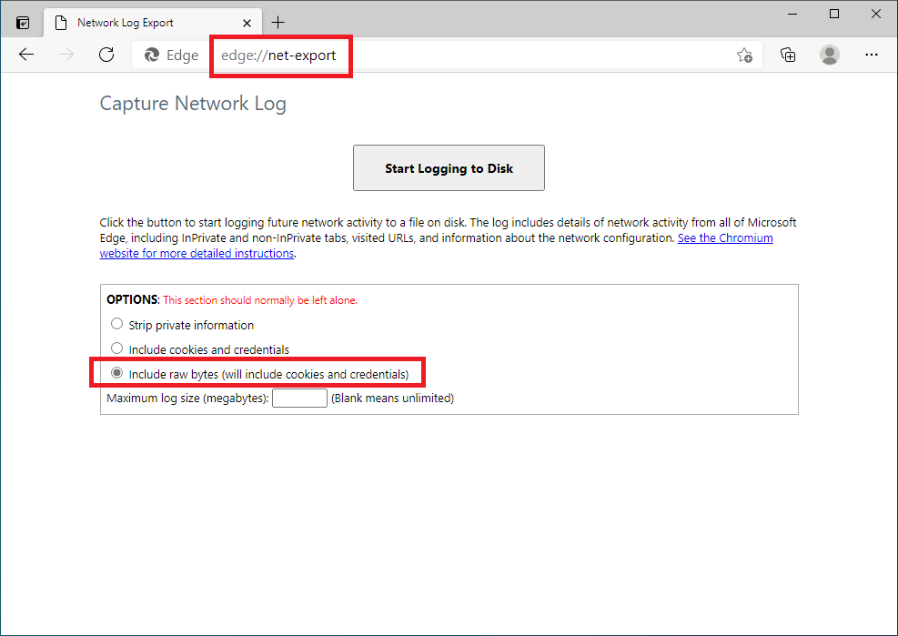
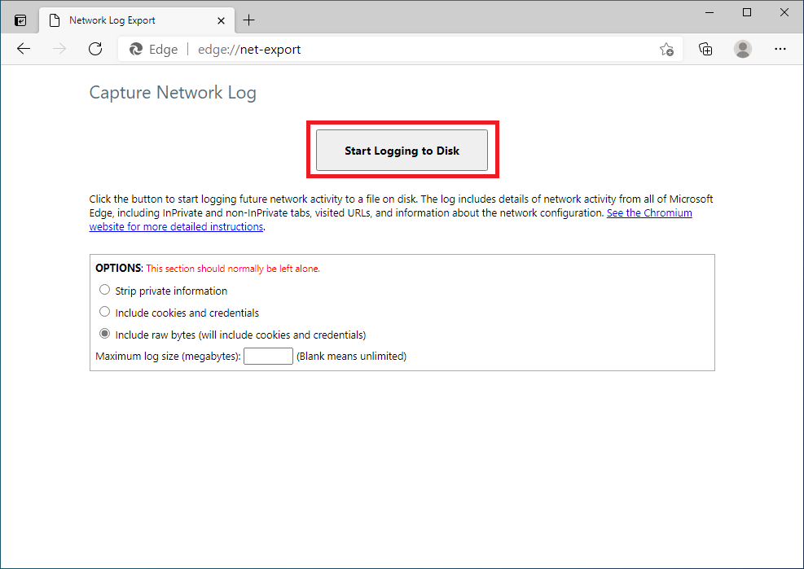
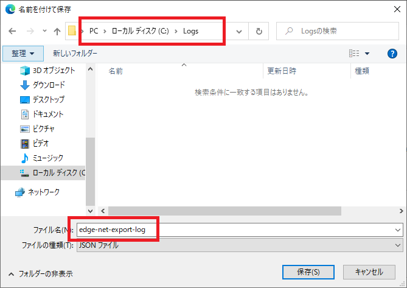
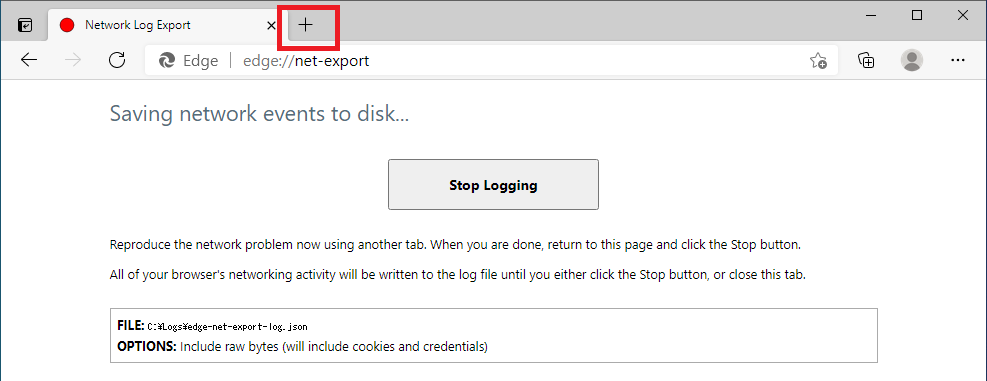
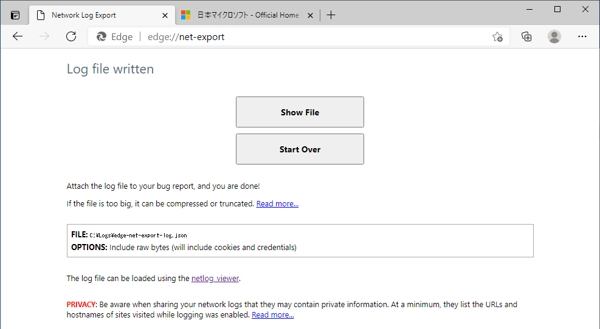
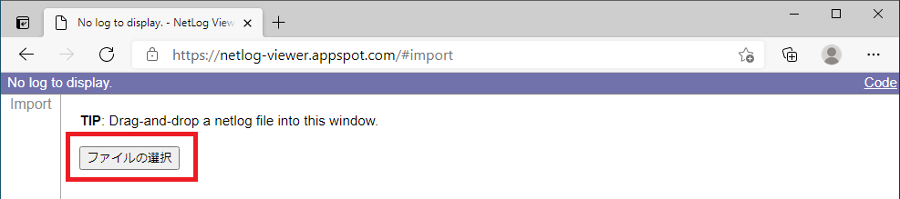
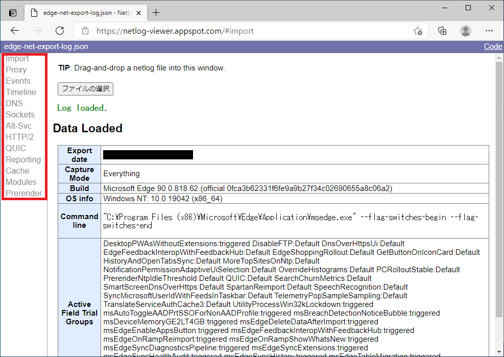

みなさんこんにちは。日本マイクロソフトの IE/Edge サポートチームです。

今回は Chromium の機能である net-export を使用して、Chromium Edge のネットワーク レベルのイベントや状態に関する詳細情報を確認する方法を紹介します。
サポートにお問い合せいただいたときにも、今回の手順でログを取得いただくこともありますので、以下を参考にしていただければと思います。

---

## ログの取得方法

1. Microsoft Edge を起動し、アドレス バーに edge://net-export/ を入力してページを開きます。
2. OPTIONS で、[Include raw bytes (will include cookies and credentials)] をオンにします。

3. [Start Logging to Disk] をクリックします。

4. ファイル名を入力し、保存場所を選択します。
5. [保存] をクリックします。

6. 新しいタブを開き、問題を再現させます。

7. 現象再現後に net-export のタブに戻り、[Stop logging] をクリックします。
8. 停止すると以下の画面になります。

---

## 保存したログの確認方法

上記の手順で取得した json ファイルは、以下のようにして任意の PC で表示できます。

1. Microsoft Edge を起動し、https://netlog-viewer.appspot.com/ を開きます。
※ [netlog-viewer](https://chromium.googlesource.com/catapult/+/refs/heads/main/netlog_viewer) は、クライアント (ブラウザー) 上だけで json ファイルを解析して視覚化します。外部へデータを送信することはありません。

2. [ファイルの選択] をクリックして json ファイルのパスを指定します。

3. ファイルが読み込まれると以下の画面になります。

左側のメニューから各種情報を確認できます。

- Import
net-export で取得した json ファイルを読み込みます。

- Proxy
ブラウザで使用しているプロキシ設定に関する情報を表示します。プロキシを使用していない場合は、"Use DIRECT connections" と表示されます。

- Events
発生したイベントのリストを表示します。イベントには、ソケット接続、SPDY セッション、HTTP-TCP 接続、URL 要求などがあります。エラーは赤い文字で表示されます。

- Timeline
開いているソケット数、使用中のソケット数、URL 要求、DNS 要求、送受信したデータ量などの情報をグラフに表示します。

- DNS
端末の DNS ルックアップのログを表示します。ウェブページを読み込めない場合の問題のトラブルシューティングに役立ちます。ログには、URL とそれに対応する IP だけでなく、DNS 要求の時間も示されます。

- Sockets
開いているソケットと使用されているソケットのログを表示します。このログはネットワークの高度なトラブルシューティングに使用します。

- Alt-Svc
代替サービス マッピングに関する情報を表示します。

- HTTP/2
HTTP/2 セッションと代替サービス マッピングのログを表示します。

- QUIC
Quick UDP Internet Connections（QUIC）に関する情報を表示します。これは、TCP を使用する接続指向のウェブアプリを最適化するネットワーク プロトコル（試験運用中）です。

- Reporting
送信元の設定、ネットワーク エラーのログ記録に関するポリシー、キューに登録されたレポートを表示します。

- Cache
キャッシュされたエントリと統計情報のリストを表示します。

- Modules
アクティブな Edge / Chrome 拡張機能とアプリのリストを表示します。

- Prerender
アクティブな事前レンダリング ウェブサイトとその履歴を表示します。

---