更新履歴:
2021/05/14 新規
2021/05/19 更新
2021/06/15 更新
2021/06/23 更新
2021/06/30 更新
2021/07/02 更新
2021/07/19 更新

---

みなさんこんにちは。日本マイクロソフトの IE/Edge サポートチームです。

これまでに「IE モード」について以下の２つのブログ記事を公開していますが、今回はよくあるご質問についてまとめたいと思います。

新しいバージョンの Microsoft Edge の "IE モード" について
https://jpdsi.github.io/blog/internet-explorer-microsoft-edge/IEMode/

まだデフォルトIE？ 新しい Microsoft Edge を使いませんか？
https://jpdsi.github.io/blog/internet-explorer-microsoft-edge/how-about-using-new-edge/

なお、IE モードに関する公式ドキュメントは以下にまとまっていますので、基本的な内容についてはこちらをご覧ください。

[Internet Explorer (IE) モードとは](https://docs.microsoft.com/ja-jp/deployedge/edge-ie-mode)

[IE モードのトラブルシューティングと FAQ](https://docs.microsoft.com/ja-jp/deployedge/edge-ie-mode-faq)

[(PDF) Microsoft Edge + Internet Explorer モード Getting Started ガイド](https://aka.ms/IEModeGuideJP)

※ [こちらの前提条件](https://docs.microsoft.com/ja-jp/deployedge/edge-ie-mode#prerequisites)　に記載のとおり、IE モードは最新の OS 更新と最新の Edge であることが前提となっていますので、おや?? と思ったらまずは最新状態かどうかをご確認ください。

---

## 目次

### 互換性に関する情報

- [window.open による子ウィンドウの扱い](#window-open-による子ウィンドウの扱い)
- [ウィンドウのクライアント領域のサイズ](#ウィンドウのクライアント領域のサイズ)
- [ウィンドウをデスクトップ外に開けない](#ウィンドウをデスクトップ外に開けない)
- [ブラウザー エンジンの切り替え時の通信で起こること](#ブラウザー-エンジンの切り替え時の通信で起こること)

### How to/Tips

- [Web コンテンツのデバッグ方法](#Web-コンテンツのデバッグ方法)
- [Cookie の共有](#Cookie-の共有)
- [ページ遷移時のブラウザー エンジンの切り替え](#ページ遷移時のブラウザー-エンジンの切り替え)
- [IE モードでの表示をテストしたい](#IE-モードでの表示をテストしたい)
- [Internet Explorer モードでサイトの再読み込みを許可](#Internet-Explorer-モードでサイトの再読み込みを許可)
- [サイトリストで指定しているサイトが IE モードで表示されない](#サイトリストで指定しているサイトが-IE-モードで表示されない)
- [ドキュメント モードを確認したい](#ドキュメント-モードを確認したい)
- [ニュートラル サイト](#ニュートラル-サイト)

---

## window.open による子ウィンドウの扱い

Microsoft Edge の IE11 モードでは、IE11 のブラウザー エンジンで表示する必要のある Web サイトを Microsoft Edge 上のタブ内で表示しますが、IE モードで表示されている Web コンテンツ内で window.open メソッドを実行して表示される子ウィンドウは新しい Microsoft Edge のウィンドウとなります。

IE モードでは、Web ページ コンテンツの表示 (レンダリング) やスクリプトは IE11 のブラウザー エンジンによって処理されますが、ブラウザー ウィンドウとしての外枠 (フレーム) 部分は Microsoft Edge によって制御されます。具体的には、以下の図の緑色の枠線内は IE モードによって処理されますが、枠の外側は Microsoft Edge によって処理されます。

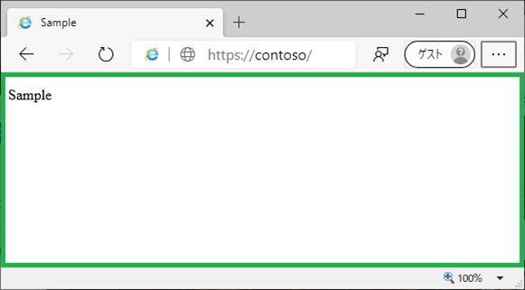

上記動作に伴い、window.open(url, windowName, windowFeatures) の引数 windowFeatures で指定する以下のオプションは反映されません。
なお、この動作は Microsoft Edge における想定された動作となります。

- location
引数 url で指定されるサイトがローカル イントラネットや信頼済みサイト ゾーンで、かつ、引数 windowFeatures において location=no と指定していても、以下のようにアドレス バーは表示されます (ただし、アドレス バーでの操作はできません)。

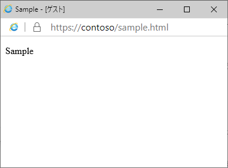

- resizable
resizable オプション指定は常に無視され、ユーザーはウィンドウ サイズを変更することができます。

- fullscreen
fullscreen オプション指定は常に無視され、全画面表示とはなりません。

- channelmode
channelmode オプション指定は常に無視され、シアター表示とはなりません。

(参考情報)
window.open - Web API | MDN
https://developer.mozilla.org/ja/docs/Web/API/Window/open

- [目次へ](#目次)

---

## ウィンドウのクライアント領域のサイズ

IE モードであっても、ブラウザー ウィンドウとしての外枠 (フレーム) 部分は Microsoft Edge によって制御されます。

異なるブラウザー内での表示となるため、IE11 デスクトップ アプリと比較して、クライアント領域のサイズがわずかに異なります。
<span style="color: #ff0000">コンテンツが 1 ピクセル単位で厳密な位置調整をしている場合、テキストの折り返しが発生する、表示しきれない</span>などの問題が生じることがあります。

クライアント領域のサイズの差異によるレイアウトの崩れが起きていないか、実際に IE モードで動作させての確認を推奨します。
もしレイアウトの崩れが発生する場合は、クライアント領域のサイズの差異に影響を受けないようなページ レイアウトへ変更してください。

- [目次へ](#目次)

---

## ウィンドウをデスクトップ外に開けない

IE11 デスクトップ アプリでは、セキュリティ設定の \[サイズや位置の制限なしにスクリプトでウィンドウを開くことを許可する\] が有効であれば、window.open メソッドや window.moveTo メソッドでデスクトップ外の座標を指定することにより、デスクトップ外でウィンドウを開くことができます。

IE モードでもこれらの API の動作自体は変わりませんが、別途 Chromium のセキュリティ上の制約により、デスクトップ外に開いたウィンドウはデスクトップ内に戻されてしまいます。そのため、結果としては、<span style="color: #ff0000">IE モードでデスクトップ外にウィンドウを開くことができません。</span>

デスクトップ外のウィンドウで処理を行うのではなく、表示されているウィンドウ内のスクリプトや iframe で処理を行うよう変更してください。

- [目次へ](#目次)

---

## ブラウザー エンジンの切り替え時の通信で起こること

ブラウザー エンジンの切り替え時 (Edge から IE モード、およびその逆) の通信は以下のようになります。

- POST メソッドが GET メソッドになる
- HTTP リクエスト ヘッダーに Referrer が含まれない

ページ遷移時に POST リクエストではなく GET リクエストが Web サーバーに送信されている場合には、こちらの制限に該当していると言えます。
POST リクエストが GET リクエストとなる動作は、異なるプロセス間での POST データのやり取りに対するセキュリティ的な懸念の観点と、技術的な制約からなる想定された動作となり、この動作を変更することはできません。

元のページから POST リクエストで通信を行った場合は GET リクエストに変わるため、POST リクエストの body に含まれる内容は消失します。
対処策としては、データを引き渡す必要がないように、関連する一連のページをすべて IE モードで表示するか、Edge で開けるように統一するかのどちらかとなります。

なお、[こちらのロードマップにて情報公開されました](https://www.microsoft.com/en-us/microsoft-365/roadmap?filters=Microsoft%20Edge%2CRolling%20out%2CIn%20development&searchterms=Microsoft%2CEdge%2Cpost%2Cdata)が、[2021/10/21 の週にリリース予定のバージョン 95](https://docs.microsoft.com/en-us/deployedge/microsoft-edge-release-schedule) から上記の制限がなくなる見込みです。今後の予定についてはロードマップのドキュメントをご覧ください。

- [目次へ](#目次)

---

## Web コンテンツのデバッグ方法

Microsoft Edge の IE モードでは、IE11 のブラウザー エンジンで表示する必要のある Web サイトを Microsoft Edge 上のタブ内で表示しますが、IE モードで表示されている Web コンテンツに対して、Microsoft Edge の F12 開発者ツールを使用することはできません。
IE モードで表示されている Web コンテンツをデバッグするには、IEChooser (Microsoft Edge 開発者ツール) を使用します。具体的には、以下の手順にてデバッグ作業を行います。

※ このトピックは、Windows 10 および Windows Server 2016、Windows Server 2019 以上の環境を前提としています。Windows 8.1 および Windows Server 2012 R2 以前の Windows プラットフォームについては、恐れ入りますが、後述の方法で IE モードで表示されている Web コンテンツをデバッグすることはできません。

1. Microsoft Edge 上で、IE モードの Web コンテンツを表示します。
2. %WINDIR%\System32\F12 フォルダー内にある、IEChooser.exe (Windows 10 のバージョン 1709 以前、および Windows Server 2016 では F12Chooser.exe) を起動します。
3. 以下のようなウィンドウが表示されますので、IE モードで表示されている Web コンテンツをクリックします。
なお、以下のウィンドウ内には、IE11 および IE モードで表示されている Web コンテンツのファイル名またはタイトルが表示されますので、その情報を基に対象の Web コンテンツを選択します。

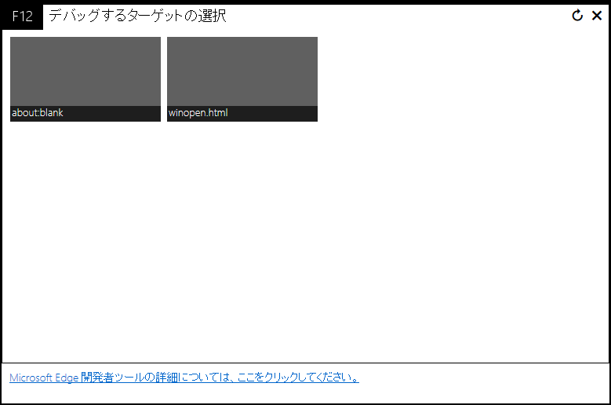

4. 開発者ツールが起動しますので、Web コンテンツをデバッグします。

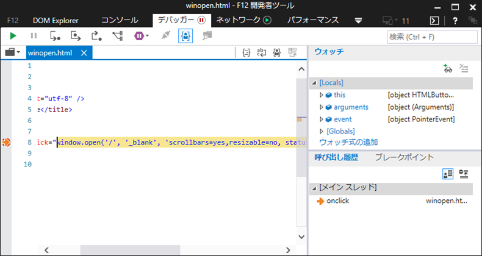

- [目次へ](#目次)

---

## Cookie の共有

以下のドキュメントに詳細がまとまっていますが、<span style="color: #ff0000">セッション Cookie</span> に関して、Edge から IE モードにのみ共有することができます。
<span style="color: #ff0000">セッション Cookie</span>を逆方向へ (IE モードから Edge へ) 共有することはできません。

Microsoft Edge から Internet Explorer への Cookie の共有
https://docs.microsoft.com/ja-jp/deployedge/edge-ie-mode-add-guidance-cookieshare

<span style="color: #ff0000;font-weight:bold;">※ 共有できる Cookie の種類は、有効期限のある永続 Cookie ではなく、有効期間のないセッション Cookie のみですのでご注意ください。</span>

最も理想的な解決方法は、Cookie の共有が必要なコンテンツを全て Edge に移行させることです。

- [目次へ](#目次)

---

## ページ遷移時のブラウザー エンジンの切り替え

以下のポリシーの設定状態によって、IE モードで表示しているページからの遷移時の動作が変わります。

InternetExplorerIntegrationSiteRedirect
https://docs.microsoft.com/ja-jp/deployedge/microsoft-edge-policies#internetexplorerintegrationsiteredirect

実際の動きをみてみましょう。(ポリシー変更後はいったん Edge を再起動させてください)

サイトリストには以下のふたつの URL を登録した状態にします。

```
<site url="docs.microsoft.com/ja-jp/deployedge/edge-ie-mode">
<open-in>IE11</open-in>
</site>
<site url="aka.ms">
<open-in>IE11</open-in>
</site>
```

このサイトリストが反映された状態で以下の A, B の操作をすると、ポリシーの設定状態によって下記のとおりになります。

A) https://docs.microsoft.com/ja-jp/deployedge/edge-ie-mode を (IE モードで) 開いたあと、ページ左側の目次から任意の別のページを開く
B) https://aka.ms/windows/releaseinfo を開く

- 未構成もしくは既定
A, B) 遷移先のページが Edge モードで表示される。

- 自動ナビゲーションのみを Internet Explorer モードで維持する
A) 遷移先のページが Edge モードで表示される。
B) 遷移先のページが IE モードで表示される。

- すべてのページ内ナビゲーション を Internet Explorer モードで維持する
A, B) 遷移先のページが IE モードで表示される。

- [目次へ](#目次)

---

## IE モードでの表示をテストしたい

IE モードのテストのために、毎回サイトリストを書き替えたり、ポリシーを設定しなおすことは大変な手間がかかります。
この手間を解消するために、以下の A, B どちらかの方法でメニューから IE モードもしくは Edge モードを切り替え、コンテンツを表示することが可能です。

<span style="color: #ff0000">これらの機能はテストを目的に用意されており、意図しないサイトで IE モードを利用することは、想定しない ActiveX の実行など、セキュリティのリスクがありますので十分ご注意ください。</span>

以下の通知は、サイトリストを使用せずに後述の A, B の方法で手動で IE モードに切り替えた場合に表示されるものです。テスト モードでこのメッセージを抑止する方法はありません。サイトリストを使用して IE モードを利用する場合には表示されません。


なお、テスト モードの利用は IE モードが構成されていることが前提となります。以下のポリシーで IE モードを有効に設定してください。

      [コンピューターの構成] or [ユーザーの構成]
       ＋[管理用テンプレート]
        ＋[Microsoft Edge]
      「Internet Explorer 統合を構成する」有効にし IE モードを選択

A) [InternetExplorerIntegrationTestingAllowed (Internet Explorer モードのテストを許可) ポリシー](https://docs.microsoft.com/ja-jp/deployedge/microsoft-edge-policies#internetexplorerintegrationtestingallowed) を有効に設定する

      [コンピューターの構成] or [ユーザーの構成]
       ＋[管理用テンプレート]
        ＋[Microsoft Edge]
      「Internet Explorer モードのテストを許可」有効

※ 上記のポリシーはバージョン 95 から利用できなくなりますので、バージョン 92 (2021/7/22 の週にリリース予定) からは、[Internet Explorer モードでサイトの再読み込みを許可](#Internet-Explorer-モードでサイトの再読み込みを許可) をご利用ください。

B) "\-\-ie-mode-test" オプションを付加して msedge.exe を実行する
実行例)
```
"C:\Program Files (x86)\Microsoft\Edge\Application\msedge.exe" --ie-mode-test
```

上記 A, B の方法を利用することで、ポリシーの説明にもあるように [その他のツール] 以下に、[サイトを Internet Explorer モードで開く]、[サイトを Edge モードで開く] メニューが表示されます。

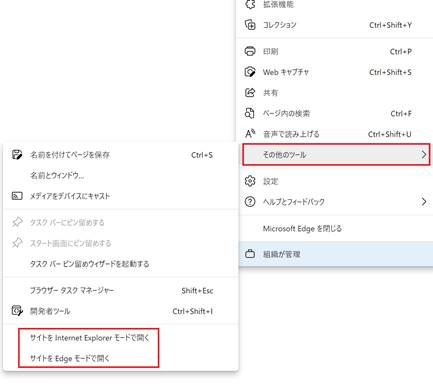

(参考)
グループ ポリシーを使用して Internet Explorer 統合を有効にする
https://docs.microsoft.com/ja-jp/deployedge/edge-ie-mode-policies#enable-internet-explorer-integration-using-group-policy

- [目次へ](#目次)

---

## Internet Explorer モードでサイトの再読み込みを許可

現在この機能はコンシューマー向けであり、Windows 10 Home、あるいはドメイン不参加の Windows 10 Pro で利用可能です。
Windows 10 Enterprise エディションやドメイン参加環境の Pro エディションでは使用できません(※) ので、上述の A もしくは B の方法で「サイトを Internet Explorer モードで開く」という機能を使用します。
(なお上記は OS のエディションについてであり、Edge 自体に OOOO エディションのようなものはありません。)

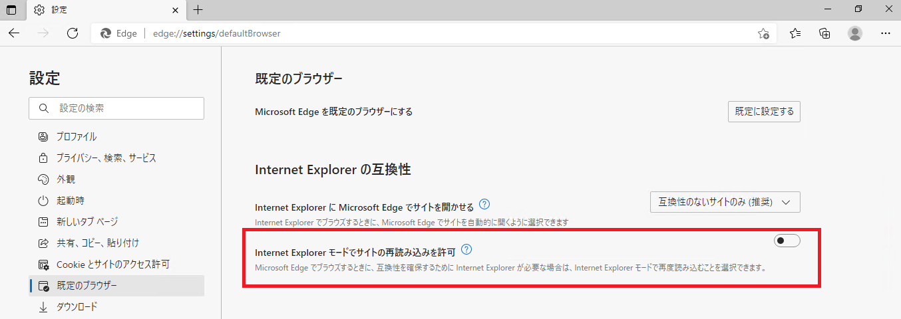

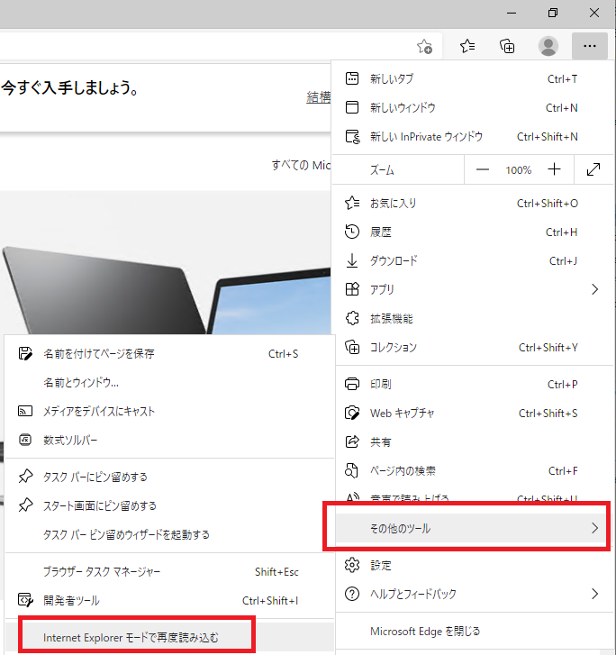

(参考) 以下の注釈部分でも触れています。
[Microsoft Edge の Internet Explorer モード](https://support.microsoft.com/ja-jp/office/microsoft-edge-%e3%81%ae-internet-explorer-%e3%83%a2%e3%83%bc%e3%83%89-6604162f-e38a-48b2-acd2-682dbac6f0de?ui=ja-jp&rs=ja-jp&ad=jp)

※ バージョン 92 (2021/7/22 の週にリリース予定) から、[Internet Explorer モードで未構成のサイトを再度読み込みできるようにする](https://docs.microsoft.com/ja-jp/deployedge/microsoft-edge-policies#internetexplorerintegrationreloadiniemodeallowed) ポリシーを有効にすることで、エンタープライズ環境でも「Internet Explorer モードでサイトの再読み込みを許可」を利用可能になります。

※ [Internet Explorer モードで未構成のサイトを再度読み込みできるようにする](https://docs.microsoft.com/ja-jp/deployedge/microsoft-edge-policies#internetexplorerintegrationreloadiniemodeallowed) ポリシーで機能を利用するには、Windows 10 version 1909 では [KB5003698](https://support.microsoft.com/en-us/topic/june-15-2021-kb5003698-os-build-18363-1645-preview-1ecf117e-1f89-40f9-a0a5-ed5766737620) 以上、Windows 10 version 2004 / 20H2 / 21H1 では [KB5003690](https://support.microsoft.com/en-us/topic/june-21-2021-kb5003690-os-builds-19041-1081-19042-1081-and-19043-1081-preview-11a7581f-2a01-47d5-ba12-431709ee2248) 以上を適用する必要があります。

- [目次へ](#目次)

---

## サイトリストで指定しているサイトが IE モードで表示されない

まずは edge://compat を開いて、Edge が読み込んでいるサイトリストの内容を確認します。

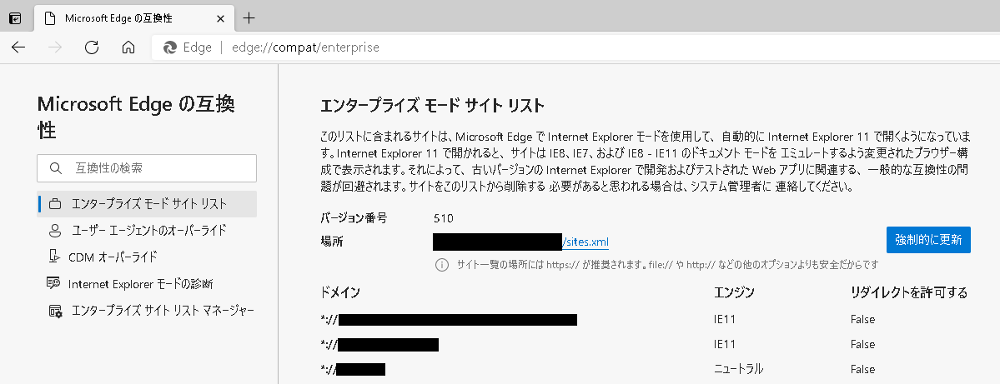

確認ポイント

- URL 一覧の中に、IE モードで表示したい項目が存在するか。
- 対象のサイトについて "エンジン" が "IE11" となっているか。
- "エンジン"が "ニュートラル" となっている場合、遷移元のページが IE モードで表示されているか。

もし想定していない状態であれば、なぜ意図したサイトリストが利用されていないのかを掘り下げていきます。

確認ポイント

- サイトリストのバージョンを更新したか。
- [エンタープライズ モード スキーマ v.2 ガイダンス](https://docs.microsoft.com/ja-jp/internet-explorer/ie11-deploy-guide/enterprise-mode-schema-version-2-guidance) に沿っているか。
- シンプルに１つだけ登録した状態であれば、Edge に反映されるか。

サイトリストの内容には問題がない場合、edge://compat/iediagnostic を開いて、ポリシーの設定状態を確認します。

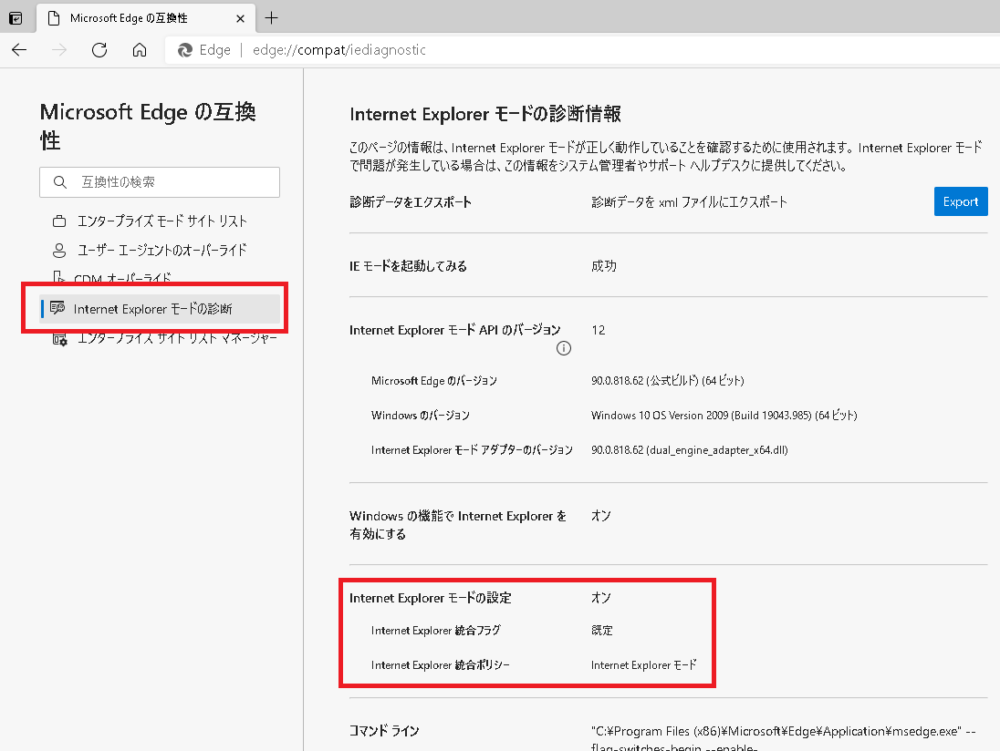
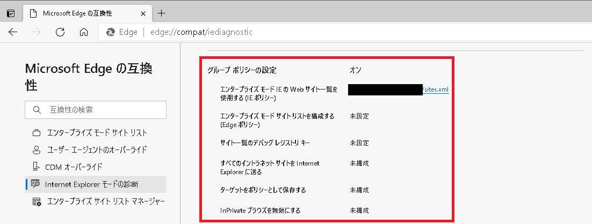

確認ポイント

- "Internet Explorer モードの設定" で上記のようになっているかどうか。
- "グループ ポリシーの設定" が想定したとおりになっているかどうか。

設定について [IE モード ポリシーの構成](https://docs.microsoft.com/ja-jp/deployedge/edge-ie-mode-policies) のドキュメントをみながら構成を確認します。

- [目次へ](#目次)

---

## ドキュメント モードを確認したい

アドレス バーの横にある IE モードのアイコンをクリックすると確認できます。

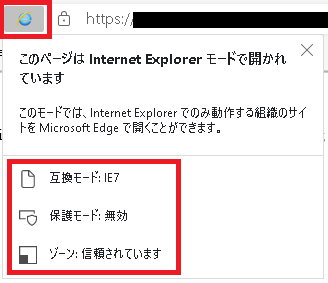

なお、ドキュメント モードは IE11 デスクトップ アプリと同じく [こちらにあるフロー](https://docs.microsoft.com/en-us/previous-versions/windows/internet-explorer/ie-developer/compatibility/dn384051(v=vs.85)) に従って決定されます。

たとえば、エンタープライズ モードで Web ページを表示するように指定している場合に、対象の Web ページにて meta タグ (X-UA-Compatible) の指定や !DOCTYPE 宣言がないとドキュメント モードは IE5 となります。

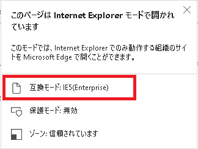

- [目次へ](#目次)

---

## ニュートラル サイト

ニュートラルの機能は、<font color="red">その URL に遷移してきた際の直前のブラウザーを維持することです。</font>
つまり、Edge で遷移してきた場合には Edge を維持し、IE モードで遷移してきた場合には IE モードを維持するにようにできます。

以下のような場面で利用します。

### 認証がうまくいかないケース

IE モードを利用するとき『認証がうまくいかない』というお問い合せをよくいただきますので、ここで紹介します。

認証がうまくいかないという話では [保護モードをまたいだ Cookie について](../cross-protected-mode-cookie/) という記事で、Azure AD (AAD) 認証を必要とする Web アプリケーションを例としました。
対象の Web アプリケーションのドメインと認証時にアクセスする login.microsoftonline.com が異なったセキュリティ ゾーンに属していた場合、認証済みを示す Cookie がリクエストに含まれないことで、ユーザーがログオンしていないと判断され、再度認証を求められてしまうという現象を解説しました。

IE モードを利用するとき『どの URL を IE モードで表示するか』を設定しますが、対象の Web アプリケーションの URL に加えて、<font color="red">**認証サーバー / シングル サインオン サーバーに対してのアクセスも IE モードで動作するように明示的に構成する**</font> 必要があります。
認証サーバーも含めておかないと、以下のように IE モードと Edge とで行き来するときに認証に必要な Cookie が共有されずに認証ができません。

1. 対象の Web アプリケーションの URL にアクセスします。(IE モードで動作します)
2. 認証のために認証サーバーにアクセスします。(Edge で通信します)
3. Edge 側で認証済みを示す Cookie を受け取ります。
4. 対象の Web アプリケーションにリダイレクトしますが、ここで IE モードに切り替わります。
5. IE モードとしては認証済みを示す Cookie を持っていないので、Cookie なしの状態でリクエストすることになります。
6. 認証済みを示す Cookie がリクエストに含まれないことで、ユーザーがログオンしていないと判断され、再度認証を求められます。

ただ、認証時に通信するサーバーをすべて IE モードで動作するように明示的に指定してしまうと、逆に Edge でアクセスする必要があるパターンでうまくいきません。

具体例として、Azure AD (AAD) 認証を必要とする Web アプリケーションとして Office.com を使って試してみます。
(本来は IE モードを使わずに Edge でご覧いただくことをおすすめします)

まずは以下のように対象サイト (office.com) だけを登録してみます。

```
<site url="office.com">
    <open-in>IE11</open-in>
</site>
```

このサイト リストを読み込んで、office.com にアクセスすると IE モードで開きます。
サインインの操作をしてみるとわかりますが、サインインが完了しません。(場合によっては、認証画面の表示がループしてしまうこともあります)
これは、上述のとおり、認証済みを示す Cookie がリクエストに含まれないことで、ユーザーがログオンしていないと判断されたためです。

そこで以下のように、今回の認証時に経由する可能性がある、login.microsoftonline.com, login.windows.net, login.live.com に対しても IE モードになるように \<open-in\>IE11\</open-in\> を設定してみます。

```
<site url="office.com">
    <open-in>IE11</open-in>
</site>
<site url="login.microsoftonline.com">
    <open-in>IE11</open-in>
</site>
<site url="login.windows.net">
    <open-in>IE11</open-in>
</site>
<site url="login.live.com">
    <open-in>IE11</open-in>
</site>
```

これにより、認証時に通信するサーバーすべてが IE モードで動作し、認証完了まで進みます。

それでは、この状態で [Outlook on the web (OWA)](https://outlook.live.com/owa/) を開いてみましょう。
OWA は IE モードで開くように登録をしていないので、通常の Edge で開きます。
サインインをしようとすると、login.live.com が IE モードとして登録されているので、サインイン画面が IE モードで開きます。
アカウント情報を入力してみると...

エラーになってしまいました :(

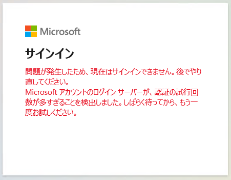


認証サーバー (login.microsoftonline.com, login.windows.net, login.live.com) を IE モードの対象から外せば、OWA は開きます。
でもそうすると、先ほどの Office.com がまたダメになってしまいます。

どちらもうまくいくように構成するにはどうしたらよいか...

**<font color="red">Edge と IE のどちらからも経由され得るサイトを『ニュートラル』に登録することで解決できます！</font>**

冒頭に記述したように、ニュートラルの機能は、<font color="red">その URL に遷移してきた際の直前のブラウザーを維持することです。</font>
つまり、Edge で遷移してきた場合には Edge を維持し、IE モードで遷移してきた場合には IE モードを維持するにようにできます。

それでは、先ほどのサイト リストを以下のように認証サーバー (login.microsoftonline.com, login.windows.net, login.live.com) に対してそれぞれ \<open-in\>None\</open-in\> に変えます。

```
<site url="office.com">
    <open-in>IE11</open-in>
</site>
<site url="login.microsoftonline.com">
    <open-in>None</open-in>
</site>
<site url="login.windows.net">
    <open-in>None</open-in>
</site>
<site url="login.live.com">
    <open-in>None</open-in>
</site>
```

こうすると、IE モードで開く Office.com から認証サーバーにアクセスするときは IE モードが維持され、Edge で開く OWA から認証サーバーにアクセスするときは Edge が維持されますので、認証処理の途中でモードが変わってしまうことを回避できます。

なお、下記ドキュメントの「ニュートラル サイトを構成する」の部分にも記載がありますが、上記の例のように Edge と IE のどちらからも経由され得るサイトはすべてニュートラルに登録する必要があります。

エンタープライズ モード サイト リストでのサイトの構成
https://docs.microsoft.com/ja-jp/deployedge/edge-ie-mode-sitelist

一時的な対応策としては [Internet Explorer モード ページから起動したときに未構成サイトへの「ページ内」ナビゲーションの動作を指定する] というポリシーが利用できますので、状況に合わせた対応をご検討いただければと思います。

Internet Explorer モードでページ内ナビゲーションを保持する
https://docs.microsoft.com/ja-jp/deployedge/edge-learnmore-inpage-nav

- [目次へ](#目次)

---
