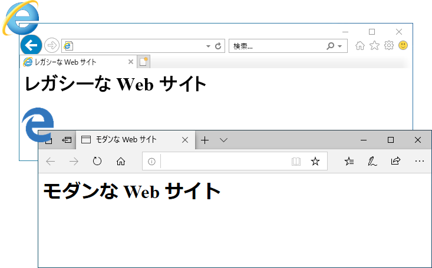
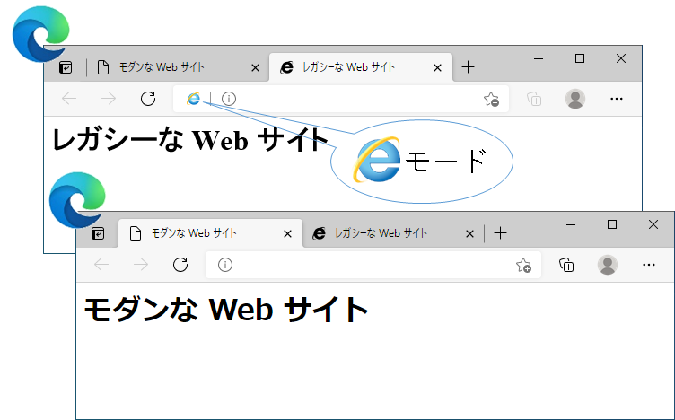

みなさんこんにちは。日本マイクロソフトの IE/Edge サポートチームです。

本日、以下の情報が公開されました。
FAQ を含め日本語での資料が充実していますので、まず以下のふたつの公式ドキュメントを一通りご覧ください。

[Internet Explorer は Microsoft Edge へ – Windows 10 の Internet Explorer 11 デスクトップアプリは 2022 年 6 月 15 日にサポート終了](https://blogs.windows.com/japan/2021/05/19/the-future-of-internet-explorer-on-windows-10-is-in-microsoft-edge/)

[「Internet Explorer 11 デスクトップ アプリケーションのサポート終了」の発表に関連する FAQ](https://blogs.windows.com/japan/2021/05/19/internet-explorer-11-desktop-app-retirement-faq/)

(英語原文)
[The future of Internet Explorer on Windows 10 is in Microsoft Edge—the Internet Explorer 11 desktop application will be retired on June 15, 2022](https://blogs.windows.com/windowsexperience/2021/05/19/the-future-of-internet-explorer-on-windows-10-is-in-microsoft-edge/)

[Internet Explorer 11 desktop app retirement FAQ](https://aka.ms/IEModeFAQ)

以下には上記の公式ドキュメントにある内容から要点のみ簡潔にまとめています。

---

## 2022 年 6 月 15 日に Windows 10 の Internet Explorer 11 "デスクトップ アプリ" のサポートを終了し、Microsoft Edge に組み込まれている "IE モード" で少なくとも 2029 年までは引き続きサポートします。

### サポート終了対象
- 半期チャネル (SAC) で配信される以下の OS 上の Internet Explorer 11 デスクトップ アプリ (スタンドアロンの IE11)
    - Windows 10 desktop 全エディション (20H2 およびそれ以降にリリースされるバージョン) 
    - Windows 10 IoT (20H2 およびそれ以降にリリースされるバージョン)

### サポート終了対象外
- IE モード
- Internet Explorer platform (MSHTML / Trident) (WebBrowser コントロールの利用)
- 現在リリースされている 以下の OS 上の Internet Explorer 11 デスクトップ アプリ (スタンドアロンの IE11)
    - Windows 8.1
    - Windows 7 ESU
    - Windows 10 Server SAC (全バージョン)
    - Windows 10 IoT LTSC (旧 LTSB 含む) (全バージョン)
    - Windows 10 Server LTSC (旧 LTSB 含む) (全バージョン)
    - Windows 10 client LTSC (旧 LTSB 含む) (全バージョン)

なお、上記 Windows OS のサポート終了日は [こちらの "8) IE モードはいつまでサポートされますか？" の部分にある表](https://blogs.windows.com/japan/2021/05/19/internet-explorer-11-desktop-app-retirement-faq/) をご覧ください。

* IE でなければ閲覧できない古い技術を使って作成されたレガシーな Web サイトは、2022 年 6 月 15 日以降は IE モードで閲覧してください。(以下のイメージをご覧ください)
* スタンドアロンの IE についてはサポートを終了しますが、IE モードは少なくとも 2029 年まではサポートされますので、IE モードへの移行、さらには Edge への移行 (HTML5 に対応したモダンなウェブ アプリへの移行) を計画的に進めていただくことをお勧めします。
* IE モードのよくあるご質問は [こちら](https://jpdsi.github.io/blog/internet-explorer-microsoft-edge/ie-mode-faq/) をご覧ください。

---

### これまで : 二つのブラウザーを使い分ける

### これから : 一つの Edge を利用する

---

#### (参考) 関連する記事
- [「Internet Explorer 11 デスクトップ アプリケーションのサポート終了」の発表に関連する FAQ](https://blogs.windows.com/japan/2021/05/19/internet-explorer-11-desktop-app-retirement-faq/)

##### これまでに当サポート チームで公開した記事
- [Internet Explorer の今後について](https://social.msdn.microsoft.com/Forums/ja-JP/47290e24-fc66-4d3e-a2de-429643758d40/internet-explorer-12398201702446012395123881235612390?forum=edgeiesupportteamja)
- [まだデフォルトIE？ 新しい Microsoft Edge を使いませんか？](https://jpdsi.github.io/blog/internet-explorer-microsoft-edge/how-about-using-new-edge/)

- [IE モードのよくあるご質問](https://jpdsi.github.io/blog/internet-explorer-microsoft-edge/ie-mode-faq/)
- [Internet Explorer から Microsoft Edge への移行ガイドライン](https://jpdsi.github.io/blog/internet-explorer-microsoft-edge/guidelines-for-migrating-from-ie-to-microsoft-edge/)
- [Microsoft Edge 組み込みのサイト リスト マネージャーについて](https://jpdsi.github.io/blog/internet-explorer-microsoft-edge/edge-ie-mode-site-list-manager/)

##### その他弊社社員が作成した資料
- [(動画) Microsoft Edge で IE モードを使ってみよう (IT 管理者向け)](https://youtu.be/XPFx4A32npk)

---