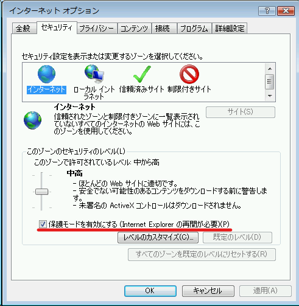
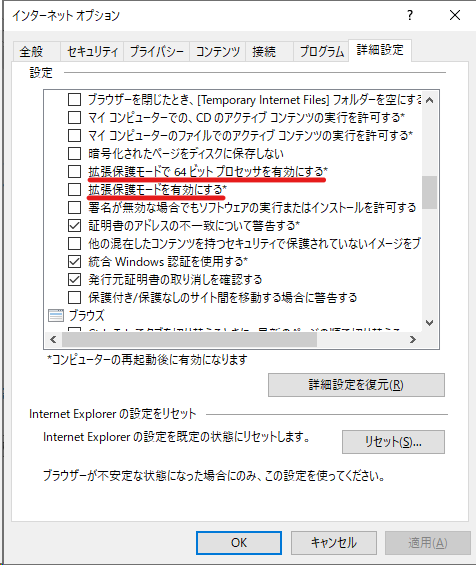

> 本記事は Technet Blog の更新停止に伴い、もともとばらばらに存在していた記事を一つのブログに集約／移行したものです。
> 元の記事の最新の更新情報については、本内容をご参照ください。

こんにちは。
今回は Internet Explorer の保護モードって何だっけ？拡張保護モードって何だっけ？という点について改めてご紹介いたします。

## そもそも保護モードおよび拡張保護モードはなぜ必要なの？
保護モードの登場は、日々進化したインターネット ビジネスと日々深刻なってくるセキュリティ保護の重要性と深い関係があります。

Windows XP / 2003 以前の OS はログインしたユーザーが起動したプロセスなら、プロセス内にそのユーザーの権限をフルに使うことができました。
管理者権限でログインして、インターネット サーフィンをするときどうなるかを想像してみたことがありますか？
Internet Explorer を立ち上げて、管理者権限でプロセス (iexplore.exe) が起動されて、その中で Web ページが動いています。
ページ内の ActiveX コントロールなどの実行を許可してしまうと、管理者権限でプロセスが動作しているため何の制限もなく自由にローカル ファイルなどへのアクセスができてしまいます。
今となってはとても恐ろしい状態と言えます。

そこで Windows Vista で OS レベルでプロセス整合性レベルという新機能が登場しました。
この機能のおかげでユーザーの権限を一部だけ許可できるようになり、Internet Explorer もこの機能を活用することで安全性を向上させる機能が登場しました。
この機能こそが「保護モード」です。

「保護モード」が有効である場合、整合性レベルが低いプロセスで動かすことにより、危険性が高いサイトを閲覧したとしてもセキュリティ上のリスクを軽減することができるようになりました。

更に Windows 8 での Windows ストア アプリケーションの登場により、同じく整合性レベルが低いプロセスでも、更なる厳しい権限制限やデーターアクセスの分離の必要性が生じ AppContainer というさらに低い整合性レベルが追加されました。
Internet Explorer もこの追加された権限を利用し、従来よりもさらに安全性を向上させる機能が登場しました。
この機能こそが「拡張保護モード」です。

保護モード、拡張保護モードについて詳しく紹介していきます。

## 保護モードとは？
保護モードが最初に登場したのは、Windows Vista 上の Internet Explorer 7 です。
下記のように、インターネット オプションで各ゾーンのセキュリティ設定を行うタブに [保護モードを有効にする] というオプションが追加されました。

#### 保護モードの既定値: 
|インターネット|ローカル イントラネット|信頼済みサイト|制限付きサイト|
|:--:|:--:|:--:|:--:|
|有効|無効|無効|有効|

#### 保護モードの本質: 
保護モードは、Windows OS のプロセス整合性モデル (Integrity Level、以下 IL) を利用したセキュリティを強化するための機能です。

IL とは簡単に言うと、OS 上のプロセスを [高] (High) - [中] (Medium) - [低] (Low) の三段階でレベル付けし、レベルが高ければ高いほど OS での読み込み・書き込み権限が強い、低ければ低いほど権限が弱いという仕組みです。
Internet Explorer は保護モードが有効のサイトを表示する際時は IL が [低] のプロセス (コンテンツ プロセス) で処理し、保護モードが無効のサイトは IL が [中] のプロセス (コンテンツ プロセス) で処理します。
こうして、インターネット上のサイトを権限の低いプロセスでホストして、仮にサイト内に OS への意図しない箇所への書き込みもしくは読み込み処理が実装されていても、この操作は権限制限によって失敗するため悪意のあるサイトから OS のデータを保護できます。

#### 保護モードが効かないパターン: 
この IL という仕組みは、ユーザー アカウント制御 (UAC) を前提としているため、この機能が有効である OS でのみ対応しています。
以下のシナリオで起動した Internet Explorer は IL=Low とならないため保護モードは実質無効です。
* OS の UAC 機能を無効に設定している場合 (IL=High)
* ビルトインの管理者 (ユーザー名: Administrator) でログオンした場合 (IL=High)
* Internet Explorer を右クリックして [管理者として起動] で起動する場合 (IL=High)
* Internet Explorer の LCIE プロセス モデルを無効 (TabProcGrowth=0) にした場合 (IL=Medium)

## 拡張保護モードとは？
Windows 8 以降 [低] よりも権限が制限された IL レベル:  AppContainer が追加されました。
この AppContainer は Windows ストア アプリケーション (Windows 8 でタイル状のアイコンから起動するアプリケーション) が動作するセキュリティ基盤となります。
Windows 10 における ユニバーサル Windows プラットフォーム (UWP) アプリケーションも同様です。

Internet Explorer においてもこの新しい IL レベルに対応する機能が追加されました。
これが [拡張保護モード] であり、Windows 8 上の Internet Explorer 10 で初めて実装されました。

#### 拡張保護モードの設定箇所: 
Windows 8.1 に実装されているモダン UI 版の Internet Explorer (タイル アイコンから起動する Internet Explorer) は常に拡張保護モードが有効です。
モダン UI 版においては設定変更することはできません。

Windows 10 などのデスクトップで利用する Internet Explorer は、インターネット オプションの [詳細設定] タブで設定が可能です。

上記を見てお気付きかと思いますが、64 ビット OS 環境においては [拡張保護モードで 64 ビット プロセッサを有効にする] という項目が追加されています。
この設定は、拡張保護モードが有効である場合に、コンテンツ プロセスを 64 ビットにするかどうかを設定する項目です。
Internet Explorer のプロセス モデルの投稿で "例外" と記載した点はこの項目が関係します。

なお、この項目は Internet Explorer 11 で新たに追加された項目です。
はじめて拡張保護モードに対応した Internet Explorer 10 では拡張保護モードを有効にすると、必ずコンテンツ プロセスも 64 ビットで動作します。
Internet Explorer 11 ではコンテンツ プロセスのビット数をユーザーが自由に選択できるようにするために本項目が追加されました。

#### 拡張保護モードの既定値: 
Internet Explorer 11 がサポートされているクライアント OS / サーバー OS いずれの環境においても両項目とも無効化されています。

* 拡張保護モードを有効にする
* 拡張保護モードで 64 ビット プロセッサを有効にする

Internet Explorer 11 をサポートしている環境は下記のとおりです。

> クライアント OS : Windows 7 / Windows 8.1 / Windows 10
> サーバー OS : Windows Server 2008 R2 / Windows Server 2012 / Windows Server 2012 R2 / Windows Server 2016 / Windows Server 2019

##### 補足 : Windows Server 2012 と OS のビット数について
Windows Server 2012 は、2020 年 1 月より Internet Explorer 11 のみがサポートされます。
"拡張保護モードで 64 ビット プロセッサを有効にする" の設定項目は、Windows 8.1 / Windows Server 2012 以降の 64 ビット OS 環境のみ存在します。

#### 拡張保護モードの本質: 
まず拡張保護モードは、保護モードが有効であることを前提としています。
このため、保護モードが無効な状態の場合や保護モードが効かないパターンに記載したような方法で Internet Explorer を起動した場合は、拡張保護モードも無効です。

保護モードかつ拡張保護モードのいずれも有効である場合、IL は [Low] よりも低い [AppContainer] でコンテンツ プロセスが動作します。
したがって、[Low] よりもさらに厳しい制限のもとでプロセスが動作するため、従来の保護モードよりも安全性が向上しています。

#### 整合性レベル (IL) とコンテンツ プロセスのビット数: 
コンテンツ プロセスの整合性レベル (IL) は、閲覧対象のサイトがどのゾーンに含まれるか、そのゾーンにおいて保護モードが有効となっているか、がまずは影響します。
保護モードが有効となっている状態で、かつ、"拡張保護モードを有効にする" が有効となっている場合のみ、コンテンツ プロセスの IL が AppContainer となります。
いずれか条件に合致しない場合にはコンテンツ プロセスの IL は Low もしくは Medium となります。

"拡張保護モードで 64 ビット プロセッサを有効にする" が有効となっている場合のみ、コンテンツ プロセスのビット数が 64 ビットとなります。
下記の場合にはコンテンツ プロセスのビット数は 32 ビットです。

* 本設定項目が無効となっている場合
* 32 ビット OS 環境の場合 (本設定項目がそもそも存在しない)

##### 補足 : Windows 7 および Windows Server 2008 R2 について
Windows 7 や Windows Server 2008 R2 の場合は、Windows OS 自体が AppContainer の IL に非対応です。
拡張保護モードを有効としても IL は AppContainer にはならず Low のままとなるため、64 ビット OS の場合にはコンテンツ プロセスのビット数を 64 ビットとして動作させることで、拡張保護モードに一部対応しています。
32 ビット OS (Windows 7) の場合には、プロセス自体を 64 ビットとすることができないため拡張保護モード自体に対応しておらず設定項目も存在しません。

上記をまとめると下記のとおりです。

###### 64 ビット OS 環境の場合
<table>
  <tr><th>&nbsp;</th><th>保護モード</th><th>拡張保護モードを 有効にする</th><th>拡張保護モードで 64 ビット プロセッサを 有効にする</th><th>結果</th></tr>
  <tr><td rowspan="3">Windows 7 および Windows Server 2008 R2</td><td rowspan="2">有効</td><td>有効</td><td>(項目なし)</td><td>Low 64 ビット</td></tr>
  <tr><td>無効</td><td>(項目なし)</td><td>Low 32 ビット</td></tr>
  <tr><td>無効</td><td>―</td><td>(項目なし)</td><td>Medium 32 ビット</td></tr>
  <tr><td rowspan="5">Windows 8.1 以降 および Windows Server 2012 以降</td><td rowspan="4">有効</td><td rowspan="2">有効</td><td>有効</td><td>AppContainer 64 ビット</td></tr>
  <tr><td>無効</td><td>AppContainer 32 ビット</td></tr>
  <tr><td rowspan="2">無効</td><td>有効</td><td>Low 64 ビット</td></tr>
  <tr><td>無効</td><td>Low 32 ビット</td></tr>
  <tr><td>無効</td><td>―</td><td>―</td><td>Medium 32 ビット</td></tr>
</table>

###### 32 ビット OS 環境の場合 (32 ビット版のサーバー OS は存在しません)
<table>
  <tr><th>&nbsp;</th><th>保護モード</th><th>拡張保護モードを有効にする</th><th>結果</th></tr>
  <tr><td rowspan="2">Windows 7</td><td>有効</td><td>(項目なし)</td><td>Low 32 ビット</td></tr>
  <tr><td>無効</td><td>(項目なし)</td><td>Medium 32 ビット</td></tr>
  <tr><td rowspan="3">Windows 8.1 以降</td><td rowspan="2">有効</td><td>有効</td><td>AppContainer 32 ビット</td></tr>
  <tr><td>無効</td><td>Low 32 ビット</td></tr>
  <tr><td>無効</td><td>―</td><td>Medium 32 ビット</td></tr>
</table>

#### 拡張保護モードが効かないパターン: 
重複しますが、保護モード機能が無効な場合は拡張保護モードも無効となります。
したがって、"保護モードが効かないパターン" に記載の条件下においては拡張保護モードも無効となります。
また、Windows 7 および Windows Server 2008 R2 環境においては、コンテンツ プロセスのビット数が変化するだけで本物の「拡張保護モードではない」ことも念頭においてください。

#### 拡張保護モード時の注意点: 
拡張保護モードが有効に動作している場合、当該 Web ページ上で ActiveX コントロールが利用されている場合は注意が必要です。
拡張保護モードが有効である場合、上述のとおり IL=AppContainer で動作しますが、ActiveX 自体が AppContainer 内で動作できるようにデザインされている必要があります。
下記の資料を参考に AppContainer で動作できるようにご対応をご検討ください。

> Supporting enhanced protected mode (EPM)
> https://docs.microsoft.com/ja-jp/previous-versions/windows/internet-explorer/ie-developer/compatibility/dn519894(v%3dvs.85)

長文となりましたがいかがでしたでしょうか。
上述の内容が少しでもお役に立ちましたら幸いです。
