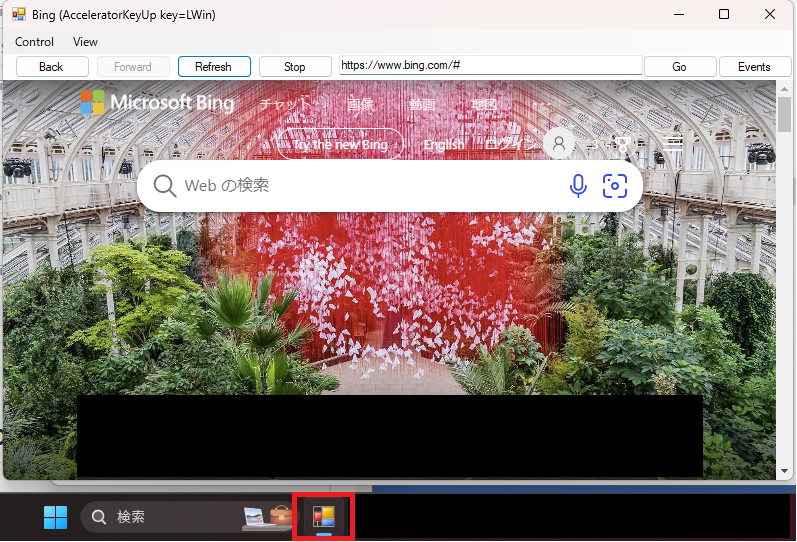

みなさんこんにちは。日本マイクロソフトの IE/Edge サポートチームです。

今回はお客様からよくご質問をいただく Microsoft Edge WebView2 (以下 WebView2) のお話をお伝えしたいと思います。

最近では WebView2 Runtime を利用する WebView2 アプリケーションも増えており、その折で端末に勝手に WebView2 Runtime がインストールされているのはなぜか？といったお問い合わせをよくいただきます。 WebView2 Runtime と WebView2 アプリケーションの違いや、そもそも Microsoft Edge とはなにが違うのかなどよくいただく質問についてこちらのブログにおまとめいたしました。

WebView2 に関しては下記 URL 関連するドキュメントにおいて、サンプルやアーキテクチャなどを詳述しております。
本ブログにおいて不明な点がございましたら、まずはドキュメントをご確認いただけますと幸いです。

https://learn.microsoft.com/ja-jp/microsoft-edge/webview2/

## 目次<!-- omit in toc -->
- [なぜ Edge は自動更新を行うのか](#なぜ-edge-は自動更新を行うのか)
- [Edge の種類と Edge のサポート範囲について](#edge-の種類と-edge-のサポート範囲について)
  - [Edge のバージョンの読み方について](#edge-のバージョンの読み方について)
  - [Edge のバージョン アップデートの頻度について](#edge-のバージョン-アップデートの頻度について)
    - [Extended Stable 版について](#extended-stable-版について)
    - [最新版の確認方法](#最新版の確認方法)
- [Edge のインストールおよび更新制御方法について](#edge-のインストールおよび更新制御方法について)
  - [1) Edge のインストールの制御](#1-edge-のインストールの制御)
  - [2) WebView2 のインストールの制御](#2-webview2-のインストールの制御)
  - [3) Edge の更新制御](#3-edge-の更新制御)
  - [4) WebView2 の更新制御](#4-webview2-の更新制御)
- [Edge の更新タイミングの制御方法について](#edge-の更新タイミングの制御方法について)
  - [Edge の更新の流れについて](#edge-の更新の流れについて)
- [具体的な更新タイミングについての制御方法について](#具体的な更新タイミングについての制御方法について)
  - [5) アップデートできない時間帯を指定する方法](#5-アップデートできない時間帯を指定する方法)
  - [6) 更新チェック後の次の更新チェックまでの最低猶予時間を指定する方法](#6-更新チェック後の次の更新チェックまでの最低猶予時間を指定する方法)
    - [UpdateSuppressed および AutoUpdateCheckPeriodMinutes が設定された場合](#updatesuppressed-および-autoupdatecheckperiodminutes-が設定された場合)
  - [7) Edge の自動更新用のモジュールの更新の制御](#7-edge-の自動更新用のモジュールの更新の制御)
- [その他更新の制御について](#その他更新の制御について)
  - [MECM/SCCM および WSUS による Edge の更新制御](#mecm-sccm-および-wsus-による-edge-の更新制御)
  - [ドメイン管理外の端末での更新制御方法について](#ドメイン管理外の端末での更新制御方法について)

## WebView2、WebView2 Runtime や WebView2 SDK とはなんですか、どのような違いがありますか？

***

「WebView2」 はご利用いただいているデスクトップアプリケーションなどに、Edge のブラウザ機能を埋め込むためにご利用いただける機能(コントロール)になります。
WebView2 を利用することで、例えばネイティブアプリ内でブラウジングの機能を実装したり、またネイティブアプリより WebView2 のブラウザをオートメーションするなどが可能になります。

https://learn.microsoft.com/ja-jp/dotnet/desktop/winforms/controls/webbrowser-control-overview?view=netframeworkdesktop-4.8

例えば以下は弊社が公開している [WebView2 のサンプルアプリケーション](https://github.com/MicrosoftEdge/WebView2Samples) です。画像を見るとわかるように、Bing のブラウザ画面にもかかわらずアプリは Edge などではなく、デスクトップ アプリケーションになっています。



上記のようにデスクトップ アプリケーションにブラウザ画面を埋め込むことができ、なおかつよく見ると、Back や Refresh, GO やアドレスバーなどがブラウザ画面の外にあることがわかります。これは WebView2 の API を利用することで、デスクトップ アプリケーション側からブラウザコンポーネントの操作を行えることを意味します。つまり、デスクトップ アプリケーションからブラウザをオートメーションさせたり、ブラウザでの表示された内容にもとづいてアプリを処理させるなどができます。

詳細は下記をご確認ください。

https://learn.microsoft.com/ja-jp/microsoft-edge/webview2/

一般に WebView2 の機能を利用したアプリケーションを 「WebView2 アプリケーション」 と表現します。

過去の IE の WebBrowser コントロールの場合は、通常 C:\Windows\System32 配下に存在する、shdocvw.dll や mshtml.dll 等の DLL を利用して動かすため、WebBrowser コントロールを利用するアプリケーションのために端末になにかを追加でインストールすることは必要ございませんでした。
**一方で WebView2 についてはアプリケーションを実行する上で必要とするモジュールを別途インストールする必要がございます**。

その **WebView2 アプリケーションを実行するために必要になるのが「WebView2 Runtime」になります**。

そのため WebView2 アプリケーションを利用するためには、WebView2 Runtime が端末にインストールされている必要がございます。

注意：  
WebView2 アプリケーション内に、WebView2 Runtime の実行可能ファイルを同梱させることも可能なため、必ずしも WebView2 アプリケーションを利用するために、端末に WebView2 Runtime が必要不可欠というわけではございません。
ただし一般的に WebView2 Runtime 自体のファイルサイズは 130~140 MB にもなりますため、アプリケーションの大きさを小さく保ちたいなどを理由として、端末に WebView2 Runtime がインストールされていることを前提として WebView2 アプリケーションを作成することが一般的です。 
なお Windows 11 においてはすでに WebView2 Runtime は自動的にインストールされており、アンインストールが行えない様になっております。

クライアントに WebView2 Runtime が存在すれば、WebView2 アプリケーションを問題なく実行することができます。

一方で WebView2 アプリケーションを開発の視点に立ちますと、どうやってアプリケーションに WebView2 の機能を埋め込む必要があります。
WebView2 アプリケーションを開発するために利用するのが 「WebView2 SDK」 になります。

SDK については [Release Notes for the WebView2 SDK](https://learn.microsoft.com/en-us/microsoft-edge/webview2/release-notes) のドキュメントをご確認ください。

上記をまとめますと以下になります。

- 「WebView2」 とはデスクトップアプリケーションにブラウザ機能を導入できる技術
- 「WebView2 Runtime」 は WebView2 アプリケーションの実行に必要なクライアントにインストールされるモジュール
- 開発者は WebView2 アプリケーションを 「WebView2 SDK」 を利用して作成しております。

### WebView2 アプリケーションと WebView2 Runtime の互換性について
***

前述したように WebView2 アプリケーションは WebView2 SDK によって作成されます。
そのため、例えば古い WebView2 SDK で提供している API と新しいバージョンの WebView2 SDK で提供している API を比較すると、新しいバージョンにしかない API が存在することもございます。

そのため例えば以下のような組み合わせの場合については、(1) と (2) はそれぞれで問題なく動作はします。

- (1) ◯ 古い WebView2 SDK <=> 古い WebView2 Runtime
- (2) ◯ 新しい WebView2 SDK <=> 新しい WebView2 Runtime

しかし、新しい WebView2 SDK の機能を利用したアプリケーションを古い WebView2 Runtime で実行しようとした場合、クライアントに存在する Runtime がその API を認識できないために実行に失敗しアプリケーションにクラッシュする可能性 (4) がございます。

- (3) ◯ 古い WebView2 SDK <=> 新しい WebView2 Runtime 
- (4) ✕ 新しい WebView2 SDK <=> 古い WebView2 Runtime

一方で (3) の古い WebView2 SDK のアプリケーションを新しい WebView2 Runtime で実行させる場合は特に問題は発生しません。これは WebView2 Runtime 自体が WebView2 SDK の API の前方互換性を保っているためになります。

なおこの前方互換性として記事作成時において担保されているのは 86.0.616.0 までになります。つまり WebView2 Runtime が 86.0.616.0 時点で作成されたアプリケーション (対応する SDK は 1.0.622.22 )については、最新の WebView2 Runtime においても動作できることが期待されます。

下記が参考になります。

[Minimum version of the browser or Runtime to load WebView2](https://learn.microsoft.com/en-us/microsoft-edge/webview2/release-notes?tabs=dotnetcsharp#minimum-version-of-the-browser-or-runtime-to-load-webview2)

```
To load WebView2, the minimum version of Microsoft Edge or the WebView2 Runtime is 86.0.616.0. 
The minimum version to load WebView2 only changes when a breaking change occurs in the web platform.
```

新しい WebView2 SDK の機能をすべてサポートする WebView2 Runtime のバージョンはそれぞれの SDK のリリースノートにおいて記載がございます。

https://learn.microsoft.com/en-us/microsoft-edge/webview2/release-notes?tabs=dotnetcsharp

例えば SDK 1.0.1722.32 の機能に完全に対応する Runtime については 112.0.1722.32 以上であることが必要になります。

```
For full API compatibility, this version of the WebView2 SDK requires WebView2 Runtime version 112.0.1722.32 or higher.
```

***
### WebView2 Runtime と WebView2 SDK のバージョンの関係性について

WebView2 SDK より作成したアプリケーションが、どの WebView2 Runtime 以上で完全互換性をもつかについては、バージョン情報のビルド バージョンを確認することで簡易的に判断ができます。


[Forward compatibility of APIs](https://learn.microsoft.com/en-us/microsoft-edge/webview2/concepts/versioning?source=recommendations#forward-compatibility-of-apis)

```
The WebView2 release SDK has been forward-compatible ever since version 1 (that is, SDK version 1.0.622.22). You can update your WebView2 app to use the latest APIs from the most recent release version of the SDK. Your app will continue to work on clients because clients automatically have the latest WebView2 Evergreen Runtime.

The WebView2 APIs in an SDK release package are stable and forward-compatible. A WebView2 API works when using a WebView2 Runtime that has an equal or higher build number as the SDK build number in which the API was introduced. The build number is the third part of the four-part version number for the Webview2 SDK, and of the four-part version number for Microsoft Edge and the WebView2 Runtime.

When you use a WebView2 SDK that has a build number equal to or less than the WebView2 Runtime, every API that you have access to in that SDK works with that version of the Runtime.

When you use a WebView2 SDK that has a build number greater than the WebView2 Runtime, the newer APIs' implementations aren't available in the Runtime.

For example, if an API is introduced in SDK 1.0.900.0, that API would work with Runtime 94.0.900+.0, but not with Runtime 90.0.700.0.
```


## WebView2 のサポート範囲について

WebView2 の機能については


aaaaaaaaaaaaaaaaaaa