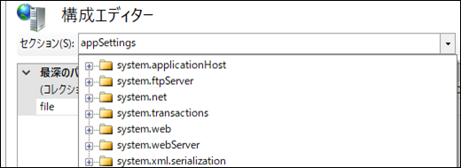
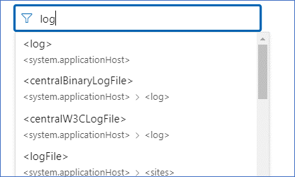
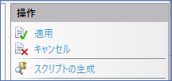
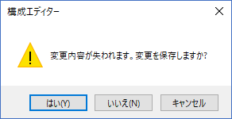

こんにちは。
 
IIS サポート チームです！

[構成エディター] を使用することで、IIS マネージャー上の設定を変更する
コマンドレット（PowerShell）やコマンドを生成することが出来ます。


この [構成エディター] は、弊社の公開情報でも設定手順が紹介されておりますが、
実情として、日本語で丁寧に書かれた情報はございません。

　Editing Collections with Configuration Editor
　https://docs.microsoft.com/en-us/iis/manage/managing-your-configuration-settings/editing-collections-with-configuration-editor

　Configuration Editor
　https://docs.microsoft.com/en-us/previous-versions/windows/it-pro/windows-server-2012-R2-and-2012/hh831362(v=ws.11)

そこで、可能な限り、丁寧に [構成エディター] を使用してコマンドレットや
コマンドを生成する方法を以下にてご案内いたします。
なお、[構成エディター] 上にある全ての UI の説明は割愛させていただき、
以下では最小限の手順となります。

## <u> 1. 前提と周辺情報 </U>
まず、IIS マネージャー上で、以下の設定を変更するコマンドレットや
コマンドを生成したいという要望があると仮定します。

“Default Web Site”
　- [ログ記録]
　　　- 右ペインの [有効にする], または [無効にする]


その場合、まず上記の設定を [構成エディター] 上で探すことが必要となります。
[構成エディター] 上では、IIS マネージャー上の設定は “セクション” と
呼ばれる箇所においてツリー状で存在しています。



※ “セクション” は以下にある applicationHots.config ファイル内の要素に該当しています

　　%SystemRoot%\system32\inetsrv\config

　　故に、設定を変更したい項目を変更して、applicationHost.config 内のどの要素が
　　変更されたのかを確認（比較）することでも、当該設定が “セクション” 内の
　　いずれにあるかを探すことが出来ます

“セクション” 内のどの箇所に当該設定があるかを把握するためには、
以下のサイトにアクセスして検索することが可能です。

　Configuration Reference <configuration>
　https://docs.microsoft.com/en-us/iis/configuration/

上記サイト左側にある configuration, administrators 等という項目が、
“セクション” に該当しています。

さて、この中から該当の設定を探すことになりますが、その場合に最も簡単な
方法といたしましては、[Filter by title] に関連するキーワードを入力する方法です。

それでは以下に、上記サイトにアクセスした後、コマンドレット、またはコマンドを
作成するまでの手順を記載いたします。

## <u> 2. 手順 </U>

1. 英語での検索になりますが、[ログ記録] に関連するキーワードとして “log” で検索します



　　複数の候補が選択されている場合には、それぞれをクリックしていただくことで、
　　設定に関する公開情報にアクセスすることが出来ます
　　今回の設定に該当する公開情報は以下の URL となります

　　 Log Files for a Web Site <logFile>
　　 https://docs.microsoft.com/en-us/iis/configuration/system.applicationhost/sites/site/logfile/
　
　　 ※URL 内に、[ログ記録] を [有効にする], または [無効する] に指定できる記載を確認できます
　　 ※URL から、当該設定は以下に存在することが分かります

　　(1)system.applicationhost – (2)sites – (3)site – (4)logfile

　　 この場所が、上述した “セクション” に該当するとお考えください

2. IIS マネージャーを起動後、左ペインから Web サーバーを選択して、
 [構成エディター] を開き、セクションから system.applicationHost – sites を選択します


3. [コレクション], [Count=1] と表示されている右端の [...] をクリックして、
「コレクション エディター」を起動します


4. [項目:] 欄にて、“name” が “Default Web Site” である行（これが (3)site）を選択して、
 [プロパティ: ] 欄にて、”logFile”（これが (4)logfile）を展開します


5) “enabled” の値（既定では “True”）をクリックして指定したい値に変更します

　　 True: [有効にする]
　　 False: [無効にする]

6) 「コレクション エディター」を閉じることで、右ペインの [スクリプトの生成] が
　  活性化されますので [スクリプトの生成] をクリックします



7) 「スクリプト ダイアログ」から、生成したいコマンドのタブを選択します

 　　 コマンドレット: ”PowerShell” タブ
 　　 コマンド: ”コマンド ライン（AppCmd）” タブ


8) 例えばコマンド ラインの場合には、以下の様に AppCmd が出力されます

>　appcmd.exe set config  -section:system.applicationHost/sites /"[name='Default Web Site'].logFile.enabled:"False""  /commit:apphost
>　appcmd.exe set config  -section:system.applicationHost/sites /"[name='Default Web Site'].logFile.enabled:"True""  /commit:apphost
　　※ AppCmd はカレント ディレクトリを C:\Windows\System32\inetsrv に移動して実行してください

9) コマンドレット、コマンドのいずれの場合でも、管理者権限にて起動した PowerShell や
　  コマンド プロンプト上で実行して、以下の設定が変更されるかを確認します

　　 “Default Web Site”
　　　 - [ログ記録]
　　　　　 - 右ペインの [有効にする], または [無効にする]

　なお、上記の appcmd コマンドを実行した後、applicationHost.config ファイル内では
　以下の要素が書き換わっていることを確認することが出来ます

##### AppCmd 実行後の applicationHost.config 内でのイメージ（上: [有効にする], 下: [無効にする]）
```
<logFile logTargetW3C="File" directory="%SystemDrive%\inetpub\logs\LogFiles" enabled="true" />
<logFile logTargetW3C="File" directory="%SystemDrive%\inetpub\logs\LogFiles" enabled="false" />
```

10) [適用] をクリックすると変更した値が反映されてしまうため、コマンドの
　   生成と取得のみを行いたい場合には、[キャンセル] をクリックする、または
　  IIS マネージャーにおいて他の画面に遷移した際に、以下のダイアログが
 　  出力されますので、[いいえ] をクリックすることで設定の反映を防げます




今回は以上です。 それでは、また次回！
