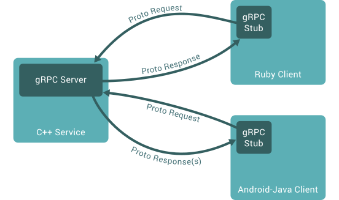
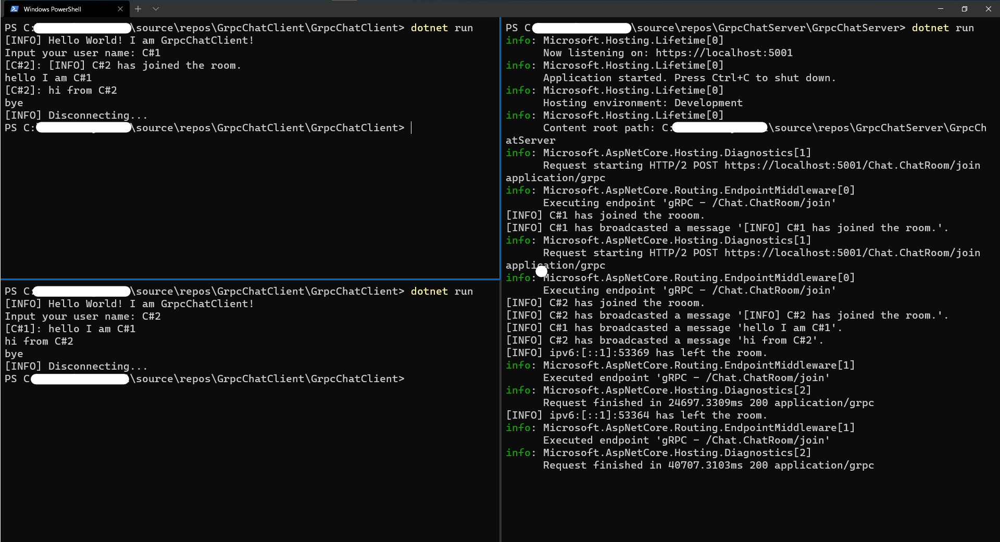
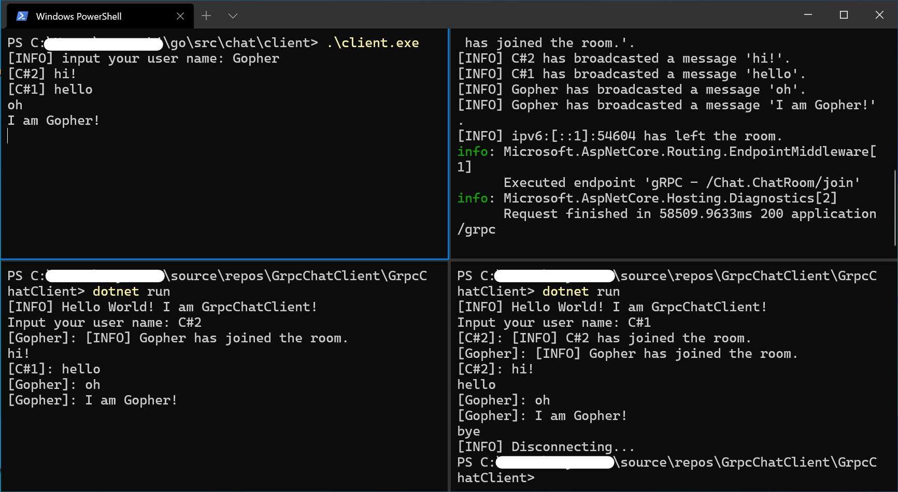

こんにちは。
Developer Support Internet チーム にてインターンをしている尾崎耀一と申します！

今回は ASP.NET Core を用いて、 gRPC で動く CLI （コマンドライン）でチャットができるアプリを作る方法を紹介します。
本記事を通じて、 ASP.NET Core を用いた gRPC サービスの開発が簡単にできることがわかると思います。
皆様の開発の一助になると幸いです。

まずはチャット アプリを作る前に ASP.NET Core についてご紹介します。

---

## ASP.NET Core について

ASP.NET Core はクロスプラットフォームで動作するウェブアプリケーションフレームワークです。

ASP.NET Core を用いることで簡単にウェブアプリを開発することができます。加えて、 ASP.NET Core はクロスプラットフォームに対応しているので、 Windows/macOS/Linux 上で開発・実行することができます。

ASP.NET Core はオープンソースで開発が進められており、 ASP.NET Core コミュニティーは大きく成長しています。

ASP.NET Core はモダンなウェブ開発をフレームワークとしてサポートしています。テストが容易に実行できるようなアーキテクチャを採用しており、クラウドへのデプロイなども想定し Visual Studio などのエディタも用意されています。

また、最新の技術にも対応しています。 例えば、gRPC によるリモート プロシージャ コールのサポートや [WebAssemby](https://webassembly.org/) によって SAP（Single Page Application）を C# で開発する [Blazor](https://docs.microsoft.com/ja-jp/aspnet/core/blazor/?view=aspnetcore-3.1) というフレームワークもサポートしています。

公式ドキュメントにもあるように、ASP.NET Core には次のような利点があります。

> - Web UI と Web API を構築するプロセスの統一。
> - テストの容易性を考慮したアーキテクチャ。
> - [Razor Pages](https://docs.microsoft.com/ja-jp/aspnet/core/razor-pages/?view=aspnetcore-3.1) により、ページ コーディングに重点を置いたシナリオがより簡略化され、その生産性が高められます。
> - [Blazor](https://docs.microsoft.com/ja-jp/aspnet/core/blazor/?view=aspnetcore-3.1) により、ブラウザー内で JavaScript と共に C# を使用できます。 すべて .NET で記述された、サーバー側とクライアント側アプリのロジックを共有します。
> - Windows、macOS、Linux 上で開発および実行できること。
> - オープン ソースで[コミュニティ重視](https://live.asp.net/)。
> - [最新のクライアント側フレームワーク](https://docs.microsoft.com/ja-jp/aspnet/core/blazor/?view=aspnetcore-3.1)と開発ワークフローの統合。
> - [gRPC](https://docs.microsoft.com/ja-jp/aspnet/core/grpc/?view=aspnetcore-3.1) を使用したリモート プロシージャ コール (RPC) サービスのホストのサポート。
> - クラウド対応で環境ベースの[構成システム](https://docs.microsoft.com/ja-jp/aspnet/core/fundamentals/configuration/?view=aspnetcore-3.1)。
> - 組み込まれている[依存性の注入](https://docs.microsoft.com/ja-jp/aspnet/core/fundamentals/dependency-injection?view=aspnetcore-3.1)。
> - 軽量で[高パフォーマンス](https://github.com/aspnet/benchmarks)のモジュール化された HTTP 要求パイプライン。
> - 次がホストする機能です。
>   - [Kestrel](https://docs.microsoft.com/ja-jp/aspnet/core/fundamentals/servers/kestrel?view=aspnetcore-3.1)
>   - [IIS](https://docs.microsoft.com/ja-jp/aspnet/core/host-and-deploy/iis/?view=aspnetcore-3.1)
>   - [HTTP.sys](https://docs.microsoft.com/ja-jp/aspnet/core/fundamentals/servers/httpsys?view=aspnetcore-3.1)
>   - [Nginx](https://docs.microsoft.com/ja-jp/aspnet/core/host-and-deploy/linux-nginx?view=aspnetcore-3.1)
>   - [Apache](https://docs.microsoft.com/ja-jp/aspnet/core/host-and-deploy/linux-apache?view=aspnetcore-3.1)
>   - [Docker](https://docs.microsoft.com/ja-jp/aspnet/core/host-and-deploy/docker/?view=aspnetcore-3.1)
> - [side-by-side でのバージョン管理](https://docs.microsoft.com/ja-jp/dotnet/standard/choosing-core-framework-server#side-by-side-net-versions-per-application-level)。
> - 最新の Web 開発を簡単にするツール。
> > ASP.NET Core 公式ドキュメントより抜粋


参考：[ASP.NET Core 公式ドキュメント](https://docs.microsoft.com/ja-jp/aspnet/core/?view=aspnetcore-3.1)
参考：[ASP.NET Coreについて](https://docs.microsoft.com/ja-jp/aspnet/core/introduction-to-aspnet-core?view=aspnetcore-3.1)


## gRPC について

次に、 gRPC についてご紹介します。

gRPC は言語に依存しない高性能なリモート プロシージャ コール（RPC）フレームワークです。

gRPC を用いることで、やり取りされるデータのシリアライズ・デシリアライズや通信部分はフレームワーク側がカバーしてくれるため、アプリケーション開発者はプロシージャを呼び出すクライアントと呼び出されるサーバプロシージャのみを実装すれば良いということになります。

gRPC ではデータのシリアライズに Protocol Buffers をデフォルトでは採用しています。Protocol Buffers はサービス間のインタフェースを定義する言語とそれを書くプログラミング言語のプログラムにコンパイルするツール群を含んでいます。Protocol Buffers では、公開する関数 (リモートプロシージャ) や、やり取りするデータの型を `.proto` ファイルにて定義し、 `.proto` ファイルからデータをシリアライズするプログラムのソースコードを自動生成することができ、対応する言語も C++/C#/Go/Java/Python etc... と豊富です。サービス間のインタフェースをコードとして静的に定義することが可能であるため、ソースコードの生成のみならず、ドキュメントの自動生成などもできます。

また、gRPC には次のような特徴を持ちます。

- Protocol Buffers を内部で用いているので他言語でのサーバ・クライアントの開発が可能です。
- HTTP/2 による通信を行います。ゆえに双方向ストリーミング通信もサポートしています。
- その手軽さと利便性から Netflix などでも採用されており、今後もユースケースの増加が見込まれます。





参考：[gRPC 公式サイト](https://grpc.io/)
参考：[Protocol Buffers 公式サイト](https://developers.google.com/protocol-buffers)

## Hands-on：CLI Chat アプリ

今回は gRPC で通信する Chat サーバと Chat クライアントを ASP.NET Core を用いて実装します。さらに gRPC で通信する Chat クライアントを C# とは別の言語（今回は go 言語）で実装し、 gRPC の「プログラミング言語に依存しない」という特徴も確認します。 ASP.NET Core を用いた gRPC サービスの開発が非常に容易であることも実感できると思います。

### 環境

以下の内容は以下の環境にて検証しました。

- OS：Windows 10 Enterprise バージョン 1903
- IDE：Visual Studio 2019
- Platform：.NET Core 3.1.401

Visual Studio のインストールは[こちら](https://docs.microsoft.com/ja-jp/visualstudio/install/install-visual-studio?view=vs-2019)を参考にしてください。

### 今回作成する Chat サービスのインターフェース定義

今回の Chat サービスでは、`ChatRoom` が一つあり、そこにユーザが `Join` することで `Message` のやり取りができるものを考えます。

ユーザは一度 `ChatRoom` に `Join` すると、その `ChatRoom` 内での他のユーザの発言を知る必要があるため、Chat サーバ-Chatクライアント間には `Message` の流れる双方向ストリームが必要になります。

これを、 `chat.proto` として記述すると以下のようになります。


```proto
syntax = "proto3";

package Chat;

service ChatRoom {
  rpc join (stream Message) returns (stream Message) {}
}

message Message {
  string user = 1;
  string text = 2;
}
```


### gRPC で通信する Chat サーバを ASP.NET Core で実装する

まず Visual Studio を立ち上げ、「新しいプロジェクトの作成」から gRPC サービスのテンプレートを選択し、テンプレートプロジェクト（プロジェクト名： `GrpcChatServer` ）を作成します。

このとき、出来上がるテンプレートプロジェクトは、[公式ドキュメント](https://docs.microsoft.com/ja-jp/aspnet/core/tutorials/grpc/grpc-start?view=aspnetcore-3.1&tabs=visual-studio)のチュートリアルにおける、「 Greeter サービス」と同じものです。このテンプレートプロジェクトには、 `Grpc.AspNetCore (2.31.0)` という ASP.NET Core で gRPC アプリケーションを作成するために必要なパッケージがインストール済みです。

このテンプレートに手を加えて、 Chat サービスを実装していきます。

まず最初に、 `chat.proto` を `GrpcChatServer/Protos` にコピーします。続けて、 `GrpcChatServer.csproj` に下記　`<ItemGroup>` を追加します。ここで　`GrpcServices="Server"` と記載することで、 `.proto` ファイルから gRPC サーバ用のコードが自動生成されることになります。

```xml
  <ItemGroup>
    <Protobuf Include="Protos\*.proto" GrpcServices="Server" />
  </ItemGroup>
```

次に、 `ChatRoom` クラスを `ChatRoom.cs` に記述します。 

```C#
using Chat;
using Grpc.Core;
using System;
using System.Collections.Generic;
using System.Collections.Concurrent;
using System.Linq;
using System.Threading.Tasks;

namespace GrpcChatServer
{
    public class ChatRoom
    {
        private ConcurrentDictionary<string, IServerStreamWriter<Message>> users = new ConcurrentDictionary<string, IServerStreamWriter<Message>>();

        public bool HasJoined(string name) => users.ContainsKey(name);
        public void Join(string name, IServerStreamWriter<Message> response)
        {
            users.TryAdd(name, response);
            Console.WriteLine($"[INFO] {name} has joined the rooom.");
        }
        public void Remove(string name)
        {
            users.TryRemove(name, out var _);
            Console.WriteLine($"[INFO] {name} has left the room.");
        }

        public async Task BroadcastMessageAsync(Message message)
        {
            await BroadcastMessages(message);
            Console.WriteLine($"[INFO] {message.User} has broadcasted a message '{message.Text}'.");
        }

        private async Task BroadcastMessages(Message message)
        {
            foreach (var user in users.Where(x => x.Key != message.User))
            {
                var item = await SendMessageToSubscriber(user, message);
                if (item != null)
                {
                    Remove(item?.Key);
                };
            }
        }

        private async Task<Nullable<KeyValuePair<string, IServerStreamWriter<Message>>>> SendMessageToSubscriber(KeyValuePair<string, IServerStreamWriter<Message>> user, Message message)
        {
            try
            {
                await user.Value.WriteAsync(message);
                // Console.WriteLine($"[INFO] broadcast message '{message.Text}' from '{message.User}'.");
                return null;
            }
            catch (Exception)
            {
                // Console.WriteLine(ex);
                return user;
            }
        }
    }
}
```

上で定義した `ChatRoom` を利用する `ChatService` を `ChatService.cs` に記述します。このとき、 `ChatService` クラスは gRPC によって自動生成された `ChatRoomBase` クラス ( `.proto` ファイルの `Service` に指定した名前の後に `Base` を付与して自動生成されるクラス) を継承する形で実装します。こうすることで、 Chat サービスを実装する際の通信回りの実装を基底クラスに委譲して、アプリ実装者はアプリケーションのロジックに専念することができるようになります。

```C#
using System.Collections.Generic;
using System.Threading.Tasks;

using Microsoft.Extensions.Logging;

using Grpc.Core;

using Chat;

namespace GrpcChatServer
{
    public class ChatService : Chat.ChatRoom.ChatRoomBase
    {
        private readonly ChatRoom _chatroomService;
        private readonly ILogger<ChatService> _logger;

        public ChatService(ChatRoom chatRoomService, ILogger<ChatService> logger)
        {
            _chatroomService = chatRoomService;
            _logger = logger;
        }

        public override async Task join(IAsyncStreamReader<Message> requestStream, IServerStreamWriter<Message> responseStream, ServerCallContext context)
        {
            if (!await requestStream.MoveNext()) return;

            do
            {
                if (!_chatroomService.HasJoined(requestStream.Current.User))
                {
                    _chatroomService.Join(requestStream.Current.User, responseStream);
                }
                await _chatroomService.BroadcastMessageAsync(requestStream.Current);
            } while (await requestStream.MoveNext());

            _chatroomService.Remove(context.Peer);

        }
    }
}
```

以上で定義した `ChatRoom` および `ChatService` を `Startup.cs` にて登録することで Chat サーバは完成です。

```C#
using System;
using System.Collections.Generic;
using System.Linq;
using System.Threading.Tasks;
using Microsoft.AspNetCore.Builder;
using Microsoft.AspNetCore.Hosting;
using Microsoft.AspNetCore.Http;
using Microsoft.Extensions.DependencyInjection;
using Microsoft.Extensions.Hosting;

namespace GrpcChatServer
{
    public class Startup
    {
        // This method gets called by the runtime. Use this method to add services to the container.
        // For more information on how to configure your application, visit https://go.microsoft.com/fwlink/?LinkID=398940
        public void ConfigureServices(IServiceCollection services)
        {
            services.AddGrpc();
            services.AddSingleton<ChatRoom>(); // ここで ChatRoom を登録
        }

        // This method gets called by the runtime. Use this method to configure the HTTP request pipeline.
        public void Configure(IApplicationBuilder app, IWebHostEnvironment env)
        {
            if (env.IsDevelopment())
            {
                app.UseDeveloperExceptionPage();
            }

            app.UseRouting();

            app.UseEndpoints(endpoints =>
            {
                endpoints.MapGrpcService<ChatService>(); // ここで ChatService を登録

                endpoints.MapGet("/", async context =>
                {
                    await context.Response.WriteAsync("Communication with gRPC endpoints must be made through a gRPC client. To learn how to create a client, visit: https://go.microsoft.com/fwlink/?linkid=2086909");
                });
            });
        }
    }
}
```

このように、 ASP.NET Core を用いて gRPC サービスを実装する際には、データのシリアライズや通信回りの実装を自動生成されたコードに委譲し、アプリケーション固有のロジックの実装に専念することができるようになります。

### gRPC で通信する Chat クライアントを ASP.NET Core で実装する

Visual Studio を立ち上げ、「新しいプロジェクトの作成」から「コンソールアプリ（.NET Core）」を選択し、テンプレートプロジェクト（プロジェクト名： `GrpcChatClient` ）を作成します。

まず最初に以下の三つのパッケージを `GrpcChatClient` にインストールします。
- `Google.Protobuf (2.31.0)`
- `Grpc.Net.Clien (2.31.0)`
- `Grpc.Tools (2.31.0)`

つづけて、 `GrpcChatClient` プロジェクト内に `Protos` フォルダを作成し、`GrpcChatServer` と同じ `chat.proto` ファイルをコピーし、 `GrpcChatClient.csproj` に以下の `<ItemGroup>` を追加します。ここでも同様に`GrpcServices="Client"` と記載することで、 `.proto` ファイルから gRPC クライアント用のコードが自動生成されることになります。

```xml
  <ItemGroup>
    <Protobuf Include="Protos\*.proto" GrpcServices="Client" />
  </ItemGroup>
```

最後に、 `Program.cs` に Chat クライアントのコードを記述してクライアントの実装は終了です。クライアントの実装では、サーバの実装と同様に gRPC によって自動生成されたクライアント用コードを `using` することで用います。

```C#
using System;
using System.Threading;
using System.Threading.Tasks;

using Grpc.Net.Client;
using Chat; // ここで gRPC によって自動生成されたコードを利用することを宣言

namespace GrpcChatClient
{
    class Program
    {
        static async Task Main()
        {
            Console.WriteLine("[INFO] Hello World! I am GrpcChatClient!");
            Console.Write("Input your user name: ");

            var userName = Console.ReadLine();

            var channel = GrpcChannel.ForAddress("https://localhost:5001");
            var client = new ChatRoom.ChatRoomClient(channel);

            using (var chat = client.join())
            {
                _ = Task.Run(async () =>
                {
                    while (await chat.ResponseStream.MoveNext(cancellationToken: CancellationToken.None))
                    {
                        var response = chat.ResponseStream.Current;
                        Console.WriteLine($"[{response.User}]: {response.Text}");
                    }
                });

                await chat.RequestStream.WriteAsync(new Message { User = userName, Text = $"[INFO] {userName} has joined the room." });

                string line;
                while ((line = Console.ReadLine()) != null)
                {
                    if (line.ToLower() == "bye")
                    {
                        break;
                    }
                    await chat.RequestStream.WriteAsync(new Message { User = userName, Text = line });
                }
                await chat.RequestStream.CompleteAsync();
            }

            Console.WriteLine("[INFO] Disconnecting...");
            await channel.ShutdownAsync();
        }
    }
}
```

ここまで終了したら、いよいよサーバとクライアントを通信させることができます。

複数コマンドプロンプトを立ち上げて、サーバとクライアントをそれぞれ実行し、通信することができるかを確かめてみましょう。





（画像右半分がサーバアプリの画面、画像左半部がクライアントアプリの画面）

### gRPC で通信する Chat クライアントを go で実装する

gRPC は、サービスのインタフェースが Protocol Buffer という、プログラミング言語とは独立した形で記述されることから、互いに異なるプログラミング言語を用いてサーバとクライアントを開発することが容易であるという特徴があります。

そこで、ここまでで開発した Chat サーバと通信する Chat クライアントを C# とは別の [Go](https://golang.org/) という言語で開発してみましょう。なお、今回はあくまで検証用のサンプルのご紹介であり、go 言語のサンプルアプリのサポートや以下の環境構築に関するサポートは弊社では行っておりませんことご了承ください。

Windows における Go/gRPC 開発環境の構築については下記サイトなどを参考に行ってください。

参考：https://golang.org/doc/install
参考：https://grpc.io/blog/installation/

Go でのクライアント実装でも、コマンドで通信部分のソースコードを自動生成し、それを利用する形でクライアントを記述していくことには変わりありません。

Chat クライアントの Go 実装については下記リポジトリを参考にしてください。

Go クライアントリポジトリ：https://github.com/jpdsi/GrpcChatSample/tree/master/GrpcChatClientGo/chat

### 実際に通信させてみる

Go 実装のクライアントと C# 実装のクライアント、 C# 実装のサーバを立ち上げ実際に通信できることを確認してみます。





（画像右上がサーバアプリの画面、画像下半分が C# クライアントアプリの画面、画像左上が Go クライアントアプリの画面）


このように、 gRPC では異なる言語によるサーバ・クライアントの実装が容易に実現することができます。

今回作ったチャットアプリのコードは以下のリポジトリにあります。

リポジトリ：https://github.com/jpdsi/GrpcChatSample

## 他のサンプルも見てみたい方へ

今回は gRPC を使った Chat サービスを ASP.NET Core を利用して実装してみました。
gRPC では他にも様々な通信をサポートしており、 ASP.NET Core による実装例も以下のリポジトリから確認することができます。

ASP.NET Core を利用した gRPC 開発を検討の際には、開発したいものに合わせたサンプルを参照すると、参考になるかと思います。

サンプルリポジトリ：https://github.com/grpc/grpc-dotnet/tree/master/examples

今回は以上です。
ASP.NET CoreでgRPCを簡単に実装できることがお分かりいただけましたでしょうか？
それでは、また次回！
