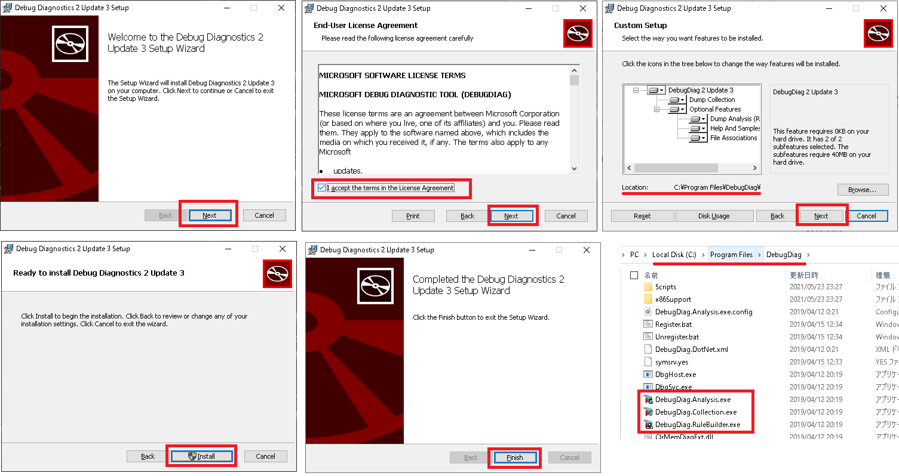
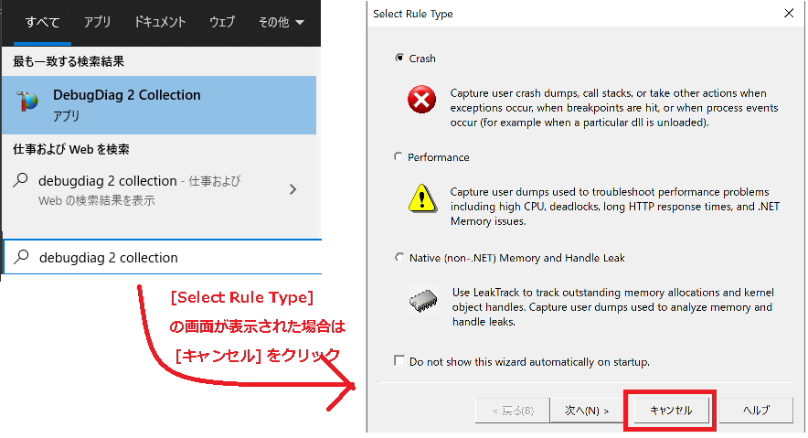
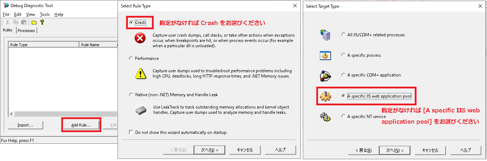
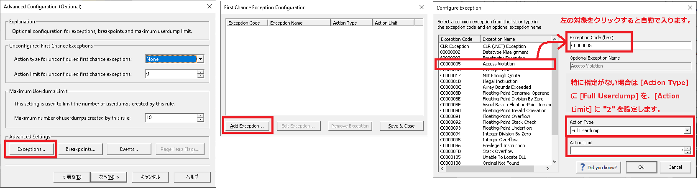
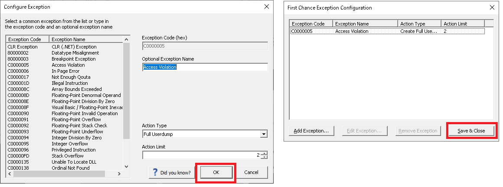
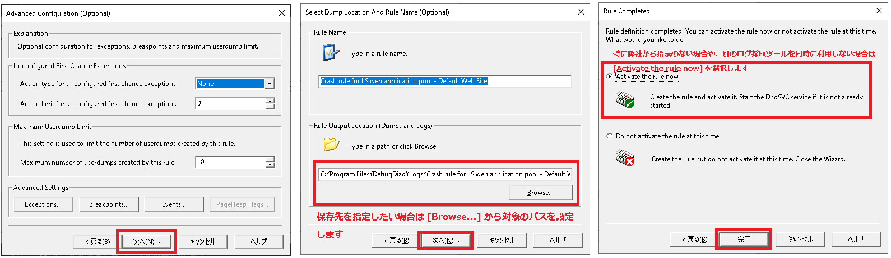
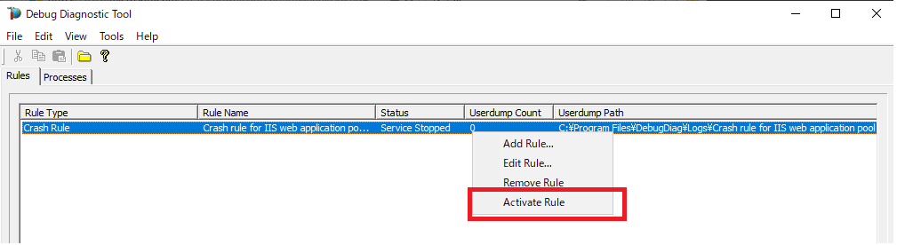
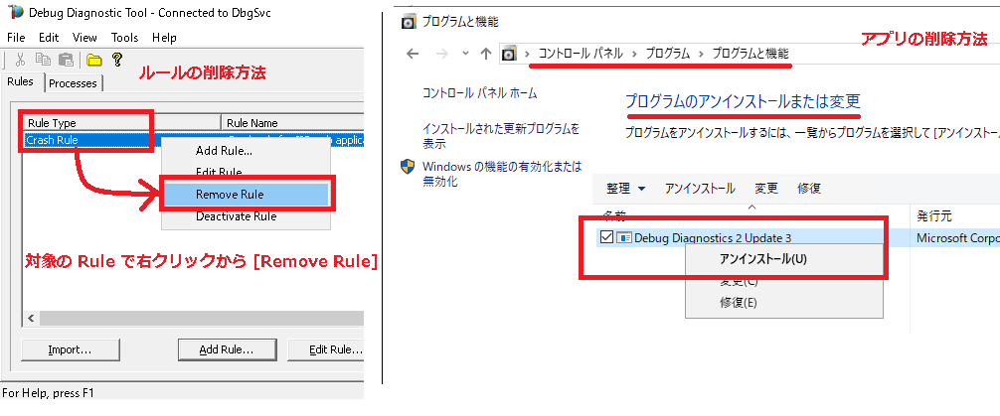

# DebugDiag の取得方法について<!-- omit in toc -->

こんにちは。IIS サポート チームです！  

弊社にお問い合わせいただくお客様に、スムーズな解決をご提供するためにお役に立てる内容をご提供しております。
今回は Debug Diagnostics Tool (以降 DebugDiag) によりメモリダンプを取得する手順についてご説明いたします。

## DebugDiag とは<!-- omit in toc -->

DebugDiag とはメモリダンプを取得・解析するための強力なツールです。  
DebudDiag は我々 IIS サポートチームのみならず、別のサポートチームにおいてでも様々なシナリオでダンプを取得し、ダンプを解析することで日々お客様の問題解決に貢献しております。

### DebudDiag のメリット<!-- omit in toc -->

DebugDiag でのダンプ採取のメリットとして、柔軟なタイミングかつ、メモリの領域を指定して取得することが上げられます。

取得するメモリの領域の指定は以下 2 つが可能です。  

- **User Fulldump** : プロセスの全領域を .dmp としてダンプします。サイズは大きいものの詳細な分析が行えます
- **User Minidump** : プロセスの一部領域 を .dmp としてダンプします。サイズは小さいものの、限られた分析しか行なえません

なお通常、お問い合わせの調査には、前者の **User Fulldump** の取得をお願いしております。  

また取得するタイミングについても以下のように柔軟に変更できます。  

- イベントログにアプリケーションの例外コードが記録されたタイミングで取得する
- イベントログに記録された文字列を起点として取得する

またそれ以外のメリットとして、ログオフした状態であってもバックグラウンドでアプリを実行可能です。

## 目次 <!-- omit in toc -->

- [1. 前提条件](#1-前提条件)
  - [1.1. 事前に準備が必要なものについて](#1-1-事前に準備が必要なものについて)
- [2. DebugDiag の取得設定](#2-DebugDiag-の取得設定)
  - [2.1. Enable Disable Performance Logging の 無効化](#2-1-Enable-Disable-Performance-Logging-の-無効化)
  - [2.2. Rule Type と Target Type の選択](#2-2-Rule-Type-と-Target-Type-の選択)
- [3. 対象となる DebugDiag のターゲットタイプ が A specific IIS web application pool の場合](#3-対象となる-DebugDiag-のターゲットタイプ-が-A-specific-IIS-web-application-pool-の場合)
  - [3.1. ダンプの取得タイミング が First Chance の場合](#3-1-ダンプの取得タイミング-が-First-Chance-の場合)
- [4. ダンプ生成後ファイルの取得](#4-ダンプ生成後ファイルの取得)
- [5. DebugDiag のアンインストール方法について](#5-DebugDiag-のアンインストール方法について)
  - [5.1. DebugDiag のルールの削除](#5-1-DebugDiag-のルールの削除)
  - [5.2. DebugDiag アプリケーション自体のアンインストール](#5-2-DebugDiag-アプリケーション自体のアンインストール)
- [6. DebugDiag の検証方法について](#6-DebugDiag-の検証方法について)
  - [6.1. 前提条件](#6-1-前提条件)
  - [6.2. 例外を意図的に発生させるアプリケーションの配置](#6-2-例外を意図的に発生させるアプリケーションの配置)
  - [6.3. 確認方法](#6-3-確認方法)

## 1. 前提条件

### 1.1. 事前に準備が必要なものについて

DebudDiag はインストールが必要かつ、フォアグラウンドまたはバックグラウンドで実行するツールになります。

64bit 版の DebugDiag をインストールします。  
※ OS が 32bit 版のみ 32bit 版の DebugDiag をインストールしてください。

- 64bit 版の DebugDiag : [Debug Diagnostic Tool v2 Update 3](http://debugdiag.com/)
- 32bit 版の DebugDiag : [Debug Diagnostic Tool v2 Update 2](https://www.microsoft.com/en-us/download/details.aspx?id=49924)

.msi ファイルをダウンロードできたら、以下の手順でインストールします。

- ダウンロードした .msi ファイルを起動します。  
- 起動後、[Next] を押し、ライセンスを承諾します。  
- デフォルトのフォルダパスは C:\Program Files\DebugDiag ですので、それ以外を設定したい場合は [Browse...] から任意のパスに変更します。
- [Next]を押し、[Install] を実行してください。なお**インストールには管理者権限が必要**です。



これで DebudDiag のインストールは終了です。

## 2. DebugDiag の取得設定

[すべてのプログラム] - [Debug Diagnostic Tool 2.0] - [Debug Diagnostics Tool 2.0 Collection] を起動します。  
[Select Rule Type] 画面が自動的に表示された場合、一旦 [キャンセル] ボタンを押してダイアログを閉じます。



### 2.1. Enable Disable Performance Logging の 無効化

- Debug Diagnostics Tool の [Tools] - [Options And Settings] メニューをクリックします。  
- [Performance log] - [Enable/Disable Performance Logging] にて、[Disable Performance Counter Data Logging] のラジオボタンにチェックがある状態にして、[OK] ボタンを押して閉じます。


### 2.2. Rule Type と Target Type の選択

この辺りから取得する対象により設定方法が変わります。

弊社から適宜 "<>" 内の設定項目が指定された場合はそちらに従ってください。  
もし特に指定がない場合や、こちらのブログを参考に DebugDiag の取得を調査している場合は、
例に従うことでアクセス違反発生時にダンプを取得する場合の設定手順をお試しいただけます。

ウィンドウ下部の [Add Rules] ボタンを押します。
表示された [Select Rule Type] 画面にて、<対象となる DebudDiag のルールタイプ> を選択し、[次へ] ボタンを押します。
次に、[Select Target Type] 画面にて、<対象となる DebudDiag のターゲットタイプ> を選択し、[次へ] をクリックします。  

※ 例として、アクセス違反発生時にダンプを取得する場合は、[Select Rule Type] には [Crash] を選択し、  
[Select Target Type] には [A specific IIS web application pool] を選択してください。  

以下の画像のように設定をすることで、 Access Violation による例外発生によるダンプの取得を行います。  
<!-- 
[Crash] 以外についてはGUI上の表示も変わってくることから、
今回の説明は Crash 後の選択に合わせた形でよいと考える。

仮に Crash 以外の選択が必要になった場合は、別記事として分散させることを期待する。
別記事じゃなくここの記事にRule Type 自体もヘッダー分けして書くと、非常に長くなりそうなため。

Target Type は a specific IIS webapplication pool 以外も選択したことが過去にもあるため、そこは分岐がある想定で目次のヘッダーの深さをターゲットタイプで ## になるように作成する。
-->



<!--
仮にここで分岐が起こる場合は、目次を挿入するのも良いとと考える
-->

## 3. 対象となる DebugDiag のターゲットタイプ が A specific IIS web application pool の場合

ダンプの取得タイミングにより更に取得方法が分岐します。以下 2 つのうちどちらかのタイミングで取得します。

- **First Chance** : 例外が発生したタイミングで取得する設定で、例外処理をしていてアプリケーションがクラッシュしない場合でも取得する
- **Second Chance** : 例外が発生し、例外処理がされずにアプリケーションがクラッシュ場合のみ取得する設定で、クラッシュの直前のタイミングで取得する

弊社より <ダンプの取得タイミング> について設定項目が指定された場合はそちらに従ってください。  
※ 例として、アクセス違反発生時にダンプを取得する場合は、 <ダンプの取得タイミング> は First Chance を選択してください。  

### 3.1. ダンプの取得タイミング が First Chance の場合

First Chance とは、例外発生したタイミングでダンプを取得する方法になります。  
例えば try/catch による例外処理をしていて、アプリケーションがクラッシュしない場合においても、First Chance により、例外が発生した瞬間にダンプを取得することができます。

[Advanced Configuration (Optional)] 画面にて [Advanced Settings] -  [Exceptions…] をクリックします。  
次に、 [First Chance Exception Configuration] - [Add Exception…] をクリックします。  
次に、 [Configure Exception] 画面にてダンプを生成する例外の条件を設定します。  
  
設定条件には以下を入力してください。  
(<その他の設定> について弊社から特に指示がない場合は無視してください。)

- [Exception Code (hex)] : \<First Chance での対象となる例外コード\>
- [Action Type] : \<First Chance での取得するダンプの領域\>
- [Action Limit] : \<First Chance での取得するダンプの回数\>
- [その他の設定項目] : \<First Chance でのその他の設定\>

※ 例として、今回ははアクセス違反発生時にダンプを取得する場合の設定条件を紹介します。
以下の画像のように設定をすることで、 Access Violation による例外発生によるダンプの取得を行います。

- [Exception Code (hex)] : C0000005 (Access Violation)
- [Action Type] : Full Userdump
- [Action Limit] : 2



[Configure Exception] 画面にて [OK] を選択し、  
[First Chance Exception Configuration] 画面にて [Save & Close] を選択します。



こちらで First Chance つまり例外発生時にダンプを取得する設定を完了しました。

[Advanced Configuration (Optional)] 画面に戻りますので、[次へ] ボタンを押します。  
[Select Dump Location And Rule Name (Optional)] では、ダンプの出力先やルールの名前を設定できます。  
\<DebugDiag の有効化時期\> について弊社から指定がない場合は、 [Rule Completed] - [Activate the rule now] を選択し、 [完了] をクリックします。

※ 例として、今回ははアクセス違反発生時にダンプを取得する場合の設定の場合は画像の通り、[Activate the rule now] を選択し、[完了] をクリックします。



なお別のログ採取ツールのタイミングに応じて DebugDiag も有効化したい場合などは [Do not activate the rule at this time] を選択し、  
別途 DebudDiag を有効化するタイミングで当該の作成したルールを選び [右クリック] から [Activate Rule] を実行してください。



## 4. ダンプ生成後ファイルの取得

設定を完了後、現象の再現を待ちます。  
事象が発生した場合、出力先に設定した箇所にダンプ ファイル (拡張子 .dmp) が出力されます。そちらをアップロードしてください。

## 5. DebugDiag のアンインストール方法について

### 5.1. DebugDiag のルールの削除

DebugDiag の作成したルールの削除であれば作成したルールを [右クリック] し、[Remove Rule]を実行します。

### 5.2. DebugDiag アプリケーション自体のアンインストール

DebugDiag 自体を削除する場合は、有効化したルールすべてを削除します。  
コントロールパネルを開き、[プログラムのアンインストールまたは変更] を開きます。  
DebugDiag のアプリケーションを選択し、 [アンインストール] を実行してください。



## 6. DebugDiag の検証方法について

### 6.1. 前提条件

- ASP.NET が実行できる環境をご用意ください。

### 6.2. 例外を意図的に発生させるアプリケーションの配置

以下のコードを .aspx という拡張子で保存して IIS 上の任意のサイトに配置します。

コード中の <検証用の例外コード> には 例外コードを 10 進数で入力します。  
例えば C0000005 の例外を発生させたい場合は、それを 10 進数で表した 3221225477 を入力します。  

以下例として、アクセス違反の例外を意図的に発生させます。  
具体的にはアクセス違反の例外コードである 0xC0000005 を 10 進数表記した 3221225477 を <検証用の例外コード> 指定してください。

```cpp
<%@ Import Namespace="System.Runtime.InteropServices" %>
<%@ Page language="C#" %>
<html>
  <head>
   <script language="cs" runat="server">
[DllImport("kernel32.dll")]
static extern void RaiseException(uint dwExceptionCode, uint dwExceptionFlags,  uint nNumberOfArguments, IntPtr lpArguments);
 
private void throwEx()
{
    RaiseException(<検証用の例外コード>, 0, 0, new IntPtr(1));
}
 
protected void Button1_Click(object sender, EventArgs e)
{
    System.Threading.Thread t = new System.Threading.Thread(throwEx);
        t.Start();
}
  </script>
  </head>
  <body>
    <form id="form1" runat="server">
        <div>
          <asp:Button ID="Button1" runat="server" Text="Button" onclick="Button1_Click" />
        </div>
    </form>
  </body>
</html>
```

以下の項目を右に読み替えていただき、再度上の手順に従って、例外コードを設定します。

- <対象となるアプリケーションプール>: テスト用の対象となるサイトが存在するアプリケーションプール
- \<First Chance での対象となる例外コード\>: \<検証用の例外コード\>

※ なお、Debug Diagnostic Tool ツール自体のサポートは私共技術サポートではご提供しておりません。  
そのため、上記ツールのトラブルシューティングやツールの詳細なご紹介等はご支援できませんことをご了承ください。

### 6.3. 確認方法

設定を終了後、当該の検証用のアプリケーションにアクセスして、[Button] をクリックします。  
ダンプの出力先として設定したフォルダに、メモリダンプが出力されているかどうかをご確認ください。

<!--
## DebugDiag についての FAQ

DebugDiag についてよくいただくご質問について以下におまとめしております。

- [DebugDiag についての Q&A][DebugDiag についての Q&A]  

以上の Q&A を確認したもののご不明点が解決しない場合は、  
私共サポートまでお問い合わせいただけますと大変幸いです。

 
DebugDiag FAQ のネタについて
- DebugDiag 取得時にシステムに与える影響について
- DebugDiag の解析方法？
- DebugDiag の検証方法はこっちじゃなくていいのかな

-->
