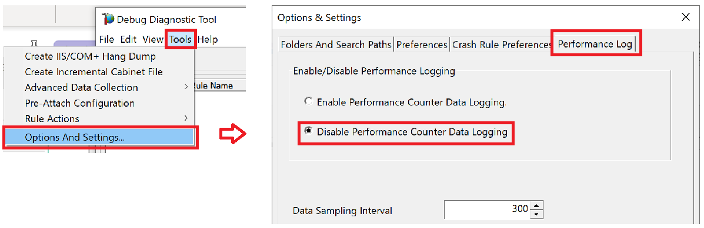

# DebugDiag の取得方法について<!-- omit in toc -->

こんにちは。IIS サポート チームです！  

弊社にお問い合わせいただくお客様に、スムーズな解決をご提供するためにお役に立てる内容をご提供させていただきます。

今回は DebugDiag によりメモリダンプを取得する手順についてご説明させていただきます。

## DebugDiag とは<!-- omit in toc -->

DebugDiag とはメモリダンプを取得・解析するための強力なツールです。  
DebudDiag は我々 IIS サポートチームのみならず、別のサポートチームにおいてでも様々なシナリオでダンプを取得し、ダンプを解析することで日々お客様の問題解決に貢献しております。

## DebudDiag のメリット<!-- omit in toc -->

DebugDiag でのダンプ採取のメリットとして、  
柔軟なタイミングかつ、メモリの領域を指定して取得することが上げられます。

取得するメモリの領域の指定は以下 2 つ可能です。なお通常、お問い合わせの調査には User Fulldump の取得をお願いしております。  

- User Fulldump : プロセスの全領域を .dmp としてダンプします。サイズは大きいものの詳細な分析が行えます
- User Minidump : プロセスの一部領域 を .dmp としてダンプします。サイズは小さいものの、限られた分析しか行なえません

また取得するタイミングについても以下のように柔軟に変更できます。  

- イベントログに、アプリケーションの例外コードが記録されたタイミングで取得する
- イベントログに記録された文字列を発火点として取得する

またそれ以外のメリットとして、ログオフした状態であってもバックグラウンドでアプリを実行可能です。

## 目次 <!-- omit in toc -->

- [1. 前提条件](#1-%E5%89%8D%E6%8F%90%E6%9D%A1%E4%BB%B6)
  - [1.1. 事前に準備が必要なものについて](#11-%E4%BA%8B%E5%89%8D%E3%81%AB%E6%BA%96%E5%82%99%E3%81%8C%E5%BF%85%E8%A6%81%E3%81%AA%E3%82%82%E3%81%AE%E3%81%AB%E3%81%A4%E3%81%84%E3%81%A6)
- [2. DebugDiag の取得設定](#2-DebugDiag-%E3%81%AE%E5%8F%96%E5%BE%97%E8%A8%AD%E5%AE%9A)
  - [2.1. Enable/Disable Performance Logging の 無効化](#21-EnableDisable-Performance-Logging-%E3%81%AE-%E7%84%A1%E5%8A%B9%E5%8C%96)
  - [2.2. Rule Type と Target Type の選択](#22-Rule-Type-%E3%81%A8-Target-Type-%E3%81%AE%E9%81%B8%E6%8A%9E)
- [3. <対象となる Target Type> が A specific IIS web application pool の場合](#3-%E5%AF%BE%E8%B1%A1%E3%81%A8%E3%81%AA%E3%82%8B-Target-Type-%E3%81%8C-A-specific-IIS-web-application-pool-%E3%81%AE%E5%A0%B4%E5%90%88)
  - [3.1. 特定の例外コードかつ First Chance でダンプを取得する場合](#31-%E7%89%B9%E5%AE%9A%E3%81%AE%E4%BE%8B%E5%A4%96%E3%82%B3%E3%83%BC%E3%83%89%E3%81%8B%E3%81%A4-First-Chance-%E3%81%A7%E3%83%80%E3%83%B3%E3%83%97%E3%82%92%E5%8F%96%E5%BE%97%E3%81%99%E3%82%8B%E5%A0%B4%E5%90%88)
- [4. ダンプ生成後ファイルの取得](#4-%E3%83%80%E3%83%B3%E3%83%97%E7%94%9F%E6%88%90%E5%BE%8C%E3%83%95%E3%82%A1%E3%82%A4%E3%83%AB%E3%81%AE%E5%8F%96%E5%BE%97)
- [5. DebugDiag のアンインストール方法について](#5-DebugDiag-%E3%81%AE%E3%82%A2%E3%83%B3%E3%82%A4%E3%83%B3%E3%82%B9%E3%83%88%E3%83%BC%E3%83%AB%E6%96%B9%E6%B3%95%E3%81%AB%E3%81%A4%E3%81%84%E3%81%A6)
- [6. DebugDiag の検証方法について](#6-DebugDiag-%E3%81%AE%E6%A4%9C%E8%A8%BC%E6%96%B9%E6%B3%95%E3%81%AB%E3%81%A4%E3%81%84%E3%81%A6)
  - [6.1. 前提条件](#61-%E5%89%8D%E6%8F%90%E6%9D%A1%E4%BB%B6)
  - [6.2. 例外を意図的に発生させるアプリケーションの配置](#62-%E4%BE%8B%E5%A4%96%E3%82%92%E6%84%8F%E5%9B%B3%E7%9A%84%E3%81%AB%E7%99%BA%E7%94%9F%E3%81%95%E3%81%9B%E3%82%8B%E3%82%A2%E3%83%97%E3%83%AA%E3%82%B1%E3%83%BC%E3%82%B7%E3%83%A7%E3%83%B3%E3%81%AE%E9%85%8D%E7%BD%AE)
  - [6.3. 確認方法](#63-%E7%A2%BA%E8%AA%8D%E6%96%B9%E6%B3%95)

## 1. 前提条件

### 1.1. 事前に準備が必要なものについて

DebudDiag はインストールが必要かつ、フォアグラウンドまたはバックグラウンドで実行するツールになります。
<インストールする DebugDiag のバージョン> に応じて、64bit 版、32bit 版のいずれかをダウンロードします。

弊社から特に指定がない場合は、64bit 版をご利用ください。  
ダンプを生成したい対象となるサイトのアプリケーションプールが [32ビット アプリケーションの有効化] を true にしている場合は、32 bit 版をダウンロードします。

- 64bit 版の Debug Diag : [Debug Diagnostic Tool v2 Update 3](http://debugdiag.com/)
- 32bit 版の Debug Diag : [Debug Diagnostic Tool v2 Update 2](https://www.microsoft.com/en-us/download/details.aspx?id=49924)

msi ファイルをダウンロードできたら、以下の手順でインストールします。

- ダウンロードした msi ファイルを起動します。  
- 起動後、[Next] を押し、ライセンスを承諾します。  
- デフォルトのフォルダパスは C:\Program Files\DebugDiag ですので、それ以外を設定したい場合は [Browse...] から任意のパスに変更します。
- [Next]を押し、[Install] を実行してください。なおインストールには管理者権限が必要です。


これで DebudDiag のインストールは終了です。

## 2. DebugDiag の取得設定

[すべてのプログラム] - [Debug Diagnostic Tool 2.0] - [Debug Diagnostics Tool 2.0 Collection] を起動します。  
"Select Rule Type" 画面が自動的に表示された場合、一旦 [キャンセル] ボタンを押してダイアログを閉じます。


### 2.1. Enable/Disable Performance Logging の 無効化

- Debug Diagnostics Tool の [Tools] - [Options And Settings] メニューをクリックします。  
- [Performance log] タブの “Enable/Disable Performance Logging” にて、[Disable Performance Counter Data Logging] のラジオボタンにチェックがある状態にして、[OK] ボタンを押して閉じます。



### 2.2. Rule Type と Target Type の選択

続けて、ウィンドウ下部の [Add Rules] ボタンを押します。
表示された “Select Rule Type” 画面にて、<対象となる DebudDiag のルールタイプ> を選択し、[次へ] ボタンを押します。  
※ 弊社から特別指定がない場合は [Crash] を選択してください。

<!-- 
[Crash] 以外についてはGUI上の表示も変わってくることから、
今回の説明は Crash 後の選択に合わせた形でよいと考える。

仮に Crash 以外の選択が必要になった場合は、別記事として分散させることを期待する。
別記事じゃなくここの記事にRule Type 自体もヘッダー分けして書くと、非常に長くなりそうなため。

Target Type は a specific IIS webapplication pool 以外も選択したことが過去にもあるため、そこは分岐がある想定でヘッダーを作成する。

-->

ここからは、 Target Type に合わせて取得方法が異なります。

[Select Target Type] 画面にて、<対象となる DebudDiag のターゲットタイプ> を選択し、[次へ] をクリックします。  
※ 弊社から特別指定がない場合は [A specific IIS web application pool] を選択してください。


## 3. <対象となる Target Type> が A specific IIS web application pool の場合

### 3.1. 特定の例外コードかつ First Chance でダンプを取得する場合

First Chance とは、例外発生したタイミングでダンプを取得する方法になります。  
例えば try/catch による例外処理をしていて、アプリケーションがクラッシュしない場合においても、First Chance により、例外が発生した瞬間にダンプを取得することができます。

弊社より <ダンプの取得タイミング> について First Chance とお伝えした場合や、対象のアプリケーションプールでの例外発生時にダンプを取得したい場合はこちらの手順を行います。

[Advanced Configuration (Optional)] 画面にて [Advanced Settings] -  [Exceptions…] をクリックします。  
次に、 [First Chance Exception Configuration] - [Add Exception…] をクリックします。  
次に、 [Configure Exception] 画面にてダンプを生成する例外の条件を設定します。  
  
設定条件には以下を入力してください。  
(<その他の設定> について弊社から特に指示がない場合は無視してください。)

- [Exception Code (hex)] : \<First Chance での対象となる例外コード\>
- [Action Type] : \<First Chance での取得するダンプの領域\>
- [Action Limit] : \<First Chance での取得するダンプの回数\>
- [その他の設定項目] : \<First Chance でのその他の設定\>

弊社より指示がない場合は、画像のように Access Violation による例外発生によるダンプの取得を行います。

- [Exception Code (hex)] : C0000005 Access Violation
- [Action Type] : Full Userdump
- [Action Limit] : 2


[Configure Exception] 画面にて [OK] を選択し、  
[First Chance Exception Configuration] 画面にて [Save & Close] を選択します。


こちらで First Chance つまり例外発生時にダンプを取得する設定を完了しました。

[Advanced Configuration (Optional)] 画面に戻りますので、[次へ] ボタンを押します。  
[Select Dump Location And Rule Name (Optional)] では、ダンプの出力先やルールの名前を設定できます。  
\<DebugDiag の有効化時期\> について弊社から指定がない場合は、 [Rule Completed] - [Activate the rule now] を選択し、 [完了] をクリックします。


なお別のログ採取ツールのタイミングに応じて DebugDiag も有効化したい場合などは [Do not activate the rule at this time] を選択し、  
別途 DebudDiag を有効化するタイミングで当該の作成したルールを選び [右クリック] から [Activate Rule] を実行してください。


## 4. ダンプ生成後ファイルの取得

設定を完了後、現象の再現を待ちます。  
事象が発生した場合、出力先に設定した箇所にダンプ ファイル (拡張子 .dmp) が出力されます。そちらをアップロードしてください。

## 5. DebugDiag のアンインストール方法について

DebugDiag の作成したルールの削除であれば作成したルールを [右クリック] し、[Remove Rule]を実行します。

DebugDiag 自体を削除する場合は、有効化したルールすべてを削除します。  
コントロールパネルを開き、[プログラムのアンインストールまたは変更] を開きます。  
DebugDiag のアプリケーションを選択し、 [アンインストール] を実行してください。


## 6. DebugDiag の検証方法について

### 6.1. 前提条件

- ASP.NET が実行できる環境をご用意ください。

### 6.2. 例外を意図的に発生させるアプリケーションの配置

以下のコードを .aspx という拡張子で保存して IIS 上の任意のサイトに配置します。

コード中の <検証用の例外コード> には 例外コードを 10 進数で入力します。  
例えば C0000005 の例外を発生させたい場合は、それを 10 進数で表した 3221225477 を入力してください。  

特に弊社から <検証用の例外コード> に指定がない場合は 0xC0000005 の例外コードを 10 進数表示した 3221225477 こちらを指定してください。

```cpp
<%@ Import Namespace="System.Runtime.InteropServices" %>
<%@ Page language="C#" %>
<html>
  <head>
   <script language="cs" runat="server">
[DllImport("kernel32.dll")]
static extern void RaiseException(uint dwExceptionCode, uint dwExceptionFlags,  uint nNumberOfArguments, IntPtr lpArguments);
 
private void throwEx()
{
    RaiseException(<検証用の例外コード>, 0, 0, new IntPtr(1));
}
 
protected void Button1_Click(object sender, EventArgs e)
{
    System.Threading.Thread t = new System.Threading.Thread(throwEx);
        t.Start();
}
  </script>
  </head>
  <body>
    <form id="form1" runat="server">
        <div>
          <asp:Button ID="Button1" runat="server" Text="Button" onclick="Button1_Click" />
        </div>
    </form>
  </body>
</html>
```

以下の項目を右に読み替えていただき、再度上の手順に従って、例外コードを設定します。

- <対象となるアプリケーションプール>: テスト用の対象となるサイトが存在するアプリケーションプール

### 6.3. 確認方法

設定を終了後、当該の検証用のアプリケーションにアクセスして、[Button] をクリックします。  
ダンプの出力先として設定したフォルダに、メモリダンプが出力されているかどうかをご確認ください。

<!--
## DebugDiag についての FAQ

DebugDiag についてよくいただくご質問について以下におまとめしております。

- [DebugDiag についての Q&A][DebugDiag についての Q&A]  

以上の Q&A を確認したもののご不明点が解決しない場合は、  
私共サポートまでお問い合わせいただけますと大変幸いです。

 
DebugDiag FAQ のネタについて
- DebugDiag 取得時にシステムに与える影響について
- DebugDiag の解析方法？
- DebugDiag の検証方法はこっちじゃなくていいのかな

-->
