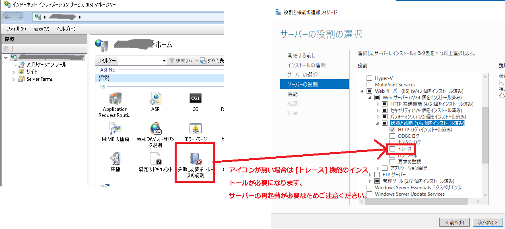
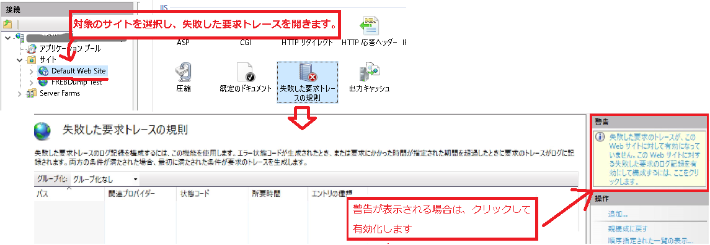
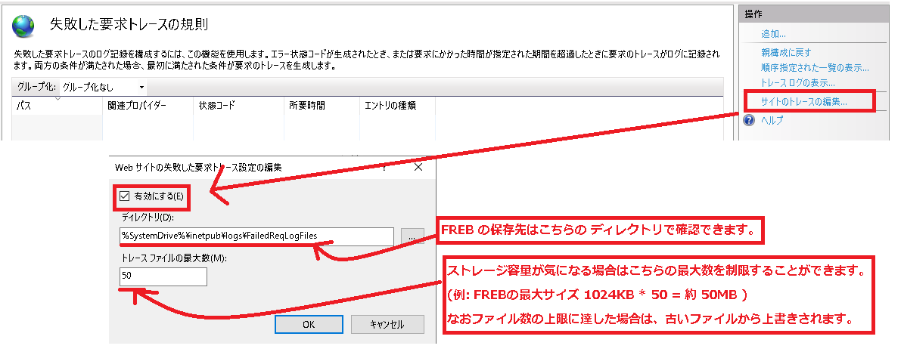
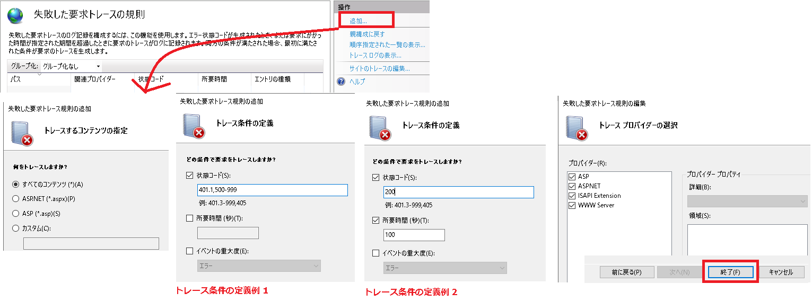
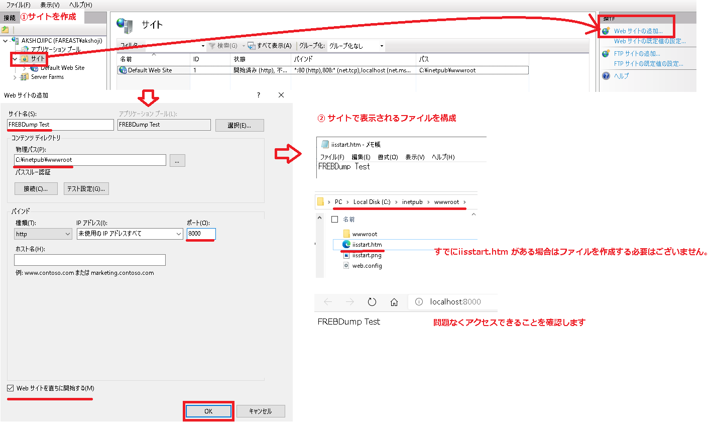
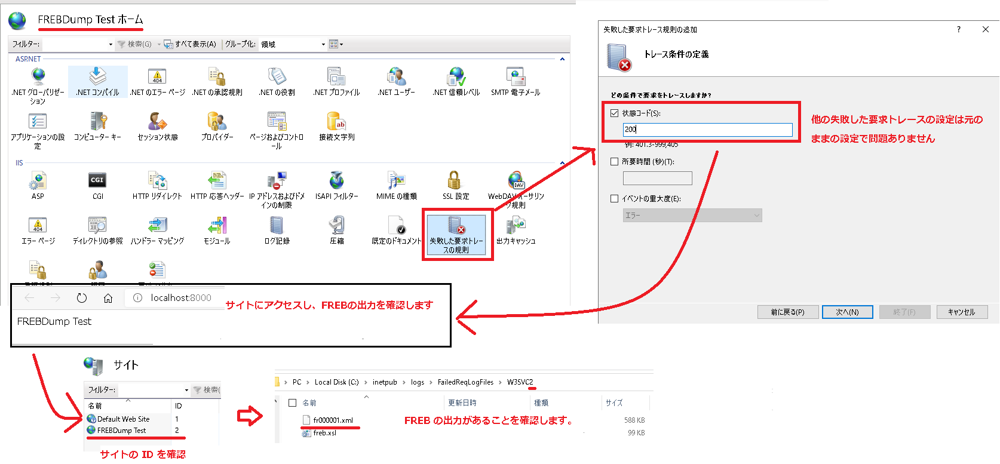

# FREB の取得方法について <!-- omit in toc -->

こんにちは。IIS サポート チームです！  

弊社にお問い合わせいただくお客様に、スムーズな解決をご提供するためにお役に立てる内容をご提供させていただきます。  
今回は 失敗した要求トレース 通称 FREB の取得手順についてご説明します。

## FREB とは <!-- omit in toc -->

FREB はウェブ リクエストにウェブサーバーがどのように応答したか、その処理過程を .xml 形式のログに出力するモジュールです。  
リクエストの応答に問題があった場合、FREB のログを確認することで問題の調査を行えます。  

ログ出力の条件は柔軟に設定することができます。40X や 50X などの応答が起きた時、もしくはリクエストの処理時間が一定時間を超えた時など、状況に合わせた設定可能です。

FREB の詳しい説明は [Monitor Activity on a Web Server (IIS 7)](https://docs.microsoft.com/en-us/previous-versions/windows/it-pro/windows-server-2008-r2-and-2008/cc730608(v=ws.10)#failed-request-tracing-rules) をご確認ください。

なお注意点として [トレース] 機能をサーバーの機能としてインストールしていない場合、インストール時に IIS サービスの再起動が発生します。  
再起動時に、IIS サーバーが処理している既存のリクエストがエラーになる可能性もあるためご注意ください。  
慎重を期す場合は、メンテナンス時間などにおいて設定することを推奨します。  

## 目次 <!-- omit in toc -->

- [1. 前提条件](#1-%E5%89%8D%E6%8F%90%E6%9D%A1%E4%BB%B6)
  - [1.1. 事前に準備が必要なものについて](#11-%E4%BA%8B%E5%89%8D%E3%81%AB%E6%BA%96%E5%82%99%E3%81%8C%E5%BF%85%E8%A6%81%E3%81%AA%E3%82%82%E3%81%AE%E3%81%AB%E3%81%A4%E3%81%84%E3%81%A6)
- [2. FREB の設定手順](#2-FREB-%E3%81%AE%E8%A8%AD%E5%AE%9A%E6%89%8B%E9%A0%86)
  - [2.1. FREB の有効化](#21-FREB-%E3%81%AE%E6%9C%89%E5%8A%B9%E5%8C%96)
  - [2.2. FREB の規則作成](#22-FREB-%E3%81%AE%E8%A6%8F%E5%89%87%E4%BD%9C%E6%88%90)
- [3. FREB の設定の削除について](#3-FREB-%E3%81%AE%E8%A8%AD%E5%AE%9A%E3%81%AE%E5%89%8A%E9%99%A4%E3%81%AB%E3%81%A4%E3%81%84%E3%81%A6)
- [4. FREB の検証手順について](#4-FREB-%E3%81%AE%E6%A4%9C%E8%A8%BC%E6%89%8B%E9%A0%86%E3%81%AB%E3%81%A4%E3%81%84%E3%81%A6)
  - [4.1. ウェブサイトの作成](#41-%E3%82%A6%E3%82%A7%E3%83%96%E3%82%B5%E3%82%A4%E3%83%88%E3%81%AE%E4%BD%9C%E6%88%90)
  - [4.2. 失敗した要求トレースの設定](#42-%E5%A4%B1%E6%95%97%E3%81%97%E3%81%9F%E8%A6%81%E6%B1%82%E3%83%88%E3%83%AC%E3%83%BC%E3%82%B9%E3%81%AE%E8%A8%AD%E5%AE%9A)
  - [4.3. ウェブサイトの削除](#43-%E3%82%A6%E3%82%A7%E3%83%96%E3%82%B5%E3%82%A4%E3%83%88%E3%81%AE%E5%89%8A%E9%99%A4)

## 1. 前提条件

### 1.1. 事前に準備が必要なものについて

IIS Manager を起動し、中央のアイコンで、[IIS] - [失敗した要求トレース] が存在することを確認します。

もしこちらが存在しない場合は、失敗した要求トレース (FREB) を記録するモジュールが存在しないため、  
サーバー マネージャーの役割サービスの追加で、[Web サーバー] - [状態と診断] - [トレース] をインストールします。  
**インストールの際は、IIS の再起動が発生しますのでご注意ください。**

## 2. FREB の設定手順

### 2.1. FREB の有効化

IIS マネージャーを起動し、[Web サイト] から現象が発生している <対象となるウェブサイト> を選択します。  

[操作] - [構成] - [失敗した要求トレース] をクリックします。  

[失敗した要求のトレースが、この Web サイトに対して有効になっていません。] という警告が表示される場合はクリックしてログを有効にします。

[操作] ウィンドウの [サイトのトレースの編集] をクリックし、[有効にする] にチェックがあることを確認してください。

### 2.2. FREB の規則作成

[失敗した要求トレースの規則] - [操作] - [追加] をクリックします。

[トレースするコンテンツの指定] で、<トレースするコンテンツ>、  
[トレース条件の定義] で、<トレース条件の定義>、  
[トレース プロバイダーの選択] で、 <トレースプロバイダー> を設定し [終了] をクリックします。

[トレース条件の定義] を [状態コード]、[所要時間] それぞれでチェックを有効化した場合、条件は AND ではなく OR として判断されます。
つまり、いずれかの条件に合致した場合に FREB によりログが出力されますので、ご注意ください。

[トレース条件の定義] の詳細については、[Create a Tracing Rule for Failed Requests (IIS 7)](https://docs.microsoft.com/en-us/previous-versions/windows/it-pro/windows-server-2008-r2-and-2008/cc725948(v=ws.10)) をご確認ください。

## 3. FREB の設定の削除について

FREB自体を無効化する場合は、  
<対象となるウェブサイト> の 失敗した要求トレースの規則 を開き、作成した規則を選択し、削除 を押してください。

## 4. FREB の検証手順について

### 4.1. ウェブサイトの作成

IIS 上にウェブサイトを作成し、ウェブ アクセスした際に 200 レスポンスが返されることを契機として、メモリダンプを取得します。

以下の画像のように、ウェブサイトを作成し、メモ帳などで作成した iisstart.htm を C:\inetpub\wwwroot 以下に作成します。問題なくアクセスできることを確認します。

### 4.2. 失敗した要求トレースの設定

トレース条件の定義として、200 を指定し、サイトにアクセスすることで、FREB の出力先に .xml 形式の出力があるかを確認します。

### 4.3. ウェブサイトの削除

IIS マネージャー より [サイト] を開き、検証用に作成したサイトを削除してください。

<!-- 
## 4. FREB の FAQ について

こちらは [失敗した要求トレース (FREB) でよくいただくご質問について](https://jpdsi.github.io/blog/web-apps/freb-faq/) をご確認ください。

以上の Q&A を確認したもののご不明点が解決しない場合は、私共サポートまでお問い合わせいただけますと大変幸いです。
-->
