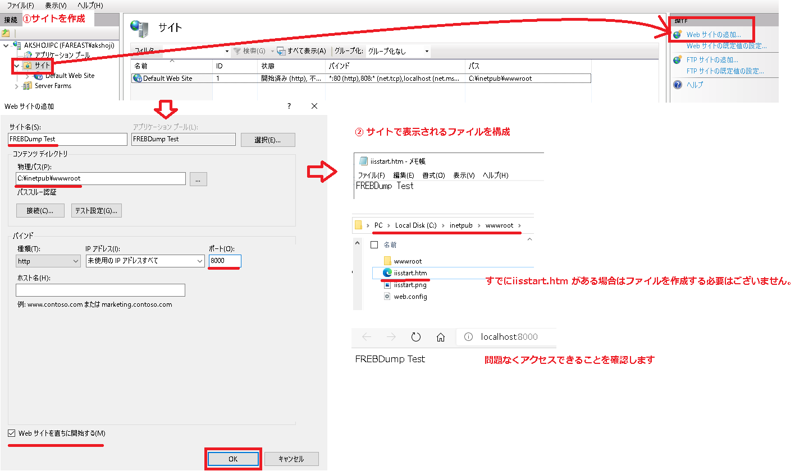
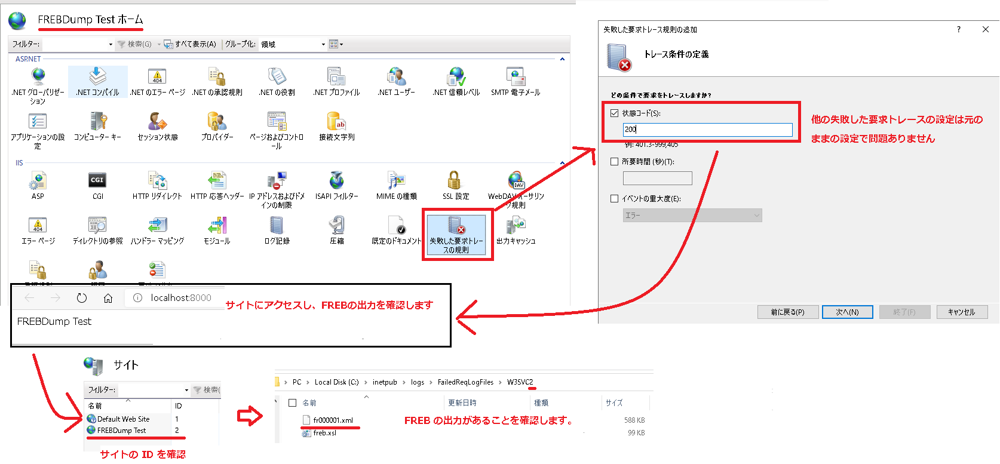
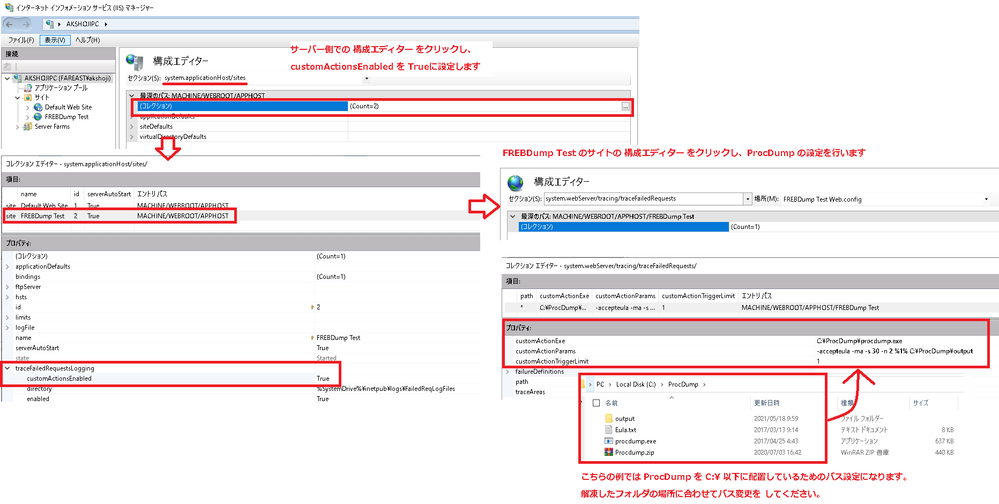
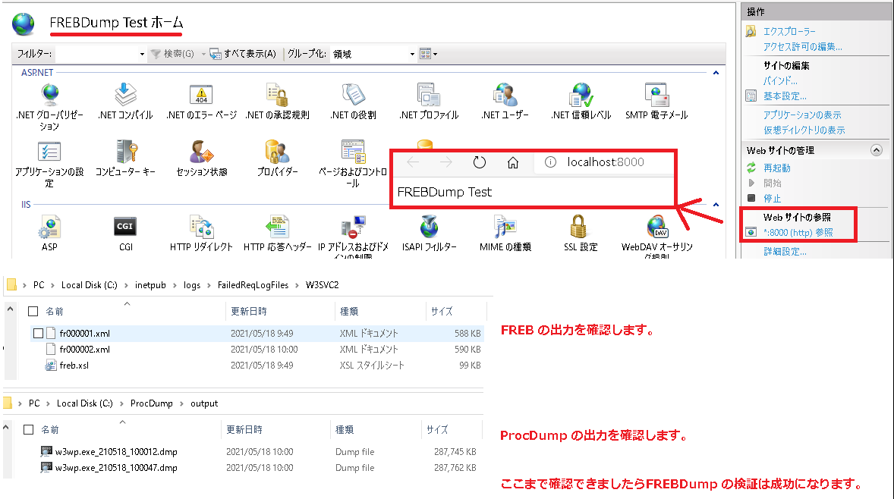
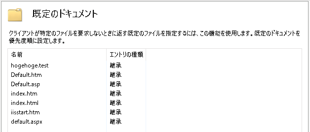
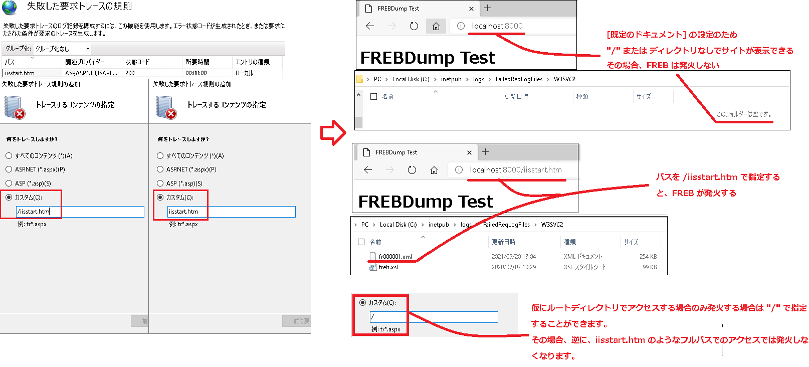

こんにちは。IIS サポート チームです！  

弊社にお問い合わせいただくお客様に、スムーズな解決をご提供するためにお役に立てる内容をご提供させていただきます。 

FREBDump について、今回はよくいただくご質問についてまとめました。

## 目次 <!-- omit in toc -->

- [FREBDump の検証手順について](#FREBDump-%E3%81%AE%E6%A4%9C%E8%A8%BC%E6%89%8B%E9%A0%86%E3%81%AB%E3%81%A4%E3%81%84%E3%81%A6)
- [FREB の [トレースするコンテンツの指定] での [カスタム] の注意点について](#FREB-%E3%81%AE-%E3%83%88%E3%83%AC%E3%83%BC%E3%82%B9%E3%81%99%E3%82%8B%E3%82%B3%E3%83%B3%E3%83%86%E3%83%B3%E3%83%84%E3%81%AE%E6%8C%87%E5%AE%9A-%E3%81%A7%E3%81%AE-%E3%82%AB%E3%82%B9%E3%82%BF%E3%83%A0-%E3%81%AE%E6%B3%A8%E6%84%8F%E7%82%B9%E3%81%AB%E3%81%A4%E3%81%84%E3%81%A6)

## FREBDump の検証手順について

以下簡易ではありますが、FREBDump が問題なく取得できるか確認するための取得手順をおまとめいたしました。  
事前検証が必要な場合は、こちらによりメモリダンプが生成されているかご確認いただけますと幸いです。

### ウェブサイトの作成<!-- omit in toc -->

IIS 上にウェブサイトを作成し、ウェブ アクセスした際に 200 レスポンスが返されることを契機として、メモリダンプを取得します。

以下の画像のように、ウェブサイトを作成し、メモ帳などで作成した iisstart.htm を C:\inetpub\wwwroot 以下に作成します。問題なくアクセスできることを確認します。

### 失敗した要求トレースの設定<!-- omit in toc -->

トレース条件の定義として、200 を指定します。  
サイトにアクセスすることで、FREB の出力先に .xml 形式の出力があるかを確認します。

### 構成エディター での ProcDump の設定<!-- omit in toc -->

画像を参考に、サーバーにおいて構成エディタにて customActionEnabled の有効化を行います。  
その後、サイトの構成エディターにおいて、[customActionExe]、[customeActionParams]、[customActionTriggerLimit] を以下の値で設定します。

- [customActionExe] : C:\Procdump\procdump.exe などのインストールした .exe のパス
- [customActionParams] : -accepteula -ma -s 30 -n 2 %1% \<任意のダンプの出力先のフォルダ\>
- [customActionTriggerLimit] : 1

### ダンプ生成の確認<!-- omit in toc -->

作成したサイトにウェブ アクセスを行います。  
200 レスポンスが返答されたことを契機として FREBDump が取得されます。
FREB、 ProcDump の出力先に ファイルが生成されていることをご確認ください。

## FREB の [トレースするコンテンツの指定] での [カスタム] の注意点について

カスタムにてパスを指定した際に、[既定のドキュメント] の設定によりサイトアクセスが "/" ディレクトリでアクセスできる場合、FREB がうまく発火しない場合がございます。

例えば、http://localhost/iisstart.htm がフルパスになるような iisstart.htm のファイルをサイトに配置します。

既定の設定では、[既定のドキュメント] に iisstart.htm が存在するため、 https://\<サイト名/> でアクセスが可能です。

この場合、[カスタム] のパスに iisstart.htm や /iisstart.htm を設定していると、 "/" などのディレクトリアクセスの時は FREB は発火しません。

[カスタム] の設定は FREB を仕掛けたいアプリケーションを制限する場合に有用な設定ですが、そのアプリケーションやウェブページが [既定のドキュメント] に存在する場合は以上の注意が必要になります。

<!-- 

- FREBDump の customActionExe, customeActionParam, customeActionTrigger の説明
- ProcDump のオプションについて

-->