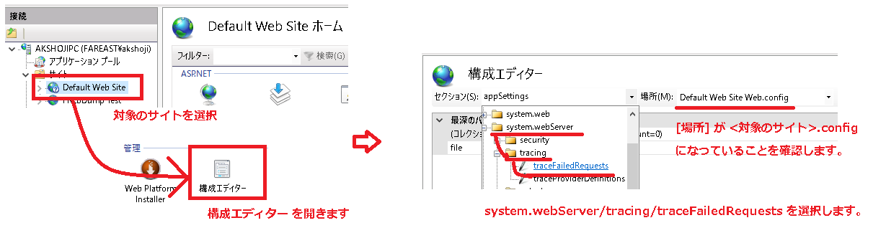

# FREBDumpの取得方法について <!-- omit in toc -->

こんにちは。IIS サポート チームです！  

弊社にお問い合わせいただくお客様に、スムーズな解決をご提供するためにお役に立てる内容をご提供させていただきます。  
今回は IIS のワーカープロセス (w3wp.exe) のメモリダンプを取得する手法の一つ、FREBDump の手順についてご説明します。

## FREBDump とは <!-- omit in toc -->

FREBDump とは、ProcDump の一種で、失敗した要求トレース (通称: FREB ) を契機として ProcDump を実行します。

(なお FREBDump は正式名称ではございません。失敗した要求トレース が 英語で Failed Request Event Buffering (FREB) と呼ばれること、ProcDump の Dump から FREBDump と呼称しております。)

このログ取得のポイントは FREB の発火点によって ProcDump を制御するところにあります。

## FREBDumpのメリット <!-- omit in toc -->

FREBDump でのダンプ採取のメリットは、ProcDump よりも柔軟なタイミングでのダンプの取得ができることです。  
例えば以下は ProcDump では難しいですが、 FREBDump では可能になります。

1) IIS サーバーが受け取ったリクエストで特定の時間以上になった場合にダンプを取る
2) 40X や 50X など、特定のエラーレスポンスで応答されたタイミングでダンプを取る

例えば、お客様から IIS サーバーが不定期にスローダウンし、リクエストのレスポンスが遅くなるといったお問い合わせをいただくことがございます。  
このような場合は 1) のように特定の時間でダンプを生成するように設定することで調査をすることができます。

- [前提条件](#前提条件)
- [FREBDumpの設定手順](#frebdumpの設定手順)
  - [FREBの有効化](#frebの有効化)
  - [FREBの規則作成](#frebの規則作成)
  - [ProcDumpの設定](#procdumpの設定)
- [FREBDumpのアンインストール方法について](#frebdumpのアンインストール方法について)
  - [FREBの設定の削除について](#frebの設定の削除について)
  - [ProcDumpの削除について](#procdumpの削除について)
- [FREBDumpの検証方法について](#frebdumpの検証方法について)
- [FREBDumpのFAQについて](#frebdumpのfaqについて)

## 前提条件

### 事前に準備が必要なものについて: <!-- omit in toc -->

FREBDump の取得のためには以下がインストールされている必要がございます。

- 失敗した要求トレース (FREB) がインストールされていること
- ProcDump がインストールされていること

IIS Manager を起動し、中央のアイコンで、[IIS] - [失敗した要求トレース] が存在することを確認します。

もしこちらが存在しない場合は、失敗した要求トレース (FREB) のモジュールが存在しないため、  
サーバー マネージャーの役割サービスの追加で、[Web サーバー] - [状態と診断] - [トレース] をインストールします。**インストールの際は、IIS の再起動が発生しますのでご注意ください。**

## FREBDumpの設定手順

### FREBの有効化

IIS マネージャーを起動し、[Web サイト] から現象が発生している <対象となるウェブサイト> を選択します。  

[操作] - [構成] - [失敗した要求トレース] をクリックします。  

[失敗した要求のトレースが、この Web サイトに対して有効になっていません。] という警告が表示される場合はクリックしてログを有効にします。

[操作] ウィンドウの [サイトのトレースの編集] をクリックし、[有効にする] にチェックがあることを確認してください。

### FREBの規則作成

[失敗した要求トレースの規則] - [操作] - [追加] をクリックします。

[トレースするコンテンツの指定] で、<トレースするコンテンツ>、  
[トレース条件の定義] で、<トレース条件の定義>、  
[トレース プロバイダーの選択] で、 <トレースプロバイダー> を設定し [終了] をクリックします。

### ProcDumpの設定

#### サーバーでのcustomActionEbaleの設定

IIS マネージャーの[接続] ウィンドウで、最上位に存在するサーバーの [構成エディター] をダブルクリックします。  
セクションで system.applicationHost/sites を選択します。

(コレクション) の行を選択し、右側にある [...] ボタンをクリックします。  
[コレクション エディター] 画面で、<対象となるウェブサイト> を選択します。  
プロパティより、[traceFailedRequestsLogging] を展開し、以下を設定します。

- [customActionsEnabled] を True  
- [maxLogFileSizeKB] に 1024

コレクション エディター ウィンドウを閉じ、適用します。

#### ウェブサイト側でのcustomActionExeなどの設定

サーバーを選択しましたが、次は <対象となるウェブサイト> を選択して、
サイトに存在する構成エディターを開きます。  
[場所] が <対象となるウェブサイト>.config になっていることを確認してください。  
[セクション] で  system.webServer/tracing/traceFailedRequests を選択します。  

(コレクション) の行を選択し、右側にある [...] ボタンをクリックします。  
[コレクション エディター] 画面で、path が * となっている行を選択し、
[プロパティ] ウィンドウの各項目に ProcDump の設定を行います。

以下それぞれを入力してください。

- customActionExe : <インストールした ProcDump のパス>
- customActionParams : \<ProcDump の引数\>
- customActionTriggerLimit : \<customActionExe の試行回数\>

※弊社から特に指示がない場合は以下の通りに行ってください。

- customActionExe : <C:\Procdump\procdump.exe などのインストールした .exe のパス>
- customActionParams : -accepteula -ma -s 30 -n 2 %1% <C:\ProcDump\output などのダンプファイル保存場所>
- customActionTriggerLimit : 2

コレクション エディター ウィンドウを閉じます。
[操作] ウィンドウで、[適用] を選択します。

以上で設定は終了です。

### FREBDumpのアンインストール方法について

<対象となるウェブサイト> の構成エディタで設定した以下3つの値を削除します。

- customActionExe
- customActionParams
- customActionTriggerLimit

サーバーの構成エディタで設定した以下の設定を変更します

- customActionEnabled = True の設定を False

### FREBの設定の削除について

FREB自体を無効化する場合は、  
<対象となるウェブサイト> の 失敗した要求トレースの規則 を開き、作成した規則を選択し、削除 を押してください。

### ProcDumpの削除について

ProcDump はインストールしたフォルダごと削除いただくことでアンインストールできます。

## FREBDumpの検証方法について

こちらは [失敗した要求トレースを契機とするメモリダンプ (FREBDump) でよくいただくご質問について](https://jpdsi.github.io/blog/web-apps/frebdump-faq/) をご確認ください。

## FREBDumpのFAQについて

こちらは [失敗した要求トレースを契機とするメモリダンプ (FREBDump) でよくいただくご質問について](https://jpdsi.github.io/blog/web-apps/frebdump-faq/) をご確認ください。

<!-- 
また今回利用した 失敗した要求トレース(FREB)、ProcDump についての Q&A も合わせてご確認いただけますと幸いです。

- [失敗した要求トレース(FREB) についての Q&A][失敗した要求トレース(FREB) についてのQ&A]
- [ProcDump についての Q&A][ProcDump についての Q&A]

-->

以上の Q&A を確認したもののご不明点が解決しない場合は、私共サポートまでお問い合わせいただけますと大変幸いです。
