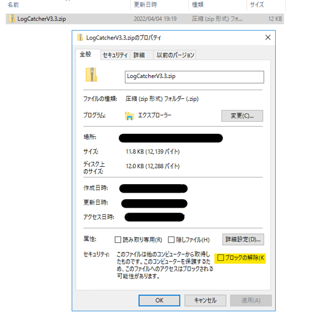
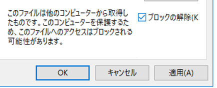
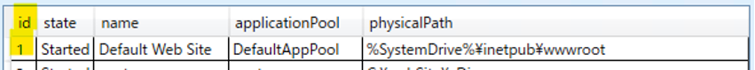
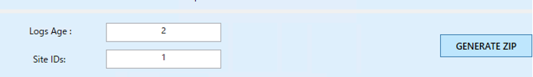
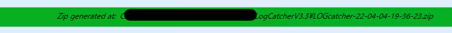

IIS サポートチームの大嶋です。
本稿では、IIS の事象発生後にまず初期調査のための情報採取の際に利用できる自動採取ツールをご紹介します。

なお、本ツールは OSS となり、我々の技術サポートでサポートするツールではございません。
もしツールでの採取に不明点・懸念点や上手く取得できない等ありましたら、まずは手動で以下の採取をご検討下さい。

[IIS の調査に必要な基本的なログ情報について](https://jpdsi.github.io/blog/web-apps/LogCollection1/)

---------------

## 採取方法について
0. 事象を再現します。
1.上記再現後、 IIS 側のサーバーにて、以下より LogCatcher (.zip) をダウンロードします。

  https://github.com/crnegule/LogCatcher/releases/latest

1. ダウンロード後、必ず解凍前に LogCatcherV3.3.zip を右クリックし、[プロパティ] を開きます。
2. プロパティ [全般] タブ下部の [セキュリティ] 欄の [ブロックの解除] (Unblock) をチェックをし、[OK] または [適用] します。

(チェック後の UI イメージ)
 
1. 上記のブロックの解除のチェックを設定後、.zip ファイルを展開します。

2. Power Shell を [管理者として実行] より、管理者権限で開き、該当の LogCatcherV3 のフォルダに cd コマンドで移動します。
(temp フォルダ配下に配置した場合の例 : cd C:\temp\LogCatcherV2.2)

6. cd コマンドにて LogCatcherV3 のフォルダ内に移動後、以下のコマンドでログ採取ツールの UI を起動します。

  .\LogCatcher.ps1

7. 下部より、事象が発生した採取対象となる IIS のサイト名 (name) を一覧より確認し、id の部分 (サイト ID) を把握します。(以下は Default Web Site だった場合のイメージ例です。)

   

8. [Logs Age] にて、上述の再現させた日にちを最低限含むように何日前までのログを含むか設定します。加えて、[Site IDs] の欄に、上記で控えたサイト ID を記載します。
※ なお上部の手順より先ほど直近で再現を実施した場合には [Logs Age] は 3 で一旦設定ください。

   

9. [GENERATE ZIP] を押し、ログ採取を開始します。暫く時間がかかりますので、UI に触らずに放置しておきます。途中で完了前に UI に触ってしまうと停止する恐れがあります。
完了後、以下のような Zip 生成が完了した緑色の欄が表示されます。該当箇所に採取された zip ファイルのパスが表示されてますので、こちらの .zip ファイルをご提供下さい。

今回は以上です。 
