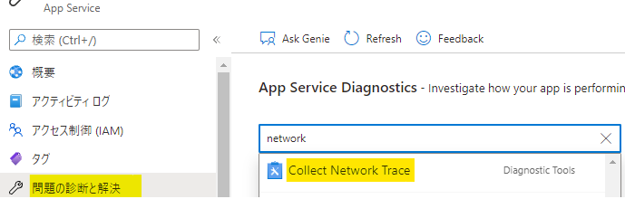

本記事は [Azure Tech Advent Calendar 2021 23 日目](https://qiita.com/advent-calendar/2021/microsoft-azure-tech) の記事です。

---

Azure Web Apps でもオンプレ IIS の時に取っていた情報が同様に取れるのか...？
-> はい、実は色々取れるものもあります。例えば...
という Blog です。

IIS サポートチームの大嶋です。

我々のチームでは普段オンプレミス製品である IIS や ASP.NET をサポートしてます。
ですが、今回は Azure Tech の Advent Calendar ということで、せっかくなので IIS とも親和性がある Azure PaaS の App Service ファミリーの Azure Web Apps (Windows) に関して、取得可能な情報を一部ですがご紹介しようと思います。

ちなみに、本稿では、具体的に有効な場面や情報の詳細等には踏み込みません。こういったものも Azure Web Apps でも取れるんだと思って頂ければと。

具体的に、本稿では以下をご紹介します。

- アプリケーション イベントログ
- ネットワーク トレース
- .NET Profiler トレース (ETW)
- メモリ ダンプ

皆様のトラブルシューティング時の今後の材料の 1 つとして、お力添えになればと思います。それでは、早速、具体的な手順の紹介に進みましょう。

---

## 1. Azure Web Apps でアプリケーション イベントログって見れるの？
見れます。アプリケーション イベントログは [IIS の調査に必要な基本的な情報](https://jpdsi.github.io/blog/web-apps/LogCollection1/) の 1 つです。
以下の手順で Azure Portal 上でアプリケーション イベントログを確認することが可能です。

1. Azure Portal 上で Azure Web Apps のリソースページ にて [問題の診断と解決] ブレードを開く
2. 検索欄から [Application Event Logs] を開く
3. アプリケーション イベントログを閲覧する

---

## 2. Azure Web Apps でネットワーク トレースって取れるの？
取れます。以下手順で Azure Portal 上の操作でネットワーク トレースを取得可能です。ネットワークトレースも [IIS の通信系の調査](https://jpdsi.github.io/blog/web-apps/LogCollection2/#2-%E3%83%8D%E3%83%83%E3%83%88%E3%83%AF%E3%83%BC%E3%82%AF-%E3%83%88%E3%83%AC%E3%83%BC%E3%82%B9) に活用する可能性のある情報です。

ただし、こちらは意図的に事象が再現できる手順が確立出来ていることが前提です。

1. Azure Portal 上で Azure Web Apps のリソースページ にて [問題の診断と解決] ブレードを開く
2. 検索欄から [Collect Network Trace] を開く

3. 取得したい秒数を選択し、[Collect Network Trace] ボタンを押す
4. 再現リクエストを実施する
5. 取得が完了すると zip ファイルがクリック可能になるのでクリックしダウンロードする
6. ダウンロードした zip ファイルをローカル環境で解凍し、解凍後の .cap ファイルをネットワークトレースを閲覧する Wireshark 等のツールで確認する

---

## 3. Azure Web Apps で .NET の Profiler トレース (ETW) って取れるの？
取れます。以下手順で Azure Portal 上の操作で [PerfView 等で取得・閲覧可能](https://jpdsi.github.io/blog/web-apps/LogCollection3/) な .NET の Profiler トレース (ETW) を取得可能です。

ただし、意図的に事象が再現できる手順が確立出来ていることが前提です。
加えて、事前準備が必要です。

<事前準備>
1. App Service Plan が Standrd 以上の必要があるため、[スケールアップ] ブレードから S1 プランなど Basic 以上にスケールアップする
2. 常時接続機能が有効である必要があるため、[構成] ブレードの [全般設定] タブから [常時接続] を [オン] に変更する

準備が整ったので、以下の手順に進みます。

<再現時の採取手順>
3. Azure Portal 上で Azure Web Apps のリソースページ にて [問題の診断と解決] ブレードを開く
4. 検索欄から [Collect .NET Profiler Trace] を開く

5. 取得する Instance(s) のチェックボックスにチェックする
6. [Collect Profiler Trace] ボタンを押す
7. Step 1 が完了し下記の画面 (Step 2) になるのを待つ
8. Step 2 になったらトレースが開始した状態のため、すぐに再現リクエストを行う
(60 秒間で Profiler が自動停止するので、Step 3 の停止に行くまでの 60 秒間以内に再現を行います)

7. .NET Profiler のトレースを含む .zip 形式のファイルがダウンロードできるようになるので、zip ファイルのリンクをクリックしダウンロードする

---

## 4. Azure Web Apps で メモリダンプ って取れるの？
取れます。以下の手順で WinDbg 等でも閲覧可能なメモリダンプを取得可能です。

ただし、意図的に事象が再現できる手順が確立出来ていることが前提です。
加えて、事前準備が必要です。

<事前準備>
1. App Service Plan が Basic 以上の必要があるため、[スケールアップ] ブレードから B1 プランなど Basic 以上にスケールアップする
2. 常時接続機能が有効である必要があるため、[構成] ブレードの [全般設定] タブから [常時接続] を [オン] に変更する

<再現時の採取手順>
4. 新規作成もしくは既存の [Storage account] を選択する
5. 取得する Instance(s) のチェックボックスにチェックする
6. [Collect Memory Dump] ボタンを押す
7. ダンプ取得が完了次第、.dmp ファイルが表示されるので、そのリンクからダンプファイルをダウンロードする

---

## まとめと留意事項
実は [問題の診断と解決] ブレードは他にも様々な充実した機能が複数ございます。
事象や状況に応じて、ぜひご活用いただければと思います。

なお、上記で紹介した後半 3 つの情報は特定の再現手順が確立できていることが前提です。
また、適切な状況で適切な再現タイミングで取得できないと意味をなさない情報です。

加えて、お客様側での各取得した情報の解析の敷居や難易度も高いことが想定されます。もし解析できたとしても大量の時間がかかる可能性があるため、いわば最終手段の 1 つのようなものです。一概にトラブルシューティングと一括りにしてウェイトが重い情報を闇雲に取得することはおすすめできません。

じゃあどうすればいいのか。そのために、実は Azure Web Apps にはそのような情報を取らないでも、事象の把握や問題の切り分け、事象によっては原因特定も可能であるツールがいくつも用意されております。

ちょうど、本アドベントカレンダーの前半でもその一部が紹介されていたので、リンクを載せておきますのでぜひこちらや、公式の情報が知りたい方は App Service の Docs を一読ください！

本 Advent Calendar 11 日目で紹介されていた [App Service で発生した事象を 問題の診断と解決 で確認してみよう](https://qiita.com/mym/items/dcf1114d2ea8b60c6132) 

まずはどういった事象なのかどういうときに発生するのか等を正確に把握したうえで、ぜひ活用してみてください。

---

ちなみに、では普段我々のチームでは IIS 以外ではどういう製品を担当しているの？Azure 製品も関わる機会はあるの？という方はぜひ以下のチーム紹介の Blog も一読頂ければと思います！

[<Career><第一弾> Developer Support Internet (DSI) ってどのような製品の技術サポートをしているの？](https://jpdsi.github.io/blog/general/career1-dsi-technologies/)

では、本日のアドベントカレンダーのブログはこんなところで。
最近は急な気温の変化もありますのでお身体には気を付けて、良いクリスマスや年末年始をお過ごしください！

---
