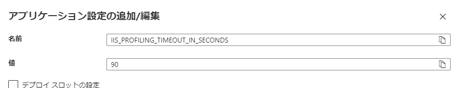
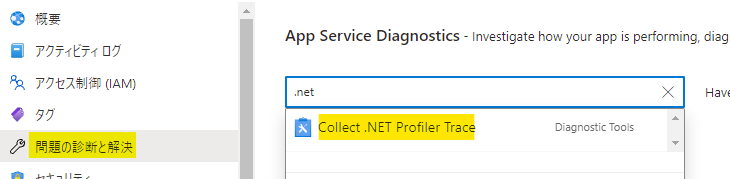
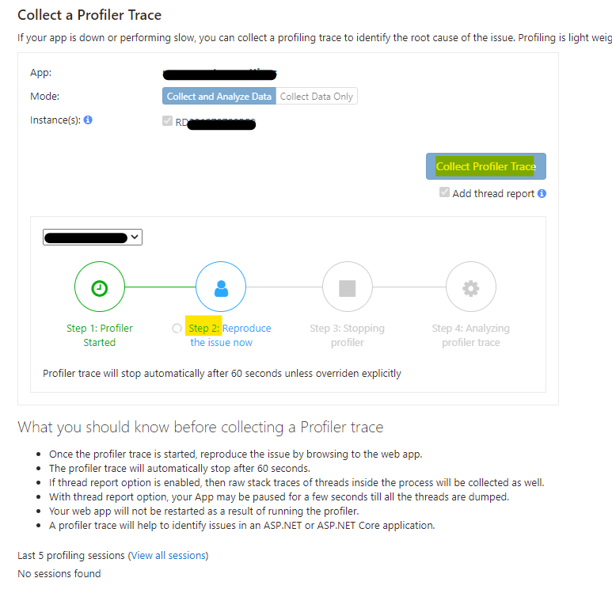

IIS / ASP.NET サポートチームの大嶋です。

本稿では、先日投稿した [Azure Web Apps の .NET の Profiler トレース (ETW)](https://jpdsi.github.io/blog/web-apps/webapps-diagnostic-tools/#3-Azure-Web-Apps-%E3%81%A7-NET-%E3%81%AE-Profiler-%E3%83%88%E3%83%AC%E3%83%BC%E3%82%B9-ETW-%E3%81%A3%E3%81%A6%E5%8F%96%E3%82%8C%E3%82%8B%E3%81%AE%EF%BC%9F) の取得時間を既定値の 60 秒から変更して取得する方法について、ご紹介します。

.NET Profiler を取得したい再現リクエストの秒数が 60 秒より短かったり、逆に 60 秒より長いことが見込まれたりと、取得秒数を既定値から変更したい場面はあるかと思います。

そのようなときは、具体的には、以下 Azure Portal 上の操作で .NET の Profiler トレース (ETW) を取得の目安時間を変更した上で採取が可能です。なお、意図的に事象が再現できる手順が確立出来ていることが前提です。

---

## 事前準備
1. App Service Plan が Standard 以上の必要があるため、該当の Azure App Service のリソースの [スケールアップ] ブレードから S1 プランなど Standard 以上にスケールアップします。
2. 常時接続機能が有効である必要があるため、[構成] ブレードの [全般設定] タブから [常時接続] を [オン] に変更します。

## 取得時間の変更
※ もし、既定値の 60 秒から変更する必要がない場合はこの手順は不要です。

1. [構成] ブレードの [アプリケーション設定] タブの [+ 新しいアプリケーション設定] を押します。
2. 名前 (キー) を "IIS_PROFILING_TIMEOUT_IN_SECONDS" に、値を ".NET Profler を取得したい秒数" に設定し、[OK] を押します。
なお、最大値は 899 秒までですので、必ず 900 以上に設定しないようにご注意ください。
3. 上部の [保存] ボタンを押し、アプリケーション設定の変更を保存します。

準備が整ったので、以下の再現時の取得手順に進みます。

## 再現時の採取手順
1. Azure Portal 上で Azure Web Apps のリソースページ にて [問題の診断と解決] ブレードを開きます。
2. 検索欄から [Collect .NET Profiler Trace] を開きます。

3. 取得する Instance(s) のチェックボックスにチェックします。
4. [Collect Profiler Trace] ボタンを押します。
5. Step 1 が完了し下記の画面 (Step 2) になるのを待ちます。
6. Step 2 になったらトレースが開始した状態のため、すぐに再現リクエストを行います。
(自動停止の Step 3 の停止に行くまでの間に必ず再現を行います)

7. 完了後、.NET Profiler のトレースを含む .zip のリンクをクリックすることで、.zip 形式のプロファイラーのファイルをダウンロード可能です。

今回は以上です。 それでは、また次回！
